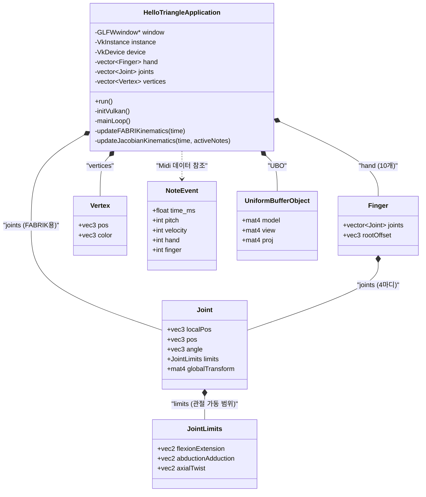

제공해주신 `Vulkan_IK_Tutorial.cpp` 코드는 Vulkan 그래픽스 API를 기반으로 피아노 치는 손의 역운동학(IK, Inverse Kinematics)을 시뮬레이션하는 애플리케이션입니다.

코드의 전반적인 아키텍처와 객체 간의 포함 관계(Composition)를 파악할 수 있도록 클래스 다이어그램을 정리해 드립니다.

### 클래스 및 구조체 관계도

---

### 주요 구성 요소 요약

다이어그램에 명시된 핵심 데이터 구조들의 역할을 한눈에 볼 수 있도록 표로 정리했습니다.

| 요소 이름 | 역할 및 특징 |
| --- | --- |
| **`HelloTriangleApplication`** | 프로그램의 메인 클래스입니다. Vulkan 초기화, 렌더링 파이프라인 구성, 루프 실행 및 매 프레임 IK(FABRIK 및 Jacobian) 연산을 트리거합니다. |
| **`Finger`** | 손가락 한 개를 표현하는 구조체입니다. 손목 기준의 오프셋(`rootOffset`)과 4개의 `Joint`로 구성되어 있습니다. |
| **`Joint`** | 뼈대의 개별 관절을 나타냅니다. 지역 위치, 전역 위치, 현재 각도, 그리고 기구학적 한계점(`JointLimits`) 데이터를 담고 있습니다. |
| **`JointLimits`** | 해부학적 관절 가동 범위(구부림/폄, 벌림/모음, 비틀림)의 최소/최대 제한값을 보관하여 IK 연산 시 손가락이 비정상적으로 꺾이지 않도록 합니다. |
| **`NoteEvent`** | MIDI 음표 데이터를 정의합니다. 시간, 건반 피치, 벨로시티, 어느 손의 어느 손가락으로 누르는지에 대한 정보를 포함합니다. |
| **`Vertex`** | Vulkan 렌더링 파이프라인으로 전달되는 정점 데이터입니다. 3D 위치(`pos`)와 색상(`color`) 정보를 가집니다. |