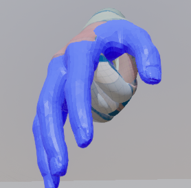

### 4.4 Chaos Flesh PBD Skinning — 곽경민

#### 4.4.1 목표

손가락이 굽혀질 때 살이 실제 물리처럼 눌리고 밀리게 하는 것이 목표입니다.

LBS는 정점을 본 행렬로 옮기기만 합니다. 관절 안쪽 살이 서로 파고들고, 부피가 줄어듭니다.

Chaos Flesh는 손 내부를 사면체(Tetrahedron)로 채웁니다. 이 볼륨을 뼈에 묶고 물리로 시뮬레이션합니다. 눌린 살은 부피를 유지하려고 옆으로 밀려납니다.

이번 기간에는 통합 프로젝트(`06_Project/pianohand_simulator`)에서 Flesh 에셋을 다시 만들었습니다. 굴곡 애니메이션을 따라 Flesh가 변형되는 것까지 확인했습니다.

<div align="center"></div>

<p align="center"><b>[그림 1]</b> 현재 결과. 주먹을 쥐는 애니메이션을 Flesh(파랑)가 따라갑니다.</p>

---

#### 4.4.2 셰이더 파이프라인과의 역할 분담

중간보고 이후 4.3의 커스텀 GPU 스키닝이 주름·핏줄까지 만들게 되었습니다. 두 모듈이 같은 일을 하지 않도록 역할을 나눴습니다.

| | 4.3 커스텀 GPU 스키닝 | 4.4 Chaos Flesh |
|---|---|---|
| 변형 계산 근거 | 스킨 웨이트 (LBS / DQS) + 변 신장률 | 사면체 볼륨의 물리 시뮬레이션 |
| 표현 대상 | 주름·핏줄·미세 노멀 | 살 눌림·부피 보존 |
| 크기 | 미시 디테일 | 거시 변형 |

4.3의 부피 보존 항은 `1/λ²`라는 가정으로 계산한 **추정값**입니다. Flesh는 사면체끼리 서로 밀어내며 **실제로 계산**합니다.

최종적으로는 Flesh가 계산한 표면 위치를 4.3 파이프라인의 입력으로 넘길 예정입니다. 물리로 변형된 표면 위에 주름·핏줄이 올라가는 구조입니다.

---

#### 4.4.3 손 모델

4.3과 같은 메시를 씁니다. 나중에 결과를 합쳐야 하기 때문입니다. 4.3의 손 모델이 바뀔 때마다 따라갔습니다.

| 시기 | 메시 | 정점 | 비고 |
|---|---|---:|---|
| 1학기 | `fbx_Clean` | — | 전신 모델. Bone Filter로 손·팔만 사면체화 |
| 2학기 초 | `SKM_MannyXR_right` | 3,239 | UE 5.6 VR 템플릿 손 |
| 현재 | `SKM_MH_Hand_R` | 4,834 | MetaHuman 바디에서 오른손만 추출 (4.3.6) |

같은 메시가 필요한 이유는 4.4.7에 있습니다. Flesh는 **메시 이름**으로 애니메이션 뼈를 찾습니다.

시뮬레이션에는 PN 테셀레이션 전 원본 메시를 씁니다. 고밀도 메시(`_Dense`, 정점 77k)는 렌더링용입니다. PBD 연산량은 사면체 수에 비례합니다.

---

#### 4.4.4 Dataflow 그래프

Flesh 에셋은 Dataflow 그래프로 만듭니다.

1학기에는 Geometry 생성과 바인딩을 그래프 두 개로 나눴습니다. 지금은 대상이 손 하나뿐이고 파라미터를 자주 바꿔야 해서 **하나로 합쳤습니다.**

<div align="center"></div>

<p align="center"><b>[그림 2]</b> 현재 Dataflow 그래프.</p>

| 노드 | 역할 | 설정 |
|---|---|---|
| `SkeletalMesh` | 입력 모델 | `SKM_MH_Hand_R` |
| `SkeletalMeshToCollection_0` (위) | 뼈 계층만 변환 | Import Transform Only ✔ |
| `SkeletalMeshToCollection` (아래) | 표면 형상 변환 | 기본값 |
| `CreateTetrahedron` | 표면 내부를 사면체로 채움 | Method: **TetWild** (4.4.5) |
| `SetFleshDefaultProperties` | 물성 초기값 | 아래 표 |
| `SetFleshBonePositionTargetBinding` | 사면체 정점을 뼈 위치로 당기는 스프링 | Position Target, Stiffness 10,000, Search Radius 1.0 |
| `FleshAssetTerminal` | Flesh 에셋으로 저장 | — |

`CreateTetrahedron`의 두 입력은 역할이 다릅니다. 엔진 소스를 확인했습니다.

```cpp
// ChaosFleshCreateTetrahedronNode.cpp (UE 5.6, 발췌)
TUniquePtr<FFleshCollection> InCollectionVal(GetValue<DataType>(Context, &Collection).NewCopy<FFleshCollection>());
TUniquePtr<FFleshCollection> InSourceCollectionVal(GetValue<DataType>(Context, &SourceCollection).NewCopy<FFleshCollection>());
// ... SourceCollection의 형상으로 사면체를 만들어 InCollectionVal에 덧붙인다 ...
SetValue<const DataType&>(Context, *InCollectionVal, &Collection);   // 출력 = Collection 입력의 복사본 + 사면체
```

출력은 `Collection` 입력을 **그대로 복사한 것**에 사면체를 붙인 것입니다. 그래서 뼈 정보는 반드시 `Collection`으로 들어가야 합니다.

여기에 형상까지 든 컬렉션을 넣으면 원래 표면 메시가 사면체와 함께 중복으로 들어갑니다. 그래서 `Collection` 쪽은 **Import Transform Only**로 뼈만 넣습니다.

1학기 그래프가 입력을 두 갈래로 나눈 것은 이 때문이었습니다. 이번에 한 갈래로 합쳤다가 문제를 겪고 확인했습니다(4.4.7).

물성은 다음과 같습니다.

| 파라미터 | 의미 | 값 |
|---|---|---:|
| `Density` | 밀도 | 1.0 |
| `Vertex Stiffness` | 형태 유지 강성 | 1,000,000 |
| `Vertex Damping` | 진동 감쇠 | 0.0 |
| `Vertex Incompressibility` | 부피 보존 강도 | 0.6 |
| `Vertex Inflation` | 내부 압력 | 0.5 |

---

#### 4.4.5 사면체 생성 — IsoStuffing에서 TetWild로

기본 방식은 IsoStuffing입니다. 바운딩 박스를 격자로 나누고, 메시 **안쪽**에 있는 칸에 사면체를 채웁니다.

**격자 해상도.** `Num Cells`는 한 축을 몇 칸으로 나눌지입니다. 기본값 32에서 칸 크기는 약 0.6 cm입니다(손 길이 약 19 cm 기준). 손가락 두께가 1.5~2 cm라 단면에 2~3칸밖에 안 들어갑니다. 손가락이 형태를 못 버텼습니다.

48로 올려 칸을 약 0.4 cm로 줄였습니다. 3차원 격자라 칸 수는 `(48/32)³ ≈ 3.4`배가 됩니다.

**MetaHuman 손에서 실패.** 손 모델을 바꾸자 손바닥만 채워지고 손가락은 끝 조각만 남았습니다.

<div align="center"></div>

<p align="center"><b>[그림 3]</b> IsoStuffing 결과(왼쪽 위). 손가락 볼륨이 비고 끝부분만 떨어져 있습니다.</p>

IsoStuffing은 칸마다 "메시 안쪽인가"를 판정합니다. 그래서 틈이 없는 닫힌 메시가 필요합니다. 이 메시는 전신 바디에서 잘라낸 것입니다. 손목 절단면은 막혔지만 표면에 틈이 남아 있는 것으로 판단됩니다.

해상도 문제라면 손가락이 가늘게라도 나왔을 것입니다. 통째로 비는 것은 안팎 판정 실패입니다.

틈이 있는 메시에도 안정적인 **TetWild**로 바꿨습니다.

<div align="center"></div>

<p align="center"><b>[그림 4]</b> TetWild 결과. 다섯 손가락 모두 볼륨이 채워졌습니다.</p>

렌더링용 메시와 시뮬레이션용 메시는 요구 조건이 다릅니다. 렌더링은 틈이 있어도 괜찮지만, 볼륨 생성은 닫힌 메시가 필요합니다.

---

#### 4.4.6 뼈 바인딩

`SetFleshBonePositionTargetBinding`은 사면체 정점을 가까운 뼈에 스프링으로 묶습니다. **Position Target** 모드는 완전히 고정하지 않고 목표 위치로 당깁니다. 살이 약간 늦게 따라오는 효과가 납니다.

처음에는 손가락 끝이 아래로 처지고 뭉개졌습니다.

<div align="center"> </div>

<p align="center"><b>[그림 5]</b> Search Radius 0(왼쪽)과 1.0(오른쪽).</p>

손끝은 마지막 뼈(`_03`)보다 바깥에 있습니다. 탐색 반경이 0이면 손끝 정점이 바인딩 범위 밖에 남는 것으로 보고 1.0으로 올렸습니다.

단, 이 조정은 뼈 정보가 빠진 상태(4.4.7)에서 한 것입니다. 뼈 정보를 복원한 뒤 다시 검증해야 합니다.

---

#### 4.4.7 애니메이션 추종

Flesh 에셋 에디터의 Preview Scene에서 4.3의 굴곡 애니메이션을 재생했습니다.

| 위치 | 항목 | 값 |
|---|---|---|
| Asset Details → Animation | Skeletal Mesh | `SKM_MH_Hand_R` |
| Asset Details → Animation | Skeleton | `metahuman_base_skel` |
| Preview Scene | Animation Asset | `A_MH_Hand_Cycle` (4초 굴곡 사이클, 4.3.5) |

Preview Scene의 Skeletal Mesh 칸은 직접 고칠 수 없습니다. Flesh 에셋의 속성을 보여주기만 합니다. Asset Details에서 지정해야 합니다.

처음에는 스켈레탈 메시만 주먹을 쥐고 Flesh는 기본 자세에 멈춰 있었습니다.

<div align="center"></div>

<p align="center"><b>[그림 6]</b> 수정 전. 스켈레탈 메시(유색)만 움직이고 Flesh(파랑)는 그대로입니다.</p>

에디터 로그에 손의 뼈 22개 전부에 대해 같은 에러가 있었습니다.

```
ChaosFleshSetFleshBonePositionTargetBindingNodeLog: Error: Collection does not contain bone[hand_r].
ChaosFleshSetFleshBonePositionTargetBindingNodeLog: Error: Collection does not contain bone[index_01_r].
...
```

바인딩 노드는 컬렉션 안에서 **뼈 이름**으로 뼈를 찾습니다.

```cpp
// ChaosFleshSetFleshBonePositionTargetBindingNode.cpp (UE 5.6, 발췌)
const TMap<FString, int32> BoneNameIndexMap = TransformFacade.BoneNameIndexMap();
for (int32 BoneIndex = 0; BoneIndex < ReferenceSkeleton.GetNum(); ++BoneIndex)
{
    FString SKMBoneName = ReferenceSkeleton.GetRefBoneInfo()[BoneIndex].Name.ToString();
    if (BoneNameIndexMap.Contains(SKMBoneName))       // 컬렉션에 같은 이름의 뼈가 있어야 묶인다
    {
        SKMBoneIndexToCollectionBoneIndex.Add(BoneIndex, BoneNameIndexMap[SKMBoneName]);
    }
}
```

원인은 그래프였습니다. 한 갈래로 합치면서 `CreateTetrahedron`의 `SourceCollection`에만 연결하고 `Collection`은 비워뒀습니다. 4.4.4에서 본 대로 출력은 `Collection`의 복사본입니다. 결과물에 뼈가 하나도 없었습니다.

실행 중에도 같은 문제가 생깁니다. Flesh 컴포넌트는 매 프레임 애니메이션 뼈를 이렇게 가져옵니다.

```cpp
// ChaosDeformableTetrahedralComponent.cpp (UE 5.6, 발췌)
TSet<int32> Roots = TransformSource.GetTransformSource(
    Skeleton->GetName(), Skeleton->GetGuid().ToString(), SkeletalMesh->GetName());
if (!Roots.IsEmpty() && ...)
{
    const TArray<FTransform>& ComponentTransforms = SkeletalMeshComponent->GetComponentSpaceTransforms();
    // ...
    AnimationTransforms[Adx] = ComponentTransforms[Cdx];   // 찾으면 애니메이션 뼈 사용
}
// 못 찾으면 AnimationTransforms는 기준 자세 그대로 → 경고 없이 멈춰 있는다
```

**스켈레톤 이름 + GUID + 메시 이름**으로 조회합니다. 4.4.3에서 4.3과 같은 메시를 써야 한다고 한 이유가 이것입니다.

`Import Transform Only` 갈래를 추가해 `Collection`에 뼈를 넣었습니다. 에러가 사라지고 Flesh가 애니메이션을 따라갑니다(그림 1).

---

#### 4.4.8 한계 및 향후 계획

- **바인딩 파라미터를 다시 맞춰야 합니다.** Stiffness와 Search Radius는 뼈가 빠진 상태에서 정한 값입니다.
- **부위별 바인딩이 없습니다.** 손끝·손목은 단단하게, 손등·손바닥은 유연하게 나눌 계획입니다. `VertexSelection` 입력으로 영역을 지정합니다.
- **물성은 기본값에 가깝습니다.** Damping이 0이라 초기 관통을 해소할 때 튀어 오르는 현상이 있습니다. Inflation은 얇은 손가락을 부풀릴 가능성이 있습니다. 두 값은 추가 테스트 후 조정 여부를 결정할 예정입니다.
- **LBS와의 비교를 아직 못 했습니다.** 같은 프레임에서 관절부 형상을 나란히 비교할 예정입니다.
- **4.3 파이프라인 연동.** Flesh가 계산한 표면 위치를 4.3의 입력으로 넘기는 어댑터를 만들 예정입니다.
- **시뮬레이션 전용 메시.** TetWild는 생성이 느립니다. 틈을 메운 전용 메시를 따로 만들면 IsoStuffing으로 되돌릴 수 있습니다.
