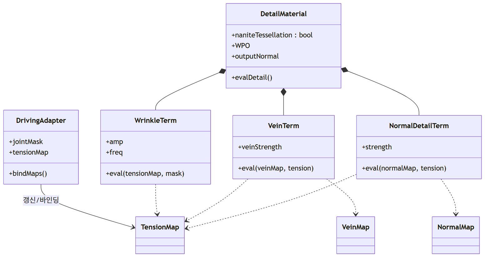
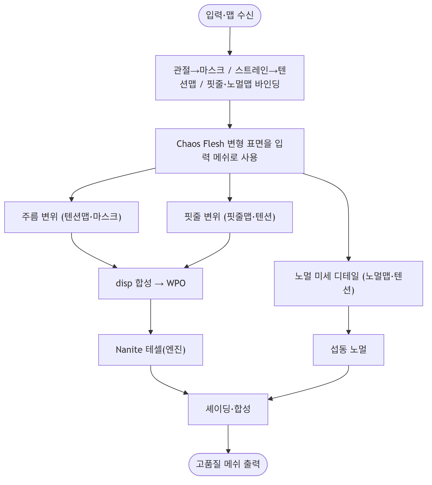

# 설계 다이어그램 — 고품질 디테일 스키닝 모듈

> 본 프로젝트 범위 = 전체 피아노 연주 파이프라인의 **마지막 단계(메쉬 디테일 적용)**.
> 디테일은 **텐션맵 · 핏줄맵 · 노멀맵** 을 활용해 주름·핏줄·미세 표면을 표현한다.

---

## D1. 전체 시스템 컨텍스트 (본 모듈의 위치)


상위 ①~④(IK·Chaos Flesh·디테일 리소스)는 **입력 제공자**(범위 밖). 본 모듈 ⑤만 상세 설계 대상.

---

## D2. SW Architecture — 본 모듈 Top-Level 구조


**관절 위치 / 변형 표면 + 스트레인 / 디테일 리소스(텐션맵·핏줄맵·노멀맵)** 를 입력받아, 2개 컴포넌트(A. 구동 신호 어댑터, B. 디테일 디스플레이스먼트 머티리얼)로 처리한다.

---

## D3. 핵심 컴포넌트 분해 — B. 디테일 머티리얼 (3 디테일 항)


- **① 주름 변위**(기하): 텐션맵·관절 마스크·다중사인 → WPO
- **② 핏줄 변위**(기하): 핏줄맵을 텐션으로 변조 → WPO
- **③ 노멀 미세 디테일**(셰이딩): 노멀맵을 텐션으로 블렌드 → 섭동된 노멀
- **텐션맵이 세 항을 공통 구동**(부위별 장력 필드). 기하 변위는 Nanite 테셀로 표현.

---

## D4. 사용사례 다이어그램 (Use Case Diagram)


외부 시스템(IK·Chaos Flesh)이 입력·맵(UC1)을 제공, 주름(UC2)·핏줄(UC3)·노멀맵 디테일(UC4)이 생성된다. 각 디테일은 아티스트가 저작한 맵·파라미터(UC6)를 `«include»`, 저밀도 시 테셀(UC5)이 `«extend»` 한다.

---

## D5. 클래스 다이어그램



`DetailMaterial` 이 주름항·핏줄항·노멀디테일항을 합성. 세 항 모두 `TensionMap` 을 참조하고, 각각 `VeinMap`·`NormalMap` 을 추가 입력으로 받는다.

---

## D6. 시퀀스 다이어그램 (런타임, 매 프레임)


입력→구동 어댑터(마스크·텐션맵·맵 바인딩)→디테일 머티리얼(주름·핏줄 변위 + 노멀 블렌드)→WPO+섭동노멀+테셀→렌더러.

---

## D7. 액티비티 다이어그램 (처리 흐름)



맵 수신 → 마스크/텐션맵 준비 → 변형 표면 위에 주름·핏줄(기하) + 노멀(셰이딩) 디테일 → 합성 → 출력.

---

## D8. 상태 다이어그램 (구현 단계)


1단계(주름·전역, 완료) → 2단계(텐션맵 필드) → 3단계(핏줄) → 4단계(노멀맵) → 5단계(테셀+실 손 메쉬).

---

> **참고**: 위 이미지는 `images/diagrams/diagram-1~8.png`. 수정 시 **`설계_다이어그램_mermaid소스.md`** 편집 후 재렌더:
> ```
> npx -y @mermaid-js/mermaid-cli -i "설계_다이어그램_mermaid소스.md" -o "images/diagrams/diagram.png" -b white -s 2
> ```
