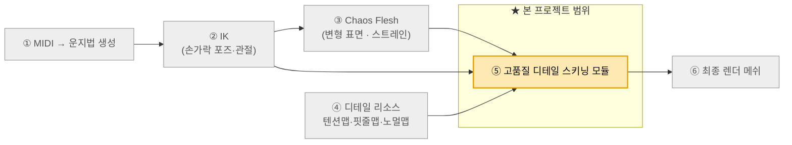
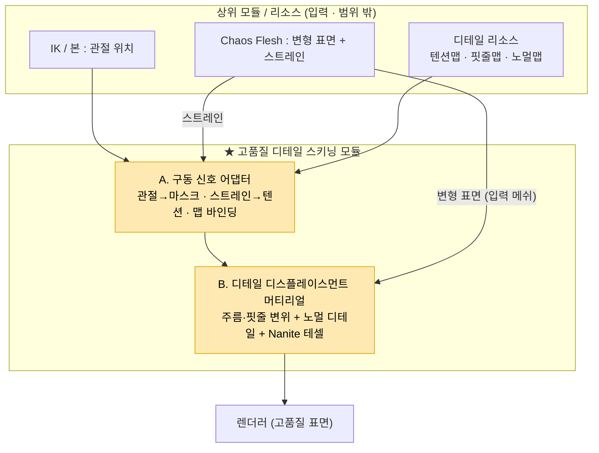
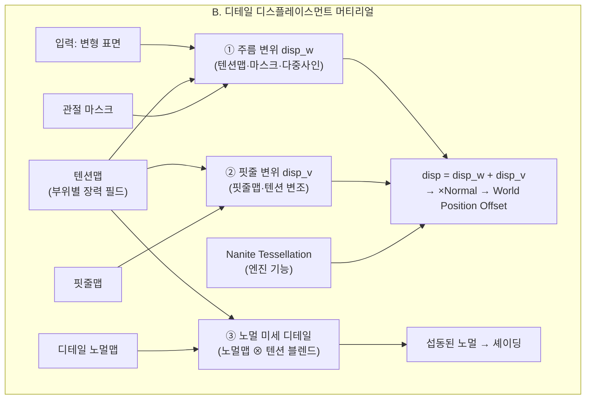
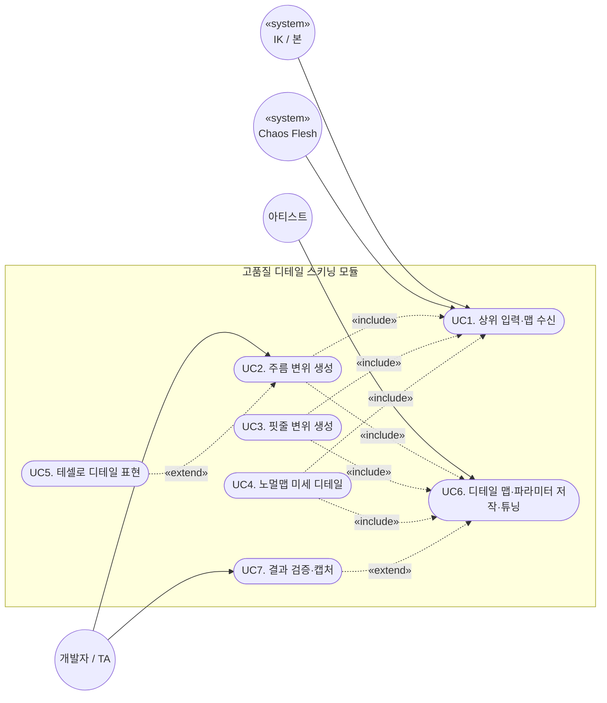
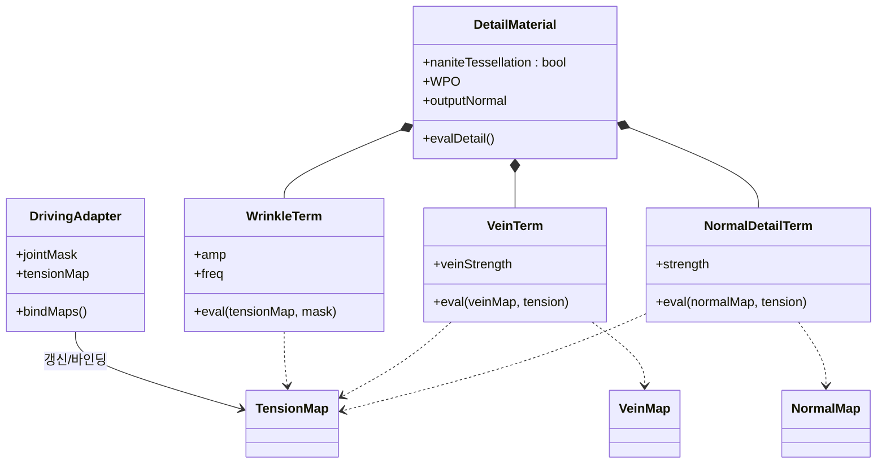
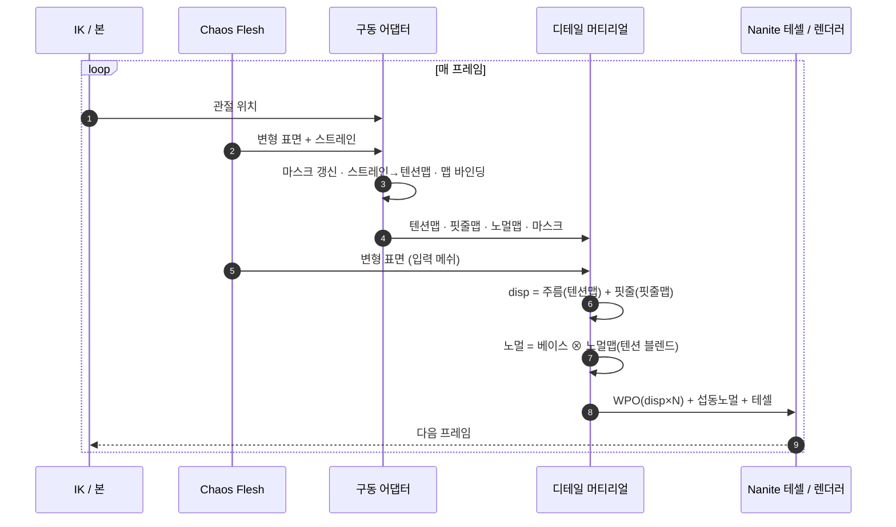
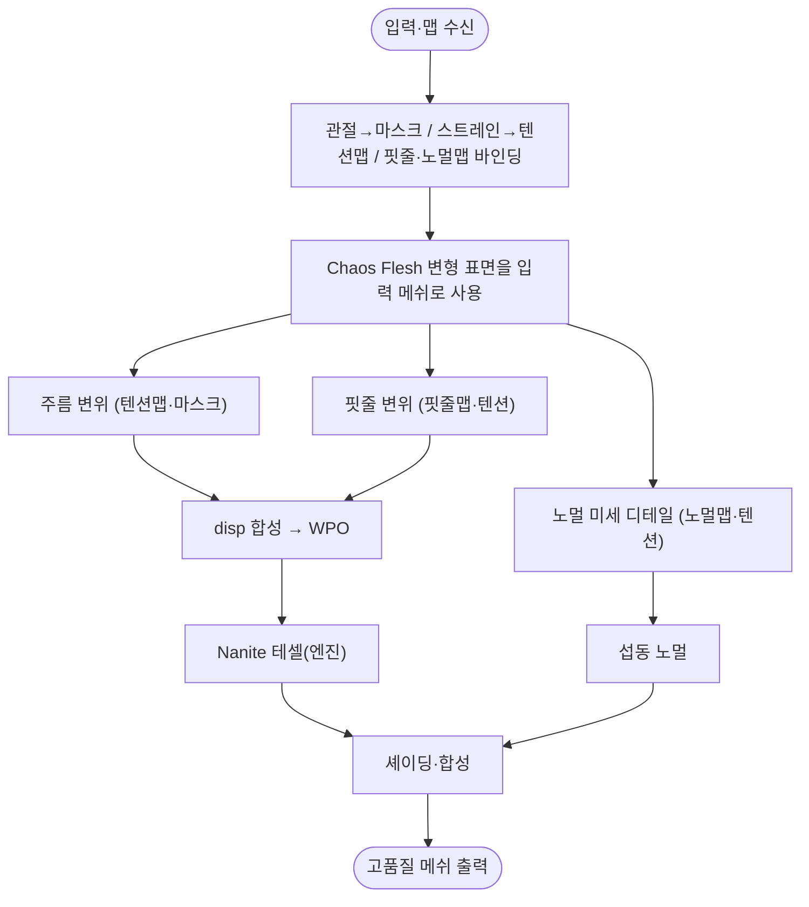
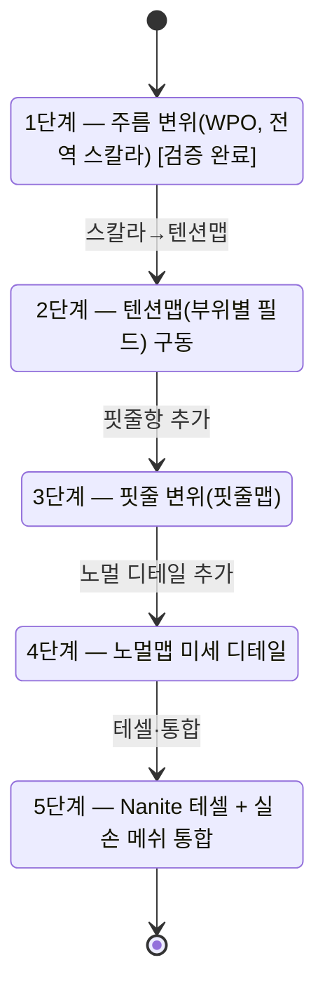

# 설계 다이어그램 — Mermaid 소스 (편집·재렌더용)

> 수정 후 재렌더:
> ```
> npx -y @mermaid-js/mermaid-cli -i "설계_다이어그램_mermaid소스.md" -o "images/diagrams/diagram.png" -b white -s 2
> ```
> 출력: mermaid 블록 순서대로 `diagram-1.png … diagram-8.png`.

---

## D1. 전체 시스템 컨텍스트



## D2. SW Architecture — 본 모듈 Top-Level 구조



## D3. 핵심 컴포넌트 분해 — B. 디테일 디스플레이스먼트 머티리얼 (3 디테일 항)



## D4. 사용사례 다이어그램



## D5. 클래스 다이어그램



## D6. 시퀀스 다이어그램 (런타임)



## D7. 액티비티 다이어그램



## D8. 상태 다이어그램 (구현 단계)


