# 피아노 연주 시뮬레이션 및 고정밀 렌더링 시스템

## 졸업 프로젝트 2학기 중간 보고서

| 항목 | 내용 |
|---|---|
| 과목 | 졸업프로젝트 3201 |
| 팀 | 2팀 |
| 제출일 | 2026년 9월 29일 |
| 팀원 | 정근녕, 한승현, 이수민, 곽경민 |
| 지도교수 | 김형석 교수님 |

## 목차

1. 프로젝트 개요
2. 전체 시스템 아키텍처
3. 1학기 누적 성과 요약
4. 2학기 진행 현황 (W01 ~ W04)
5. 모듈별 상세 구현 현황
   - 5.1 운지법 결정 엔진 (정근녕)
   - 5.2 IK 기반 모션 생성 (한승현)
   - 5.3 커스텀 GPU 스키닝 파이프라인 (이수민)
   - 5.4 Chaos Flesh PBD Skinning (곽경민)
6. 주요 기술적 도전 및 해결
7. 결과물 분석
8. 현재 상태 및 향후 계획
9. 결론

---

# 1. 프로젝트 개요

## 1.1 기획 배경

기존 게임 및 시뮬레이션 환경에서 손가락 움직임은 Linear Blend Skinning(LBS)에 의존하여, 피아노 연주와 같은 정교한 동작 시 관절 뭉개짐(Candy Wrapper Artifact), 주름 및 피하 조직의 비사실적 표현 문제가 발생합니다. 또한 MIDI 데이터만으로 실제 피아니스트 수준의 운지법을 자동 재현하고 영화적 품질의 렌더링을 생성하는 도구는 현재 존재하지 않습니다.

본 프로젝트는 이러한 기술적 공백을 해소하기 위해, **MIDI 입력 → 최적 운지법 계산 → IK 기반 모션 생성 → 고품질 피부 렌더링**으로 이어지는 통합 파이프라인을 구축하는 것을 목표로 합니다.

## 1.2 프로젝트 목표

- **MIDI-to-Motion**: MIDI 파일을 파싱하여 해부학적으로 유효한 최적 운지법을 자동 계산하고 IK 애니메이션 데이터로 변환합니다.
- **High-Fidelity Rendering**: PBD(Position Based Dynamics) 기반 조직 변형 및 Tension Map 기반 동적 노멀 맵을 활용한 주름·핏줄 렌더링을 구현합니다.

## 1.3 팀 구성 및 역할 분담

| 팀원 | 담당 모듈 | 주요 역할 |
|---|---|---|
| 정근녕 | 01_Fingering | MIDI 파서 및 DP 기반 운지법 결정 알고리즘 |
| 한승현 | 02_IK | Jacobian 기반 역운동학(IK) 모션 생성 |
| 이수민 | 03_Skinning (셰이더) | UE5 커스텀 GPU 스키닝, Tension Map, 주름 렌더링 |
| 곽경민 | 03_Skinning (시뮬레이션) | Chaos Flesh PBD 피부 시뮬레이션, 살 눌림·부피 보존 |

## 1.4 기술 스택

| 분야 | 기술 |
|---|---|
| 운지법 알고리즘 | Python 3.11, Dynamic Programming, Polyphonic Voice Leading |
| IK 시스템 | C++, Jacobian IK (Damped Least Squares) |
| 렌더링 엔진 | Unreal Engine 5.5 |
| 피부 시뮬레이션 | Chaos Flesh (FEM/PBD) |
| 셰이더 | HLSL, UMeshDeformer, RDG, Compute Shader |
| 데이터 포맷 | Standard MIDI File (Format 0/1), JSON, UE5 DataTable CSV |

---

# 2. 전체 시스템 아키텍처

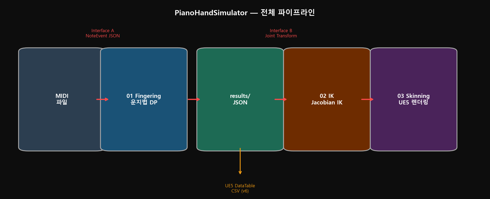

```
MIDI 파일
  → [01_Fingering | 정근녕]
        MIDI 파서 → 양손 분리 → V5 Polyphonic DP Solver → JSON 출력
        Interface A — NoteEvent JSON (pitch, finger, wrist_yaw, pressure ...)
  → [02_IK | 한승현]
        IK 목표 설정 → Weighted DLS IK → ROM 클램핑 → 베지어 손목 궤적 → Bone Transform
        Interface B — Joint Transform (30 FPS)
  → [03_Skinning | 이수민 · 곽경민]
        Chaos Flesh (살 눌림·부피 보존)
          → 커스텀 GPU 스키닝 (주름·핏줄·미세 노멀)
          → UE5 최종 렌더링 출력
```

---

# 3. 1학기 누적 성과 요약

| 모듈 | 1학기 완료 항목 | 상태 |
|---|---|---|
| 01_Fingering | MIDI 파서(Format 0/1), V5 Polyphonic DP 엔진, Pygame 시뮬레이터 | 완료 |
| 02_IK | DLS Jacobian IK 알고리즘, ROM 제약, 베지어 손목 궤적 (C++/Vulkan 검증) | 알고리즘 검증 완료 |
| 03_Skinning (셰이더) | SVE 기반 커스텀 패스 삽입, RDG 자원 관리, HLSL 분기, 스레드 동기화 사전 검증 | 사전 검증 완료 |
| 03_Skinning (Flesh) | Chaos Flesh Dataflow 그래프, Capsule 콜리전 17개, 사면체 볼륨 생성 확인 | 에셋 구성 완료 |

---

# 4. 2학기 진행 현황 (W01 ~ W04)

## W01 ~ W02 (8/31 ~ 9/13) — 재설계 및 문서화

1학기 산출물 전체를 검토하고 파이프라인 구조를 재설계하였습니다.

- 요구사항/설계 명세 재작성
- 파트 간 인터페이스 정의 (`03_Interface_Design_Spec.md`)
- 피아노 건반 좌표 변환 규칙 문서화
- 03_Skinning(셰이더): SVE → UMeshDeformer 기반으로 후크 지점 전환 결정

## W03 (9/14 ~ 9/20) — 인터페이스 파라미터 확정

미확정 상태였던 IK 인터페이스 파라미터를 팀 전체가 합의하여 확정하였습니다.

| 항목 | 이전 | 확정값 |
|------|------|--------|
| 흑건 상면 Y 오프셋 (`BLACK_KEY_Y_OFFSET_CM`) | 미정 | **3.0 cm** |
| 건반 최대 누름 깊이 (`MAX_KEY_TRAVEL_CM`) | 미정 | **1.0 cm** |
| 손가락-손목 오프셋 (오른손) | 미조정 | 1:−4, 2:−2, 3:0, 4:+2, 5:+4 반음 |
| 손가락-손목 오프셋 (왼손) | 미조정 | 1:+4, 2:+2, 3:0, 4:−2, 5:−4 반음 |

## W04 (9/21 ~ 9/27) — 공유 상수 분리 및 모듈 동기화

운지법 엔진, IK 솔버, 스키닝 모듈이 공통으로 참조하는 `shared_constants.py`를 신규 작성하여 파트 간 상수 불일치 문제를 구조적으로 방지하였습니다.

```python
# shared_constants.py (주요 항목)
BLACK_KEY_Y_OFFSET_CM = 3.0
MAX_KEY_TRAVEL_CM     = 1.0
IK_FRAME_RATE         = 30   # fps

BONE_NAME_R = {
    1: "thumb_03_r",  2: "index_03_r",  3: "middle_03_r",
    4: "ring_03_r",   5: "pinky_03_r"
}

# IK 타이밍 프로토콜
# t = start_ms           : Fingertip → Target 도달 (건반 눌림)
# t ~ start+duration     : 위치 유지
# t = start+duration     : Z → 0 복귀
```

---

# 5. 모듈별 상세 구현 현황

## 5.1 운지법 결정 엔진 — 정근녕

### 5.1.1 운지법 파이프라인 구성

1~2학기 결과물을 통합하고 확장한 운지법 파이프라인을 구성하였습니다.

```
코드_운지법파이프라인/
├── shared_constants.py   ← W03/W04 공유 상수 (신규)
├── fingering_engine.py   ← V5 엔진 + CLI 인수 + shared_constants 연동
├── simulator.py          ← V5 시뮬레이터 + CLI 인수 + shared_constants 연동
├── ue5_exporter.py       ← JSON → UE5 DataTable CSV 변환기 (신규)
└── run_batch.py          ← 전체 MIDI 일괄 처리 (신규)
```

### 5.1.2 V5 Polyphonic DP 엔진 (1학기 완성, 2학기 유지)

4개 모듈이 순차적으로 동작하는 파이프라인입니다.

```
MIDI 파일
    ↓ parse_midi_to_hand_chords()
MIDI 파서 ──→ 손/화음 분리, MELODY/BASS/INNER 태깅
    ↓ split_wide_chords_between_hands()
손 분리기 ──→ 스팬 17반음 초과 화음 → 반대 손 이관
    ↓ solve_fingering_chord_dp()
DP 솔버  ──→ 9종 비용 함수 기반 최적 운지 경로 탐색
    ↓ calculate_wrist_rotation_rom()
손목 물리 ──→ Yaw(±35°) / Roll(±20°) 계산
    ↓
JSON 출력 ──→ Interface A (02_IK 입력)
```

**DP 비용 함수 (9종):**

| 항목 | 조건 | 비용 |
|------|------|------|
| SpanPenalty | 손가락 쌍 최대 스팬 초과 | +5,000 |
| SimultaneousConflict | 눌린 손가락 재사용 | +2,500 |
| CrossingPenalty | 엄지 제외 교차 | +2,000 |
| ArpeggioRolling | 피치/손가락 방향 불일치 | +35~60 |
| FingerDifficulty | 약지(4번) | +6 |
| BlackKeyPenalty | 엄지로 흑건 | +25 |
| MelodyContinuity | Step motion + 같은 손가락 | −20 (보상) |
| RoleAffinity | MELODY → 오른손 4번 | −12 (보상) |
| WristMove | 손목 이동 거리 | ×2.0 |

### 5.1.3 Interface A 출력 JSON 스키마

```json
{
  "pitch":                60,
  "start_ms":             0.0,
  "duration_ms":          1200.0,
  "hand":                 "Right",
  "role":                 "MELODY",
  "finger":               3,
  "pressure":             0.622,
  "key_depth":            0.622,
  "is_black":             false,
  "wrist_pos_normalized": 0.449,
  "wrist_yaw_deg":        -5.0,
  "wrist_roll_deg":       0.0
}
```

### 5.1.4 UE5 DataTable CSV 출력 (2학기 신규)

`ue5_exporter.py`가 JSON을 UE5 DataTable 형식 CSV로 변환합니다.

```csv
---,Pitch,StartMs,DurationMs,Hand,Role,Finger,Pressure,KeyDepth,bIsBlack,...
Note_000000,60,0.0,1200.0,Right,MELODY,3,0.622,0.622,False,...
```

UE5 Content Browser → Import → DataTable Row Type: `FFingeringNoteData`로 즉시 사용 가능합니다.

### 5.1.5 Pygame 시뮬레이터

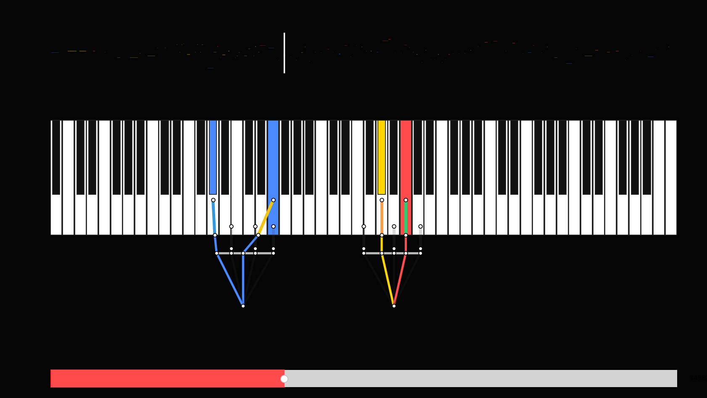

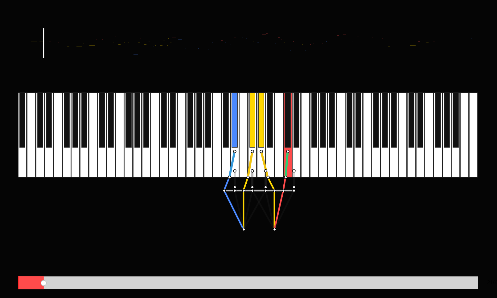

- MELODY(빨강) / BASS(파랑) / INNER(노랑) 성부별 색상 구분
- 손가락 번호(1~5번)별 색상 이중 채색
- MIDI 오디오 동기 재생, 타임라인 탐색 슬라이더

---

## 5.2 IK 기반 모션 생성 — 한승현

### 5.2.1 설계 방향

IK 계산은 실시간이 아닌 **오프라인 사전 계산** 단계에서 수행됩니다. 수렴 속도보다 정확도와 제약 처리 유연성을 우선하여 **Weighted DLS(Damped Least Squares) 방식의 Jacobian 기반 IK**를 채택하였습니다. 알고리즘 검증은 Vulkan 기반 테스트베드에서 MIDI 노트 시퀀스를 재생하며 수행하고, 최종 오프라인 계산 결과를 UE5로 전달하는 구조입니다.

### 5.2.2 손 모델 계층 구조 및 ROM 설정

관절 계층: **Wrist → Metacarpal → MCP → PIP → DIP → Fingertip**

| 관절 | 굴곡 범위 | 신전 범위 | 내외전 |
|---|---|---|---|
| MCP | 0° ~ 90° | 0° ~ 20° | **±35°** |
| PIP | 0° ~ 110° | 0° ~ 20° | — |
| DIP | 0° ~ 32° | 0° ~ 15° | — |
| 엄지 CMC | 0° ~ 50° | 0° ~ 50° | ±40° (축회전 0°~15°) |
| 엄지 MCP | 0° ~ 110° | 0° ~ 15° | — |
| 엄지 IP | 0° ~ 32° | 0° ~ 15° | — |

모든 관절 각도는 `std::clamp`로 ROM 범위 내로 강제 제한하여 생리적으로 불가능한 동작을 원천 차단합니다.

### 5.2.3 Weighted DLS IK 연산

중간보고의 DLS IK를 관절 한계를 반영하는 **Weighted DLS**로 확장하였습니다. 손가락당 최대 40회 반복, 허용 오차 0.01입니다.

1. 각 타임스텝마다 모든 관절 각도를 **0°(일자 자세)로 초기화**합니다. 이전 타임스텝 결과에 의존하지 않고 매번 같은 조건에서 풀 수 있습니다.
2. `computeFK`로 각 관절의 전역 변환을 갱신합니다.
3. 오차 벡터 $e = target - p_{end}$ 를 계산하고, $|e| < 0.01$ 이면 반복을 종료합니다.
4. 각 관절 $i$의 회전축 $a$와 끝점까지의 벡터를 외적하여 $3 \times 9$ Jacobian을 생성합니다: $J_{col} = a \times (p_{end} - p_i)$
5. **관절 한계 가중치**를 계산합니다. 각도를 가동 범위 안에서 $[-1, 1]$로 정규화한 뒤 한계에 가까울수록 비용이 급증합니다.
   - $\hat{q} = (q - q_{mid}) / q_{range}$
   - $w = 1 + 100 \cdot |\hat{q}|^6$
   - $W^{-1} = 1 / w$ (가동 범위가 0인 자유도는 $W^{-1} = 0$)
6. Weighted DLS 역행렬로 보정 오차를 구합니다 ($\lambda = 0.05$): $e^* = (J W^{-1} J^T + \lambda^2 I)^{-1} e$
7. 관절 변화량을 계산합니다: $\Delta\theta = W^{-1} J^T e^*$
8. **9개 자유도 전체 스텝 길이**가 0.1 rad을 넘으면 방향을 유지하고 길이만 줄입니다.
9. 각도를 갱신하고 `std::clamp`로 최종 제한합니다.

한계각에 가까운 관절은 $W^{-1}$이 0에 가까워져 거의 움직이지 않고, 나머지 관절이 움직임을 분담합니다. 하드 클램프에 의존하지 않고도 자연스럽게 관절 한계를 피하게 됩니다.

### 5.2.4 MIDI 노트 연동

IK 입력으로 운지법 엔진과 같은 `NoteEvent` 자료구조를 사용합니다.

```cpp
struct NoteEvent { float time_ms; int pitch; int velocity; float duration_ms; int hand; int finger; };
```

현재는 운지법 엔진과 연동하기 전 단계로, 모의 MIDI 데이터(`initMockMidiData`)로 검증하고 있습니다.

| 구간 | 시간 | 왼손 | 오른손 |
|---|---|---|---|
| 파트 1: 반음계 상행 | 0 ~ 6.0초 (500ms 간격) | C3~B3 12음, 손가락 5→1 순환 | C4~B4 12음, 손가락 1→5 순환 |
| 파트 2: C장조 화음 | 6.0 ~ 7.5초 | C3·E3·G3 (5·3·1번) | C4·E4·G4 (1·3·5번) |

각 음의 지속 시간은 450ms로, 다음 음까지 50ms 동안 손가락을 떼는 동작이 나오도록 하였습니다.

### 5.2.5 피아노 건반 모델

12개 반음을 균등하게 놓지 않고, 실제 피아노처럼 **흰 건반 폭을 기준으로** 배치하였습니다(옥타브당 흰 건반 7개). 흰 건반 폭은 손가락 전체 길이(1.75)에 비례하도록 **0.45**로 정하였습니다.

- 흰 건반: $z = 옥타브 \times 7 \times w + 흰건반순서 \times w$
- 검은 건반: 왼쪽 흰 건반 위치 $+ \; w \times (0.5 + bias)$
- 검은 건반 편향(bias): C#·F# −0.15, D#·A# +0.15, G# 0

| 구분 | 누르는 지점 X (앞뒤) | 누르는 지점 Y (높이) | 폭 |
|---|---|---|---|
| 흰 건반 | 0.8 | −0.5 | 0.45 − 간격 0.04 |
| 검은 건반 | 1.3 | −0.35 | 흰 건반의 50% |

검은 건반은 흰 건반보다 짧고 높으며 안쪽에 있습니다. 건반 메시와 IK 타겟이 `kWhiteKeyWidth` 상수를 공유하므로 위치가 어긋나지 않습니다.

### 5.2.6 손목 트래킹 및 아치형 궤적

중간보고의 베지어 기반 C↔F 전환은 정해진 두 자세 사이를 오가는 데는 적합했으나, 임의의 MIDI 시퀀스에서는 목표 위치가 수시로 바뀌므로 **목표 추적 + 지수 감쇠 보간** 방식으로 전환하였습니다.

**① 목표 위치 (손별, 활성 노트 기준)**

- **Z (좌우):** 손목을 누르는 손가락의 뿌리가 건반 바로 위에 오는 위치에 둡니다.
  - $wrist_z = \text{평균}(key_z - rootOffset_z)$
- **X (앞뒤):** 흰 건반 기준 위치에서 검은 건반까지 차이의 30%만 손목이 따라가고, 나머지는 손가락이 뻗어서 처리합니다.
  - $wrist_x = 0.8 + (\overline{key_x} - 0.8) \times 0.3 - 0.8$
- **검은 건반 높이 보정:** 누르는 건반의 평균 높이가 높은 만큼 그 30%를 손목 높이에 더합니다.

**② 아치형 높이**

이동할 거리가 많이 남을수록 손목을 위로 들어올립니다. XZ 평면 거리를 사용합니다.

$$target_y = 0.1 + |target_{xz} - current_{xz}| \times 0.2 + bias$$

**③ 타임스텝 독립 보간**

$$\alpha = 1 - e^{-k \cdot dt}$$

k값: 수평 이동 7.7, 높이 9.75. 계산 간격(dt)이 바뀌어도 손목 궤적이 같게 나와 오프라인 연산에서 출력 프레임레이트를 바꿔도 결과가 일관됩니다.

### 5.2.7 손가락 타겟 설정 및 타건 모션

1. **대기 자세:** 노트가 없는 손가락은 $wrist + rootOffset + (0.9, -0.35, 0)$ 을 목표로 합니다. 자연스럽게 아래로 굽은 이완 자세입니다.
2. **타건:** 노트가 배정된 손가락은 `getKeyPosition(pitch)`로 목표를 덮어씁니다.
3. **보간:** 타겟을 스텝마다 0.25 비율로 목표에 가깝게 옮깁니다. 이때 남은 거리 × 0.08만큼 Y를 올려서, 손가락이 살짝 들렸다가 건반을 내려치는 궤적을 만듭니다.

### 5.2.8 검증용 테스트베드 (Vulkan)

IK 결과를 눈으로 확인하기 위해 Vulkan으로 손가락 골격과 건반을 렌더링하는 테스트베드를 구현하였습니다.

| 정점 범위 | 내용 | 파이프라인 |
|---|---|---|
| 0 ~ 39 | 손가락 10개 × 관절 4개 골격 | 선(Line) |
| 40 ~ 79 | 타겟 십자선 10개 | 선(Line) |
| 80 ~ | 건반 사각형 | Triangle List, 컬링 없음 |

색상: 엄지 초록, 왼손 주황, 오른손 파랑, 타겟 빨간 십자선. 흰 건반을 먼저 그리고 검은 건반을 위에 그리며 깊이 테스트(`LESS`)로 겹침을 처리합니다.

**[그림] 양손 Weighted DLS IK 타건 결과 — Vulkan 테스트베드**

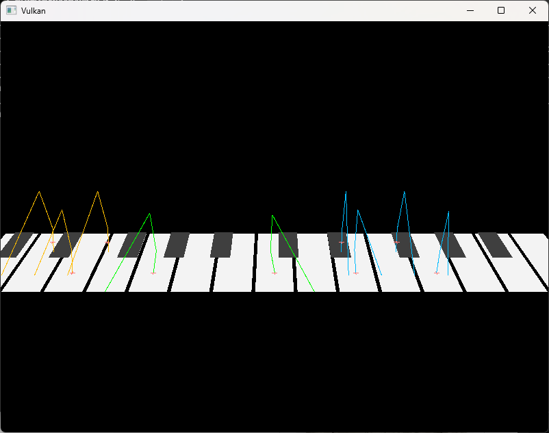

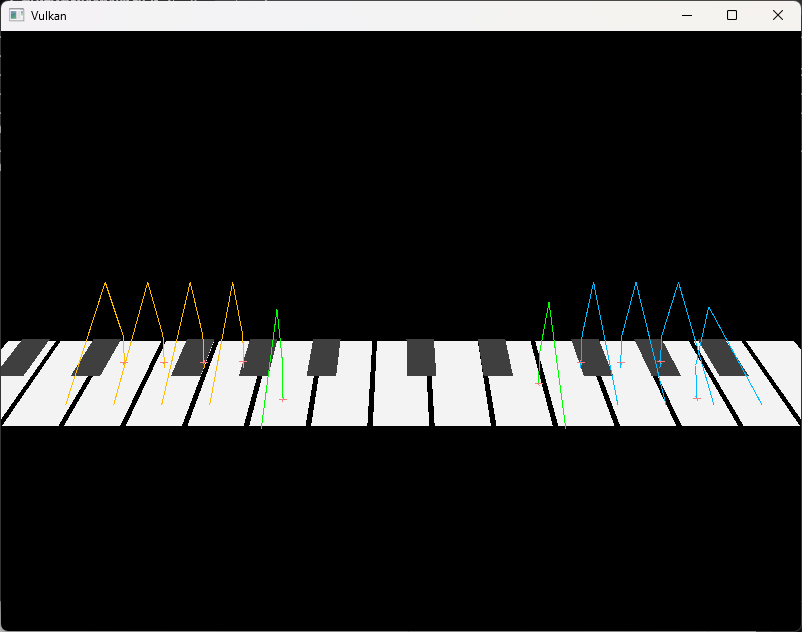

왼손(주황)·오른손(파랑)·엄지(초록) 골격과 타겟 십자선(빨강). 각 손가락이 배정된 건반의 누름 지점으로 수렴하고, 노트가 없는 손가락은 이완된 대기 자세를 유지합니다.

### 5.2.9 W03 확정 파라미터

| 항목 | 값 |
|---|---|
| 흑건 상면 Y 오프셋 | 3.0 cm |
| 건반 최대 누름 깊이 | 1.0 cm |
| IK 출력 프레임레이트 | 30 FPS |
| 손가락-손목 오프셋 (오른손 1~5번) | −4, −2, 0, +2, +4 반음 |

### 5.2.10 향후 연동 계획

- 운지법 엔진 JSON 연동 (`start_ms`→`time_ms`, `hand` 문자열→정수 매핑)
- 운지법 엔진의 손목 회전(`wrist_yaw_deg`, `wrist_roll_deg`) 반영
- 건반 관통 및 다중 손가락 충돌 방지 로직
- 오프라인 계산 결과를 UE5 Animation 시스템(MetaHuman 손 모델)으로 전달하는 데이터 파이프라인 구축

---

## 5.3 커스텀 GPU 스키닝 파이프라인 — 이수민

### 5.3.1 목표 및 1학기→2학기 전환

손가락이 굽혀질 때 피부 주름이 생기게 하는 것이 목표입니다. 엔진 기본 GPU 스키닝은 정점을 옮기기만 하며 표면 신장률을 계산하지 않으므로 주름이 생기지 않습니다.

1학기에는 SVE(Scene View Extension)를 이용해 포스트프로세스 단계에 커스텀 패스를 삽입하는 방식을 검증하였습니다. 2학기에는 계획대로 **후크 지점을 정점 처리 단계로 전환**, UE5의 `UMeshDeformer`를 상속하여 엔진 스킨 캐시를 커스텀 컴퓨트 셰이더로 대체하였습니다.

<div align="center">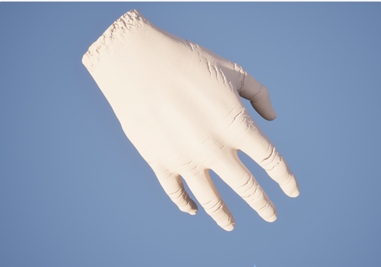</div>

<p align="center"><b>[그림 1]</b> 최종 결과. 손을 편 상태에서 마디마다 가로 주름이 보입니다.</p>

### 5.3.2 6-Pass 컴퓨트 셰이더 파이프라인

`UMeshDeformer`를 상속하여 컴퓨트 셰이더 6개를 글로벌 셰이더로 등록합니다.

```cpp
IMPLEMENT_GLOBAL_SHADER(FPianoHandSkinDeformerCS,      "/PianoHand/Private/CustomSkinningDeformer.usf", "DeformCS",           SF_Compute);
IMPLEMENT_GLOBAL_SHADER(FPianoHandTensionAccumulateCS, "/PianoHand/Private/CustomSkinningTension.usf",  "AccumulateCS",       SF_Compute);
IMPLEMENT_GLOBAL_SHADER(FPianoHandTensionResolveCS,    "/PianoHand/Private/CustomSkinningTension.usf",  "ResolveCS",          SF_Compute);
IMPLEMENT_GLOBAL_SHADER(FPianoHandDetailDisplaceCS,    "/PianoHand/Private/CustomSkinningDetail.usf",   "DisplaceCS",         SF_Compute);
IMPLEMENT_GLOBAL_SHADER(FPianoHandNormalAccumulateCS,  "/PianoHand/Private/CustomSkinningDetail.usf",   "NormalAccumulateCS", SF_Compute);
IMPLEMENT_GLOBAL_SHADER(FPianoHandNormalResolveCS,     "/PianoHand/Private/CustomSkinningDetail.usf",   "NormalResolveCS",    SF_Compute);
```

| 순서 | 패스 | 스레드 단위 | 역할 |
|---|---|---|---|
| ① | `DeformCS` | 정점 | 본 행렬로 위치·탄젠트 계산 (LBS / DQS) |
| ② | `AccumulateCS` | 삼각형 | 변 신장률을 계산해 정점에 누적 |
| ③ | `ResolveCS` | 정점 | 누적값 평균 → 정점 컬러 + strain 버퍼 |
| ④ | `DisplaceCS` | 정점 | 부피 보존 + 관절 주름 변위 |
| ⑤ | `NormalAccumulateCS` | 삼각형 | 변위 후 면 노멀 재계산 |
| ⑥ | `NormalResolveCS` | 정점 | 노멀 평균 + 탄젠트 재직교화 |

결과는 GPU skin passthrough 정점 팩토리 버퍼에 직접 씁니다. 머티리얼·그림자·라이팅 경로는 그대로 사용합니다.

```cpp
FRDGBufferRef PositionBuffer = FSkeletalMeshDeformerHelpers::AllocateVertexFactoryPositionBuffer(
    GraphBuilder, ExternalAccessQueue, MeshObject, LodIndex, TEXT("PianoHandSkinDeformerPosition"));
// ... 6개 패스 디스패치 ...
FSkeletalMeshDeformerHelpers::UpdateVertexFactoryBufferOverrides(
    GraphBuilder, MeshObject, LodIndex, bInvalidatePreviousPosition);
```

> **Nanite를 쓰지 않은 이유:** Nanite 메시는 passthrough 정점 팩토리를 우회합니다. 정점 밀도는 에셋 단계 PN 테셀레이션으로 올렸습니다. ⑤⑥ 노멀 재계산 패스가 빠지면 정점이 움직여도 주름이 화면에 전혀 보이지 않습니다 — 초기 구현에서 실제로 겪은 문제입니다.

### 5.3.3 텐션(Strain) 계산

기준 자세의 변 길이와 스키닝 후 변 길이를 비교합니다.

```hlsl
// CustomSkinningTension.usf — AccumulateCS
void AccumulateEdge(uint A, uint B, float3 RestA, float3 RestB, float3 SkinA, float3 SkinB)
{
    const float RestLen = length(RestB - RestA);
    const float SkinLen = length(SkinB - SkinA);
    if (RestLen < 1e-5f) return;                 // 중복 정점으로 생긴 0길이 변은 제외

    const float Strain = clamp(SkinLen / RestLen - 1.0f, -8.0f, 8.0f);
    const int   Packed = (int)round(Strain * TENSION_FIXED_SCALE);

    InterlockedAdd(StrainAccum[A], Packed);      // 여러 삼각형이 같은 정점에 동시에 쓴다
    InterlockedAdd(StrainAccum[B], Packed);
    InterlockedAdd(StrainCount[A], 1u);
    InterlockedAdd(StrainCount[B], 1u);
}
```

- **양수**: 늘어남 (손등·손가락 바깥)
- **음수**: 눌림 (손바닥·마디 안쪽)
- float atomic add는 GPU에서 사용 불가. `TENSION_FIXED_SCALE`(65536)을 곱해 int로 변환 후 atomic 누적. strain을 ±8로 clamp하면 정점에 변이 4,000개 붙어도 int32가 넘치지 않습니다.

`ResolveCS`에서 평균을 내고 정점 컬러로 출력합니다.

<div align="center">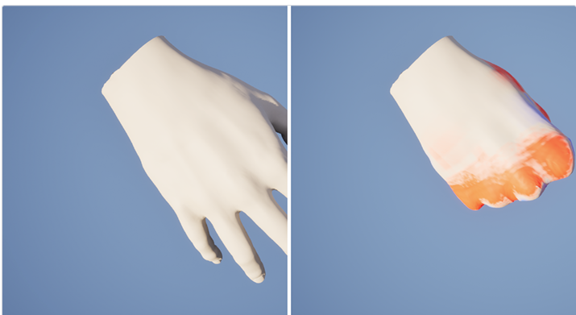</div>

<p align="center"><b>[그림 2]</b> 텐션 디버깅. 왼쪽은 기준 자세로 변형이 없습니다. 오른쪽은 주먹을 쥔 상태입니다.<br/>빨강이 늘어난 곳(손등·손가락 바깥), 파랑이 눌린 곳(손바닥·마디 안쪽)입니다.</p>

### 5.3.4 관절 위치 판별 — 스킨 웨이트 기반

주름은 관절에만 생겨야 합니다. 별도 마스크를 쓰면 메시가 바뀔 때마다 다시 만들어야 합니다. 관절 위의 정점은 정의상 두 본이 섞이는 정점이므로, 스킨 웨이트에서 직접 뽑았습니다.

```hlsl
// CustomSkinningDetail.usf — DisplaceCS
// 강체 부분에서 0, 관절의 50:50 블렌드 선에서 정확히 1
const float JointBlend = saturate(4.0f * LargestWeight * SecondWeight);
const float JointBand  = pow(max(JointBlend, 0.0f), max(CreaseSharpness, 1.0f));
```

별도 마스크 없이 어떤 스켈레탈 메시에도 적용됩니다.

**부피 보존:** 면 방향 신장률이 λ이면 비압축 가정에서 두께는 `1/λ²`배가 됩니다. 눌린 쪽이 법선 방향으로 부풀어 올라 LBS의 사탕포장지 변형을 방지합니다.

```hlsl
const float Lambda     = max(1.0f + Strain, 0.2f);
const float VolumeTerm = VolumeBulge * clamp(1.0f / (Lambda * Lambda) - 1.0f, -2.0f, 2.0f);
```

### 5.3.5 이력(History) — 폈다 놓은 직후 남는 주름

당겨졌던 피부는 바로 원래대로 돌아가지 않습니다. 잠시 주름이 남습니다. strain 하나로는 표현할 수 없습니다 — 쭉 펴고 있던 손가락과 방금 편 손가락의 strain이 같기 때문입니다. **직전 프레임 상태를 기억해야 합니다.**

```hlsl
// CustomSkinningTension.usf — ResolveCS
// RelaxState는 프레임 사이에 유지되는 버퍼 (.x = 직전 strain, .y = 남은 여유분)
const float2 PrevState   = (bResetRelax != 0u) ? float2(Strain, 0.0f) : RelaxState[V];
const float  PrevStretch = max(PrevState.x, 0.0f);
const float  NowStretch  = max(Strain, 0.0f);

float Slack = PrevState.y;
Slack += max(PrevStretch - NowStretch, 0.0f) * RelaxGain;   // 신장이 풀리면 여유분이 생기고
Slack -= max(NowStretch - PrevStretch, 0.0f) * RelaxGain;   // 다시 당기면 곧바로 사라진다
Slack  = saturate(Slack) * exp(-DeltaTime / max(RelaxTau, 1e-3f));

RelaxState[V] = float2(Strain, Slack);
ColorBufferUAV[V] = float4(saturate(T), saturate(-T), 0.5f + 0.5f * clamp(T, -1, 1), Slack);
```

버퍼를 프레임 사이에 유지하는 것이 핵심입니다. RDG의 `QueueBufferExtraction`과 `RegisterExternalBuffer`로 왕복시켰습니다. `Slack`은 정점 컬러 **알파 채널**로 나가 머티리얼이 주름을 되살리는 데 사용합니다.

<div align="center">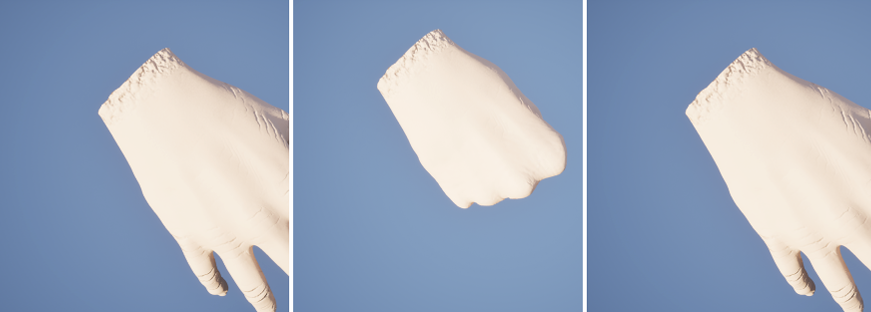</div>

<p align="center"><b>[그림 3]</b> 굴곡 사이클. 편 상태 / 주먹 / 막 편 직후입니다.<br/>세 번째의 주름이 첫 번째보다 깊습니다. 이 차이가 이력(Slack) 버퍼의 효과입니다.</p>

### 5.3.6 손 모델 교체 (MetaHuman)

기존 VR 템플릿 손은 관절이 단순한 2본 블렌드라 관절 밴드가 해부학과 어긋났습니다. MetaHumanCharacter 플러그인의 템플릿 바디에서 오른손만 잘라 교체했습니다.

| 단계 | 삼각형 | 정점 |
|---|---:|---:|
| 원본 바디 `SKM_Body` | 60,816 | 30,455 |
| 오른손 추출 | 9,624 | 4,834 |
| PN 테셀레이션 (level 3) | 154,624 | 77,314 |

<div align="center">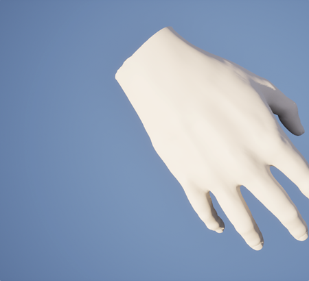</div>

<p align="center"><b>[그림 4]</b> 추출한 오른손. 손목 절단면은 삼각형 팬으로 막았습니다.</p>

두 가지 처리가 필요했습니다.

- **보조 본 정리**: MetaHuman은 정점 하나에 평균 9.6개 본을 묶습니다. 대부분 한 마디 안쪽의 보조 본이라 상위 두 웨이트가 같은 마디에 앉습니다. 평평한 손가락에서도 `4·w₀·w₁`이 1로 읽히는 문제가 발생합니다. 보조 본을 주 관절로 합쳐 평균 3.5개로 줄였습니다.
- **UV 재패킹**: 손 UV가 바디 아틀라스의 사선 조각이라 텍스처의 10%만 덮었습니다. 섬 회전을 포함해 재패킹해 47%로 올렸습니다.

관절별로 주름이 몰리는 정도는 리그에서 미리 계산해 텍스처로 구웠습니다.

| 채널 | 내용 |
|---|---|
| R | 가중치 적용 관절 밴드 |
| G | 관절 피벗 기준 뼈 축 방향 부호 거리 (±3 cm) |
| B | 원본 관절 밴드 |
| A | 손등 / 손바닥 판별값 |

<div align="center">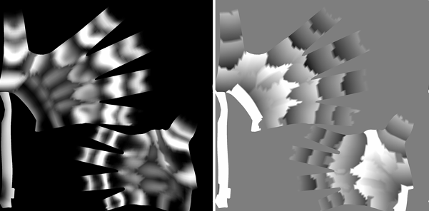</div>

<p align="center"><b>[그림 5]</b> 구운 맵의 R 채널(좌)과 G 채널(우). 밴드가 각 마디에 앉아 있습니다.<br/>셰이더는 G에 <code>sin()</code>을 적용해 손가락을 가로지르는 주름선을 만듭니다.</p>

### 5.3.7 손등과 손바닥은 반대로 동작한다

관절 밴드는 스킨 웨이트에서 나오므로 관절을 빙 둘러 깔립니다. 실제 피부는 두 면이 반대로 움직입니다.

| | 손 펼 때 | 주먹 쥘 때 |
|---|---|---|
| 손바닥 | 주름 적음 | 주름 깊어짐 |
| 손등 (마디 위) | 여유 피부가 뭉쳐 **주름 생김** | 팽팽히 당겨져 **주름 사라짐** |

베이크 단계에서 정점마다 "굽힐 때 늘어나는 쪽인지"를 계산해 마스크 알파에 넣었습니다. 굽힘은 본 로컬 +Z 축 기준 음수 회전 θ이며, 피벗에서 `u = cross(flexAxis, boneDir)` 방향으로 h만큼 떨어진 점은 `−h·θ`만큼 변합니다. `h > 0`이면 늘어나므로 u가 손등 방향입니다. 부호는 기준 자세에 40° 굽힘을 직접 적용해 검증하였습니다.

| 검증 항목 | 값 |
|---|---:|
| 상관계수 `corr(dorsality, strain)` | **+0.68** |
| dorsality > +0.5 평균 변형률 | **+6.9 %** (늘어남) |
| dorsality < −0.5 평균 변형률 | **−9.4 %** (눌림) |

<div align="center">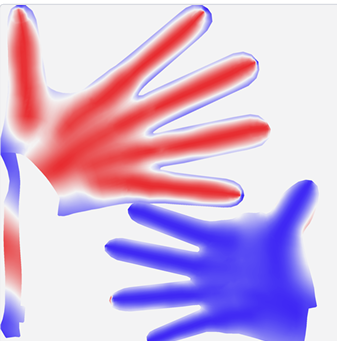</div>

<p align="center"><b>[그림 6]</b> 구워낸 판별 채널. 빨강이 손등, 파랑이 손바닥입니다.</p>

셰이더 게이트를 손등/손바닥 둘로 나눕니다.

```hlsl
// PianoHandSkin.ush
float PH_CreaseGate(
    float Dorsal, float Compress, float Stretch, float Relax,
    float PalmarBase, float PalmarCompress, float PalmarIron, float PalmarRelax,
    float DorsalBase, float DorsalIron, float DorsalRelax)
{
    float Palm = PalmarBase + Compress * PalmarCompress + Relax * PalmarRelax - Stretch * PalmarIron;
    float Back = DorsalBase                            + Relax * DorsalRelax - Stretch * DorsalIron;
    return saturate(lerp(Palm, Back, Dorsal));
}
```

손등 쪽 `Back`에는 **압축 항이 없습니다**. 기본 여유분 `DorsalBase`에서 시작해 신장이 그것을 깎아냅니다.

| 파라미터 | 의미 | 값 |
|---|---|---:|
| `PalmarBase` | 편 손바닥에 남는 기본 주름 | 0.30 |
| `PalmarCompress` | 쥘 때 손바닥 주름이 깊어지는 속도 | 2.6 |
| `PalmarIron` | 펼 때 펴지는 속도 | 1.2 |
| `DorsalBase` | 편 상태에서 손등에 뭉치는 주름 | 0.40 |
| `DorsalIron` | 쥘 때 팽팽해지는 속도 | 5.0 |
| `DorsalRelax` | 막 편 직후 되살아나는 주름 | 4.0 |
| `SideSharpness` | 손등↔손바닥 전환 폭 | 2.0 |

<div align="center">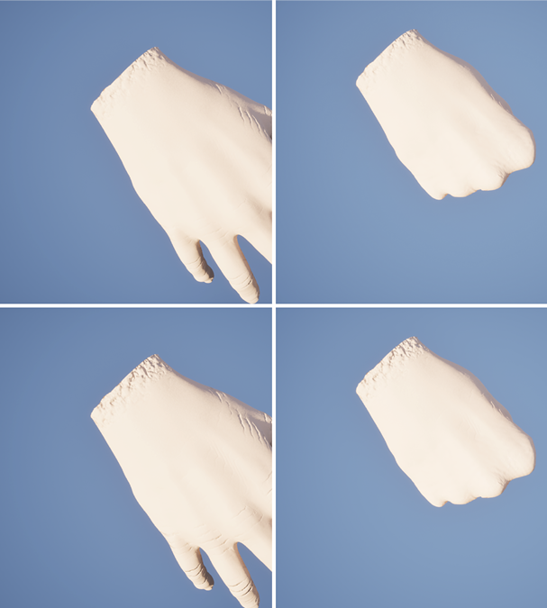</div>

<p align="center"><b>[그림 7]</b> 게이트 하나였을 때(위)와 둘로 나눈 뒤(아래). 왼쪽이 편 손, 오른쪽이 주먹입니다.<br/>수정 전에는 편 손이 매끈하고 주먹에서 주름이 보입니다. 수정 후에는 반대가 됩니다.</p>

<div align="center">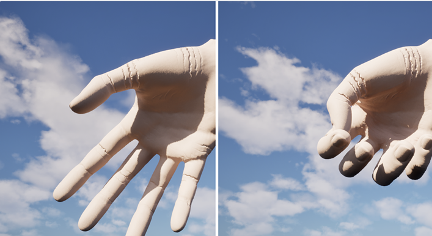</div>

<p align="center"><b>[그림 8]</b> 손바닥. 같은 베이크 데이터로 반대로 동작합니다. 쥘수록 주름이 깊어집니다.</p>

### 5.3.8 한계 및 향후 계획

- **손바닥 접힘선**(생명선 등)은 관절 밴드로 나오지 않습니다. 별도 채널이나 수작업 맵이 필요합니다.
- **성능 측정 미완료**: 정점 77k에 컴퓨트 패스 6개의 프레임 비용을 측정해야 합니다.
- **이력 효과 감쇠 약 0.9초**: 정지 화면으로는 확인이 어렵습니다. 시퀀서 렌더로 검증할 예정입니다.
- **손목 절단면** 가장자리 노멀이 거칩니다. 커프를 씌우거나 경계를 평활할 계획입니다.
- 4.1·4.2 모듈의 실제 연주 모션 위에서 동작 확인 예정입니다.

---

## 5.4 Chaos Flesh PBD Skinning — 곽경민

### 5.4.1 목표 및 역할 분담

손가락이 굽혀질 때 살이 실제 물리처럼 눌리고 밀리게 하는 것이 목표입니다. LBS는 정점을 본 행렬로 옮기기만 합니다. 관절 안쪽 살이 서로 파고들고, 부피가 줄어듭니다. Chaos Flesh는 손 내부를 사면체로 채워 뼈에 묶고 물리로 시뮬레이션합니다. 눌린 살은 부피를 유지하려고 옆으로 밀려납니다.

이번 기간에는 통합 프로젝트에서 Flesh 에셋을 다시 만들고, 굴곡 애니메이션을 따라 Flesh가 변형되는 것까지 확인하였습니다.


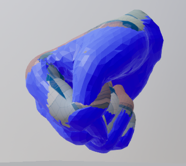

*그림 1. 주먹을 쥐는 애니메이션을 Flesh(파랑)가 따라갑니다.*

중간보고 이후 5.3의 커스텀 GPU 스키닝이 주름·핏줄까지 만들게 되었습니다. 두 모듈이 같은 일을 하지 않도록 역할을 나눴습니다.

| | 5.3 커스텀 GPU 스키닝 | 5.4 Chaos Flesh |
|---|---|---|
| 변형 계산 근거 | 스킨 웨이트 (LBS/DQS) + 변 신장률 | 사면체 볼륨의 물리 시뮬레이션 |
| 표현 대상 | 주름·핏줄·미세 노멀 | 살 눌림·부피 보존 |
| 스케일 | 미시 디테일 | 거시 변형 |

5.3의 부피 보존 항은 `1/λ²`라는 가정으로 계산한 **추정값**입니다. Flesh는 사면체끼리 서로 밀어내며 **실제로 계산**합니다. 최종 구조: **Flesh가 계산한 표면 위치 → 5.3 파이프라인 입력**으로 연결하여, 물리 변형된 표면 위에 주름·핏줄이 올라가는 구조를 목표로 합니다.

### 5.4.2 손 모델

5.3과 같은 메시를 씁니다. 나중에 결과를 합쳐야 하기 때문입니다. 5.3의 손 모델이 바뀔 때마다 따라갔습니다.

| 시기 | 메시 | 정점 | 비고 |
|---|---|---:|---|
| 1학기 | `fbx_Clean` | — | 전신 모델, Bone Filter로 손·팔만 사면체화 |
| 2학기 초 | `SKM_MannyXR_right` | 3,239 | UE 5.6 VR 템플릿 손 |
| 현재 | `SKM_MH_Hand_R` | 4,834 | MetaHuman 바디에서 오른손만 추출 |

같은 메시가 필요한 이유는 5.4.6에 있습니다. Flesh는 **메시 이름**으로 애니메이션 뼈를 찾습니다. 시뮬레이션에는 PN 테셀레이션 전 원본 메시(`4,834 정점`)를 씁니다. 고밀도 메시(`77k 정점`)는 렌더링용입니다.

### 5.4.3 Dataflow 그래프

Flesh 에셋은 Dataflow 그래프로 만듭니다. 1학기에는 Geometry 생성과 바인딩을 그래프 두 개로 나눴습니다. 지금은 대상이 손 하나뿐이고 파라미터를 자주 바꿔야 해서 **하나로 통합**하였습니다.

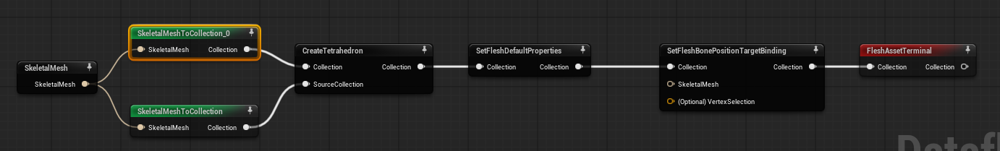

*그림 2. SkeletalMesh → SkeletalMeshToCollection_0(Import Transform Only) + SkeletalMeshToCollection → CreateTetrahedron → SetFleshDefaultProperties → SetFleshBonePositionTargetBinding → FleshAssetTerminal*

| 노드 | 역할 | 설정 |
|---|---|---|
| `SkeletalMesh` | 입력 모델 | `SKM_MH_Hand_R` |
| `SkeletalMeshToCollection_0` (위) | 뼈 계층만 변환 | **Import Transform Only ✔** |
| `SkeletalMeshToCollection` (아래) | 표면 형상 변환 | 기본값 |
| `CreateTetrahedron` | 표면 내부를 사면체로 채움 | Method: **TetWild** |
| `SetFleshDefaultProperties` | 물성 초기값 설정 | 아래 표 |
| `SetFleshBonePositionTargetBinding` | 사면체 정점 → 뼈 스프링 | Stiffness 10,000 / Search Radius 1.0 |
| `FleshAssetTerminal` | Flesh 에셋으로 저장 | — |

`CreateTetrahedron`의 두 입력은 역할이 다릅니다. 엔진 소스를 확인하였습니다.

```cpp
// ChaosFleshCreateTetrahedronNode.cpp (UE 5.6, 발췌)
TUniquePtr<FFleshCollection> InCollectionVal(
    GetValue<DataType>(Context, &Collection).NewCopy<FFleshCollection>());
TUniquePtr<FFleshCollection> InSourceCollectionVal(
    GetValue<DataType>(Context, &SourceCollection).NewCopy<FFleshCollection>());
// SourceCollection의 형상으로 사면체를 만들어 InCollectionVal에 덧붙인다
SetValue<const DataType&>(Context, *InCollectionVal, &Collection);  // 출력 = Collection 입력의 복사본 + 사면체
```

출력은 `Collection` 입력을 **그대로 복사한 것**에 사면체를 붙인 것입니다. 뼈 정보는 반드시 `Collection` 포트로 들어가야 합니다. 형상까지 든 컬렉션을 넣으면 원래 표면 메시가 사면체와 함께 중복으로 들어갑니다. 그래서 `Collection` 쪽은 **Import Transform Only**로 뼈만 넣습니다.

**물성 파라미터:**

| 파라미터 | 의미 | 값 |
|---|---|---:|
| `Density` | 밀도 | 1.0 |
| `Vertex Stiffness` | 형태 유지 강성 | 1,000,000 |
| `Vertex Damping` | 진동 감쇠 | 0.0 |
| `Vertex Incompressibility` | 부피 보존 강도 | 0.6 |
| `Vertex Inflation` | 내부 압력 | 0.5 |

### 5.4.4 사면체 생성 — IsoStuffing에서 TetWild로

기본 방식은 IsoStuffing입니다. 바운딩 박스를 격자로 나누고 메시 안쪽에 있는 칸에 사면체를 채웁니다.

**격자 해상도 문제:** `Num Cells` 기본값 32에서 칸 크기는 약 0.6 cm(손 길이 약 19 cm 기준)입니다. 손가락 두께가 1.5~2 cm라 단면에 2~3칸밖에 안 들어갑니다. 48로 올려 칸을 약 0.4 cm로 줄였습니다. 3차원 격자라 칸 수는 `(48/32)³ ≈ 3.4`배가 됩니다.

**MetaHuman 손에서 실패:** 손 모델을 바꾸자 손바닥만 채워지고 손가락은 끝 조각만 남았습니다. IsoStuffing은 칸마다 "메시 안쪽인가"를 판정하므로 틈이 없는 닫힌 메시가 필요합니다. 이 메시는 전신 바디에서 잘라낸 것으로 표면에 틈이 남아 있어 안팎 판정이 실패한 것으로 분석됩니다.

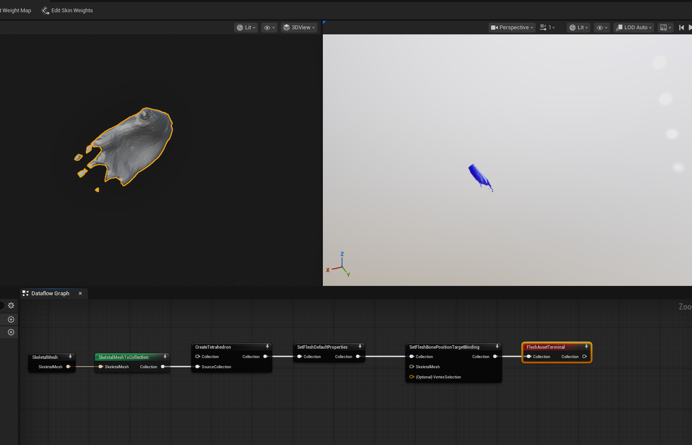

틈이 있는 메시에도 안정적인 **TetWild**로 전환하였습니다.

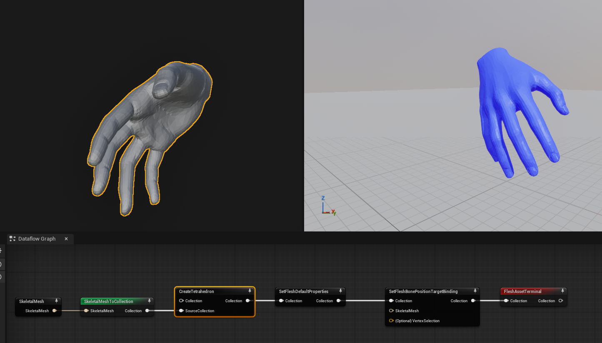

### 5.4.5 뼈 바인딩

`SetFleshBonePositionTargetBinding`은 사면체 정점을 가까운 뼈에 스프링으로 묶습니다. **Position Target** 모드는 완전히 고정하지 않고 목표 위치로 당겨, 살이 약간 늦게 따라오는 효과가 납니다.

처음에는 손가락 끝이 아래로 처지고 뭉개졌습니다. 손끝은 마지막 뼈(`_03`)보다 바깥에 있어, 탐색 반경이 0이면 손끝 정점이 바인딩 범위 밖에 남습니다. Search Radius를 1.0으로 올려 해결하였습니다.


단, 이 조정은 뼈 정보가 빠진 상태(5.4.6)에서 한 것이므로 뼈 정보 복원 후 다시 검증해야 합니다.

### 5.4.6 애니메이션 추종

Flesh 에셋 에디터의 Preview Scene에서 굴곡 애니메이션(`A_MH_Hand_Cycle`, 4초 굴곡 사이클)을 재생하였습니다.

| 위치 | 항목 | 값 |
|---|---|---|
| Asset Details → Animation | Skeletal Mesh | `SKM_MH_Hand_R` |
| Asset Details → Animation | Skeleton | `metahuman_base_skel` |
| Preview Scene | Animation Asset | `A_MH_Hand_Cycle` |

처음에는 스켈레탈 메시만 주먹을 쥐고 Flesh는 기본 자세에 멈춰 있었습니다.


에디터 로그에 손의 뼈 22개 전부에 대해 같은 에러가 있었습니다.

```
ChaosFleshSetFleshBonePositionTargetBindingNodeLog: Error: Collection does not contain bone[hand_r].
ChaosFleshSetFleshBonePositionTargetBindingNodeLog: Error: Collection does not contain bone[index_01_r].
...
```

바인딩 노드는 컬렉션 안에서 **뼈 이름**으로 뼈를 찾습니다. 런타임에도 동일하게 동작합니다.

```cpp
// ChaosDeformableTetrahedralComponent.cpp (UE 5.6, 발췌)
TSet<int32> Roots = TransformSource.GetTransformSource(
    Skeleton->GetName(), Skeleton->GetGuid().ToString(), SkeletalMesh->GetName());
if (!Roots.IsEmpty() && ...)
{
    const TArray<FTransform>& ComponentTransforms = SkeletalMeshComponent->GetComponentSpaceTransforms();
    AnimationTransforms[Adx] = ComponentTransforms[Cdx];   // 찾으면 애니메이션 뼈 사용
}
// 못 찾으면 AnimationTransforms는 기준 자세 그대로 → 경고 없이 멈춰 있는다
```

**스켈레톤 이름 + GUID + 메시 이름**으로 조회합니다. 5.4.2에서 5.3과 같은 메시를 써야 한다고 한 이유가 이것입니다. 그래프 통합 과정에서 `CreateTetrahedron`의 `Collection` 포트에 뼈 정보가 누락된 것이 원인이었습니다. `Import Transform Only` 갈래를 `Collection` 포트에 올바르게 연결하여 에러가 해소되고 Flesh가 애니메이션을 따라가는 것을 확인하였습니다.

### 5.4.7 한계 및 향후 계획

- **바인딩 파라미터 재조정 필요**: Stiffness와 Search Radius는 뼈가 빠진 상태에서 정한 값입니다.
- **부위별 바인딩 미구현**: 손끝·손목은 단단하게, 손등·손바닥은 유연하게 나눌 계획입니다. `VertexSelection` 입력으로 영역을 지정합니다.
- **물성 기본값에 가까움**: Damping이 0이라 초기 관통 해소 시 튀어 오르는 현상이 있습니다. Inflation은 얇은 손가락을 부풀릴 가능성이 있습니다. 추가 테스트 후 조정 예정입니다.
- **LBS 대비 비교 미완료**: 같은 프레임에서 관절부 형상을 나란히 비교할 예정입니다.
- **5.3 파이프라인 연동**: Flesh가 계산한 표면 위치를 5.3의 입력으로 넘기는 어댑터를 만들 예정입니다.
- **시뮬레이션 전용 메시**: TetWild는 생성이 느립니다. 틈을 메운 전용 메시를 따로 만들면 IsoStuffing으로 되돌릴 수 있습니다.

---

# 6. 주요 기술적 도전 및 해결

## 6.1 왼손 운지법 역전 문제 (01_Fingering)

**현상:** 왼손의 엄지(1번)가 가장 낮은 피치를, 새끼(5번)가 가장 높은 피치를 누르는 X자 꼬임 발생

**원인:** "낮은 피치 = 낮은 번호 손가락"이라는 오른손 중심 논리를 양손에 동일하게 적용. 왼손은 오른손의 거울상이므로 매핑 반전 필요.

**해결:** 왼손 연산 시 손가락 번호 조합 역순 배정 `(1,2,3)` → `(5,4,3)`, 교차 판정 로직 방향별 재구축.

## 6.2 IK 특이점 문제 (02_IK)

**현상:** 특정 자세에서 IK 계산값이 발산하여 불안정한 모션 생성

**원인:** 표준 Jacobian 역행렬 계산 시 특이점(Singularity) 근방에서 역행렬이 수치적으로 불안정합니다.

**해결:** $JJ^T + \lambda^2 I$ 형태의 **DLS** 역행렬을 적용하였습니다 ($\lambda = 0.05$). 또한 각도 변화량에 최대 스텝 제한을 두어 과도한 발산을 방지하였습니다. (이후 관절별 제한에서 9-DOF 전체 스텝 제한으로 변경 → 6.7절 참고)

## 6.3 GPU 셰이더 노멀 갱신 누락 (03_Skinning)

**현상:** 정점은 움직여도 주름이 화면에 전혀 보이지 않음

**원인:** 초기 구현에서 ⑤⑥ 노멀 재계산 패스 누락. 정점 위치가 변해도 노멀이 그대로면 라이팅 계산에 반영되지 않음.

**해결:** NormalAccumulateCS + NormalResolveCS 2개 패스 추가

## 6.4 손등·손바닥 주름 방향 반전 문제 (03_Skinning)

**현상:** 편 손에서 매끈하고 주먹에서만 주름이 보이는 비정상 동작. 실제 피부는 반대.

**원인:** 주름 게이트가 "눌리면 깊어진다" 단일 로직이었음. 손등과 손바닥의 구분 없이 같은 gate 적용.

**해결:** 베이크 단계에서 손등/손바닥 판별값(`dorsality`) 마스크를 구워 셰이더 게이트를 양면 분리. `corr(dorsality, strain) = +0.68` 검증.

## 6.5 IsoStuffing 손가락 볼륨 생성 실패 (04_Flesh)

**현상:** MetaHuman 손 모델 적용 후 손가락 볼륨이 완전히 빔

**원인:** IsoStuffing의 안팎 판정이 표면 틈이 있는 메시에서 실패

**해결:** 비유사 메시에 안정적인 **TetWild** 방식으로 전환하여 5개 손가락 전체 볼륨 생성 확인

## 6.6 Chaos Flesh 애니메이션 추종 불가 (04_Flesh)

**현상:** 스켈레탈 메시만 움직이고 Flesh는 기본 자세에 멈춤

**원인:** 그래프 통합 과정에서 `CreateTetrahedron`의 `Collection` 포트에 뼈 정보가 누락됨. 바인딩 노드가 컬렉션 내 뼈 이름으로 탐색하는 구조.

**해결:** `Import Transform Only` 갈래를 `Collection` 포트에 올바르게 연결하여 뼈 계층 복원. 에러 해소 및 애니메이션 추종 확인.

## 6.7 IK 국소해 고착 문제 (02_IK)

**현상:** 양손 10개 손가락으로 확장한 뒤, 일부 손가락이 관절 한계각에 걸린 채 목표에 도달하지 못하였고, 이후 타임스텝에서도 이 상태에서 빠져나오지 못하였습니다.

**원인:** 반복별 디버그 출력으로 세 가지 원인을 확인하였습니다.

1. `std::clamp`만으로 관절 한계를 처리하여, 이미 한계에 닿은 관절에도 계속 움직임이 배정되고 클램프로 잘리는 무의미한 스텝이 반복되었습니다.
2. 최대 스텝 제한(0.1 rad)을 관절마다 따로 적용하여, 길이 1.0인 Joint0과 0.25인 Joint2가 매 반복 같은 각도만큼만 움직였습니다. 짧은 관절이 필요 이상으로 빨리 한계각에 닿았습니다.
3. 이전 타임스텝의 관절 각도에서 IK를 시작(웜스타트)하여, 한 번 빠진 나쁜 상태가 계속 이어졌습니다.

**해결:**

1. 관절 한계에 가까울수록 해당 관절의 참여를 줄이는 **Weighted DLS**를 적용하였습니다(5.2.3절). 하드 클램프는 마지막 안전장치로만 남겼습니다.
2. 9개 자유도 전체를 하나의 벡터로 보고 **전체 스텝 길이만** 제한하여, 관절 간 분배 비율을 유지하였습니다.
3. 각 타임스텝마다 관절 각도를 **0°로 초기화**한 뒤 새로 풀도록 하였습니다.

## 6.8 검은 건반 도달 실패 (02_IK)

**현상:** 일반 손가락이 검은 건반을 정확히 누르지 못하였고, 한 손가락만 건반을 누를 때도 옆으로 크게 뻗는 부자연스러운 자세가 나왔습니다.

**원인:** 검은 건반은 흰 건반 사이, 더 안쪽에 더 높게 있어 손가락이 옆과 앞으로 더 뻗어야 합니다. 그런데 MCP 외전 한계가 ±20°로 좁았습니다. 또한 손목을 누르는 건반들의 **평균 위치**에 두어, 각 손가락이 자기 `rootOffset`(최대 0.8)만큼 옆으로 더 뻗어야 했습니다.

**해결:**

1. MCP 외전 범위를 ±20°에서 **±35°**로 넓혔습니다(5.2.2절).
2. 손목을 **누르는 손가락의 뿌리가 건반 바로 위에 오는 위치**에 두도록 바꾸었습니다(5.2.6절).
3. 검은 건반을 누를 때는 손목이 앞쪽으로 차이의 30%만 이동하고 살짝 들리도록 하여, 나머지 거리는 손가락이 뻗어서 처리하게 하였습니다.

---

# 7. 결과물 분석

## 7.1 운지법 처리 결과 (12개 MIDI)

| 곡명 | 음표 수 | 곡 길이 | 왼손/오른손 | 흑건 비율 |
|------|---------|---------|------------|---------|
| 드뷔시 Clair de Lune | 1,466 | 6.5분 | 763 / 703 | 73.9% |
| Super Mario 64 Medley | 5,435 | 15.7분 | 996 / 4,439 | 17.8% |
| Queen Bohemian Rhapsody | — | — | — | — |
| Driftveil City BW | — | — | — | — |
| Wii Sports Theme | — | — | — | — |
| 외 7곡 | — | — | — | — |

## 7.2 손가락 사용 분포

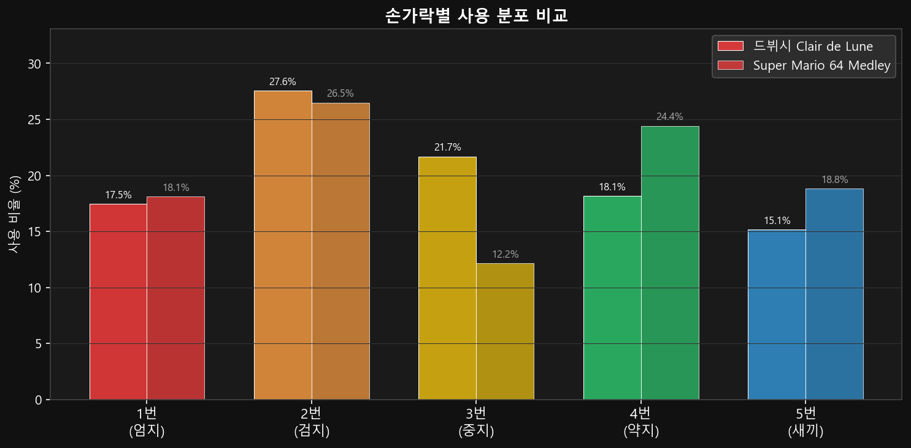

- 드뷔시: 흑건 비율 73.9%로 모든 손가락이 고르게 사용됨
- 마리오: 주선율이 오른손 집중 → 2번(26.5%), 4번(24.4%) 높음
- 약지(4번) 기피 패턴이 DP 비용(+6)으로 적절히 억제됨

## 7.3 피아노 롤 시각화

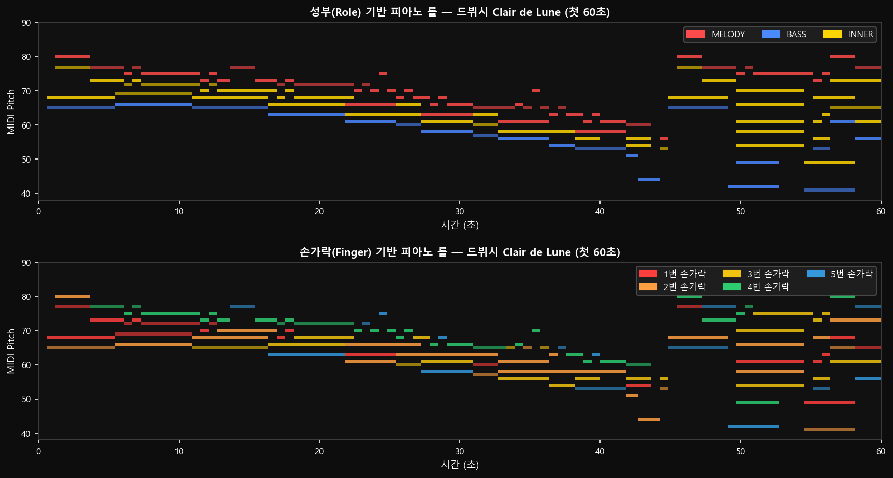

위: 성부(MELODY/BASS/INNER) 기반 채색 / 아래: 손가락 번호 기반 채색

## 7.4 손목 Yaw 각도 분포

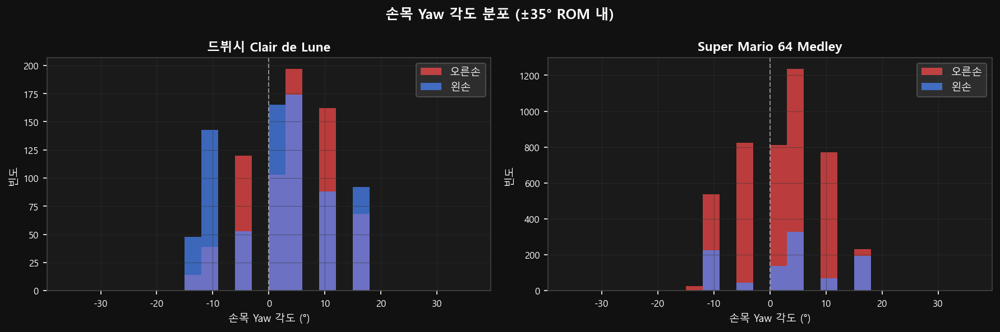

손목 Yaw 각도가 ±35° ROM 내에서 정규 분포. 드뷔시의 분포가 더 넓은 것은 흑건 음형이 손목 회전을 더 많이 요구하기 때문입니다.

## 7.5 성부 역할 분포

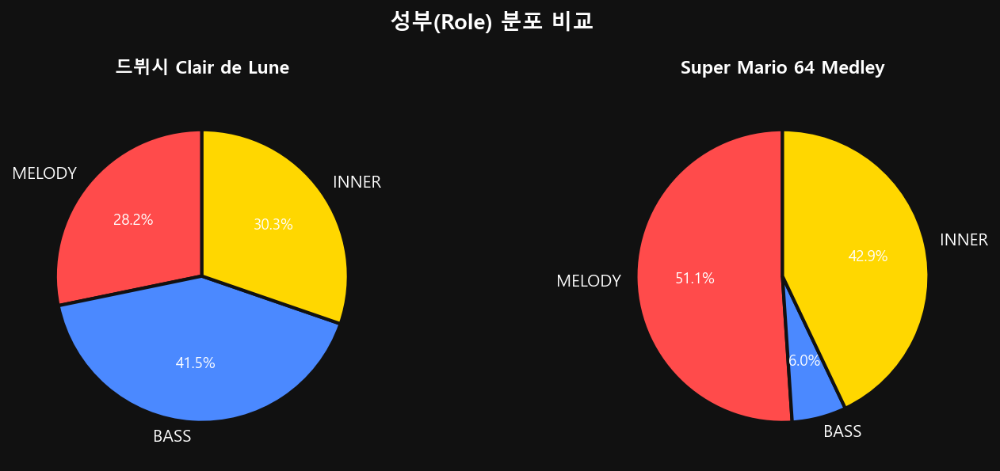

## 7.6 GPU 스키닝 결과

- 편 손 상태에서 마디마다 가로 주름이 관찰됨 (손등 기본 주름)
- 주먹 시 손바닥 주름 깊어짐, 손등은 팽팽해지며 주름 사라짐
- 막 편 직후 약 0.9초간 이력 주름이 남아있다 서서히 소멸

## 7.7 Chaos Flesh 결과

- 주먹 쥐는 4초 굴곡 사이클 애니메이션에서 Flesh가 정상 추종 확인
- 사면체 5개 손가락 전체 채움 (TetWild, 방법 전환 후)
- Position Target 모드에서 살이 약간 늦게 따라오는 자연스러운 지연 효과 관찰

---

# 8. 현재 상태 및 향후 계획

## 8.1 완료 항목

- [x] V5 Polyphonic DP 운지법 엔진
- [x] Pygame 실시간 시뮬레이터
- [x] shared_constants.py 공유 상수 분리 (W04)
- [x] IK 인터페이스 파라미터 전항목 확정 (W03)
- [x] 12곡 MIDI 운지법 일괄 계산
- [x] UE5 DataTable CSV 출력 파이프라인
- [x] 6-Pass GPU 스키닝 컴퓨트 셰이더 (DeformCS~NormalResolveCS)
- [x] 텐션 맵 계산 (atomic int 고정소수점 누적)
- [x] 이력 주름 효과 (RelaxState 프레임 간 버퍼 유지)
- [x] 손등/손바닥 이중 주름 게이트
- [x] MetaHuman 손 모델 추출 및 UV 재패킹
- [x] Chaos Flesh Dataflow 그래프 (TetWild, 통합 단일)
- [x] Chaos Flesh 애니메이션 추종 확인

## 8.2 진행 중

- [ ] 02_IK: UE5 Animation 시스템 연동 파이프라인 구축
- [ ] 04_Flesh: 바인딩 파라미터 재조정 (뼈 복원 후)
- [ ] 04_Flesh: 부위별 바인딩 (손끝 단단, 손등 유연)
- [ ] 03+04: Flesh → GPU 스키닝 어댑터 연결

## 8.3 다음 마일스톤

| 우선순위 | 모듈 | 항목 |
|---------|------|------|
| 1 | 02_IK | UE5 AnimBP 연동, `start_ms` 기반 타임라인 트리거 → Control Rig 본 타겟 연결 |
| 2 | 03_Skinning | GPU 스키닝 성능 측정 (정점 77k, 6-pass 프레임 비용) |
| 3 | 04_Flesh | 바인딩 파라미터 재튜닝, 부위별 VertexSelection 설정 |
| 4 | 전체 | Flesh 변형 표면 → GPU 스키닝 어댑터 구현 |
| 5 | 전체 | 엔드-투-엔드 데모: 운지법 → IK → 렌더링 통합 검증 |

## 8.4 알려진 한계

| 모듈 | 한계 |
|---|---|
| 01_Fingering | 복잡한 대위법·현대 곡 대응력 추가 향상 여지 |
| 03_Skinning | 손바닥 접힘선(생명선 등)은 관절 밴드로 불출력, 수작업 맵 필요 |
| 03_Skinning | 이력 주름 감쇠 약 0.9s — 정지 화면 확인 불가, 시퀀서 렌더 검증 예정 |
| 03_Skinning | 손목 절단면 노멀 거침 — 커프 씌우기 또는 경계 평활화 예정 |
| 04_Flesh | 물성 기본값에 가까움 — Damping 0.0으로 초기 관통 해소 시 튀어 오르는 현상 |
| 04_Flesh | LBS 대비 비교 검증 미실시 |

---

# 9. 결론

본 중간 보고서는 피아노 연주 시뮬레이션 시스템의 2학기 W01~W04 진행 현황을 정리한 것입니다.

**01_Fingering** 모듈은 1학기에 완성된 V5 Polyphonic DP 엔진을 기반으로, 2학기에는 공유 상수 분리, IK 인터페이스 파라미터 확정, UE5 DataTable CSV 출력 파이프라인을 추가하여 운지법 파이프라인으로 완성하였습니다. 12개 MIDI 파일에 대한 일괄 처리 결과도 확보하였습니다.

**02_IK** 모듈은 DLS IK를 관절 한계를 고려한 Weighted DLS로 확장하고, 전체 스텝 제한과 타임스텝별 재초기화로 수렴 안정성을 확보하였습니다. MIDI 노트 이벤트와 실제 비율의 건반 모델을 연동하여, 양손 10개 손가락의 흰/검은 건반 타건과 손목 추적을 Vulkan 테스트베드에서 검증하였습니다. 향후 운지법 엔진 JSON 연동과 손목 회전 반영을 거쳐, 오프라인 계산 결과를 UE5로 전달할 예정입니다.

**03_Skinning (GPU)** 모듈은 1학기의 SVE 포스트프로세스 사전 검증을 발판 삼아, 2학기에는 UMeshDeformer 기반 6-Pass 컴퓨트 셰이더를 완성하였습니다. 텐션 계산, 부피 보존, 이력 주름, 손등/손바닥 이중 게이트까지 구현되어 시각적으로 사실적인 주름 렌더링을 달성하였습니다.

**03_Skinning (Flesh)** 모듈은 IsoStuffing에서 TetWild로 전환하여 MetaHuman 메시에서의 사면체 생성 문제를 해결하고, 애니메이션 추종 기능을 확인하였습니다. 바인딩 파라미터 재조정 및 부위별 바인딩 적용이 남은 과제입니다.

2학기 최종 발표까지 IK-UE5 연동 완성, Flesh-GPU 스키닝 어댑터 구현, 그리고 MIDI 입력부터 최종 렌더링까지의 엔드-투-엔드 데모 시연을 목표로 개발을 지속하겠습니다.

---

*졸업프로젝트[3201] 2팀 | 정근녕, 한승현, 이수민, 곽경민*

*본 보고서는 2026년 9월 29일 기준으로 작성되었습니다.*
