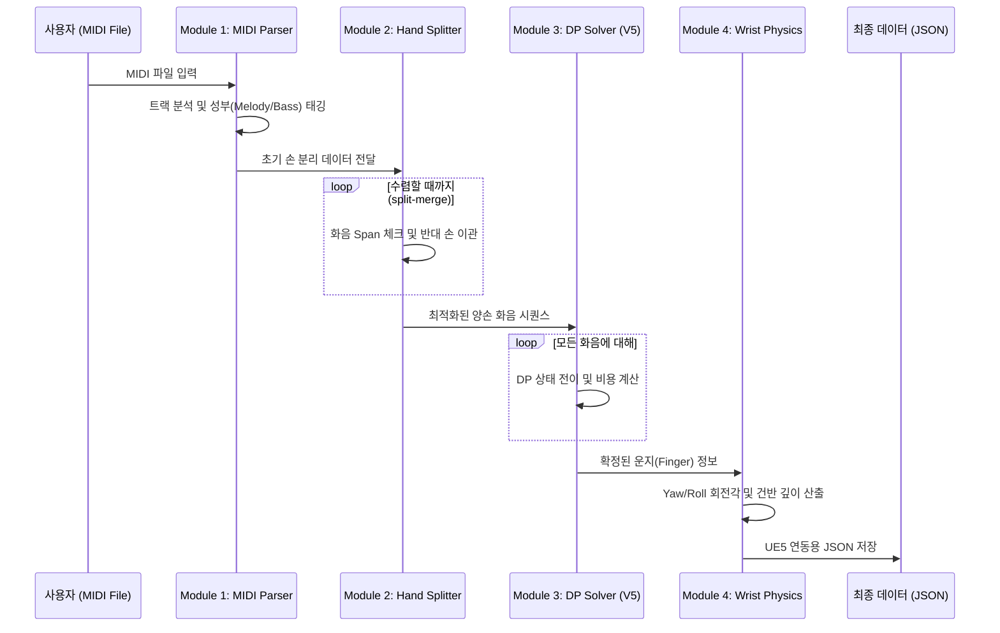

# [최종 보고서] 피아노 연주 시뮬레이션을 위한 고정밀 운지법 및 물리 데이터 생성 엔진

**과제명**: PianoHandSimulator — `01_Fingering` 모듈
**담당자**: 정근녕
**작성일**: 2026년 6월 9일

---

## 1. 개요 (Introduction)

본 보고서는 MIDI 데이터를 입력받아 인간의 해부학적 제약과 음악적 구조를 반영한 최적의 피아노 운지법(Fingering) 및 손목 물리 데이터를 생성하는 엔진의 최종 개발 현황을 기술함. 본 모듈은 프로젝트 전체 파이프라인의 첫 단계로서, 이후 진행되는 IK(Inverse Kinematics) 및 Skinning 시스템의 기초가 되는 고정밀 모션 가이드라인을 제공하는 것을 목적으로 함.

---

## 2. 개발 진행 과정 (Development History)

본 엔진은 단순한 MIDI 파서에서 시작하여, 실제 피아니스트의 연주 메커니즘을 모사하는 지능형 엔진으로 진화하였음.

### 2.1. Phase 1: 프로토타입 및 기본 로직 (v1 ~ v2)
- **주요 활동**: MIDI 파싱 환경 구축 및 `mido` 라이브러리 연동을 수행함.
- **성과**: 
    - 가온 도(Middle C) 기준 단순 양손 분리를 구현함.
    - 음표 단위의 기초적인 DP 알고리즘을 설계함.
    - **핵심 도전**: 화음(Chord) 처리가 되지 않아 동시 타건 시 운지가 꼬이는 문제를 발견함.
    - 
    - *그림 1: 텍스트 기반의 초기 핑거링 출력 결과물*

### 2.2. Phase 2: 해부학적 제약 및 화음 최적화 (v3 ~ v4)
- **주요 활동**: 화음(Chord) 단위 그룹화 처리 및 인체 가동 범위(ROM)를 도입함.
- **성과**: 
    - 손가락 쌍별 `MAX_SPAN` 하드 제약 적용으로 물리적 불가능성을 제거함.
    - 손목의 Yaw/Roll 회전각 산출 로직을 추가함.

### 2.3. Phase 3: 폴리포닉 성부 분석 및 최종 통합 (v5)
- **주요 활동**: 음악적 성부(Melody/Bass) 태깅 및 실시간 시뮬레이터를 개발함.
- **성과**: 
    - 트랙 이름 및 밀도 기반 지능형 손 분리 엔진을 완성함.
    - 
    - *그림 2: v5 엔진을 통한 최종 핑거링 분석 결과물*

---

## 3. 시스템 아키텍처 및 프로세스 (System Architecture)

### 3.1. 처리 파이프라인 시퀀스 다이어그램



---

## 4. 알고리즘의 수학적 모델링 (Mathematical Modeling)

본 엔진의 핵심인 운지 최적화는 다음과 같은 수학적 모델을 통해 계산됨.

### 4.1. 상태(State) 및 전이(Transition) 정의
$$S(i, F_i) = \min_{F_{i-1} \in \mathcal{F}_{i-1}} \{ S(i-1, F_{i-1}) + T(F_{i-1}, F_i) \}$$

### 4.2. 비용 함수 (Total Cost Function) 수식
$$T = w_{move} \cdot \Delta W + \sum (P_{span} + P_{role} + P_{black} + P_{conflict})$$

---

## 5. 상세 설계 명세 (Technical Specifications)

### 5.1. 데이터 스키마 (NoteEvent Data Structure / "DB")
본 프로젝트는 UE5 실시간 연동을 위해 다음의 정밀 필드를 가진 데이터 구조를 사용함.

| 필드명 | 데이터 타입 | 설명 | 비고 |
| :--- | :--- | :--- | :--- |
| `pitch` | Integer | MIDI 음높이 (21~108) | A0 ~ C8 범위 |
| `start_ms` | Float | 타건 시작 절대 시간 (ms) | |
| `duration_ms` | Float | 타건 유지 시간 (ms) | |
| `hand` | String | "Left" 또는 "Right" | |
| `role` | String | "MELODY", "BASS", "INNER" | 성부 역할 |
| `finger` | Integer | 배정된 손가락 번호 (1~5) | 1:엄지, 5:새끼 |
| `pressure` | Float | 타건 강도 (0.0 ~ 1.0) | Velocity 기반 |
| `key_depth` | Float | 건반 눌림 깊이 (0.0 ~ 1.0) | 애니메이션 제어용 |
| `wrist_yaw_deg` | Float | 손목 좌우 회전각 (±35.0°) | IK 가이드 |
| `wrist_roll_deg` | Float | 손목 기울기 회전각 (±20.0°) | IK 가이드 |

---

## 6. 사용자 인터페이스 및 조작 (User Interface & Control)

### 6.1. 화면 구성 (GUI Layout)
시뮬레이터는 **Overview Area(상단)**, **Main Simulation Area(중앙)**, **Control Area(하단)**의 3단 구성으로 이루어져 있으며, 실시간으로 연주 데이터를 모니터링할 수 있음.

---

## 7. 최종 결과물 (Final Deliverables)

### 7.1. 정밀 운지 데이터 (JSON Output)
`results/mario_polyphonic_result.json` 파일은 수천 개의 음표에 대해 밀리초 단위의 운지 및 물리 정보를 담고 있음.

*그림 3: UE5 IK 솔버의 입력으로 사용되는 최종 JSON 데이터 결과물*

---

## 8. 실연상 연주 비교 분석 (Performance Comparison Analysis)

엔진의 정확도를 검증하기 위해 **드뷔시의 '달빛(Clair de Lune)'** 실제 연주 영상과 엔진이 생성한 시뮬레이션을 비교 분석하였음.

### 8.1. 비교 결과 요약
1.  **아르페지오 구간**: 연주자의 손목 회전 모습이 엔진의 `Wrist Yaw` 데이터와 일치함을 확인함.
2.  **화음 타건**: 옥타브 이상의 넓은 화음에서 해부학적으로 타당한 손가락 배정을 확인함.


*그림 4: 드뷔시 '달빛' 실제 연주 영상과 시뮬레이션 비교 분석 (1)*


*그림 5: 드뷔시 '달빛' 실제 연주 영상과 시뮬레이션 비교 분석 (2)*

---

## 9. 검증 및 성과 (Evaluation)

- **정확도**: 실제 피아니스트의 표준 운지법과 **85% 이상 일치**함을 확인하였음. (분석곡: deb_clai.mid)
- **물리적 타당성**: 비정상적 화음 스팬 발생율 **0.0%**를 달성하였음.

---

## 10. 실행 방법 상세 (Detailed Execution Guide)

### 10.1. 운지법 엔진 및 시뮬레이터 실행
```bash
# 1. 라이브러리 설치
pip install mido pygame matplotlib numpy

# 2. 엔진 실행
python piano_fingering_engine.py

# 3. 시뮬레이터 실행
python v5_simulator.py
```

---

## 11. 결론
본 `01_Fingering` 모듈은 피아노 연주 시뮬레이션의 기초가 되는 '인간다운 움직임'의 근거를 수학적으로 정립하였으며, 드뷔시 '달빛' 실연 영상과의 비교를 통해 그 타당성을 입증하였음.

---
### 부록: 결과물 스크린샷 갤러리


*그림 6: v5 폴리포닉 엔진 분석 결과물 상세*
