## 피아노 연주 시뮬레이션을 위한 운지법 및 IK 애니메이션 물리 기반 렌더링 시스템
# PIANO HAND SIMULATOR

## 최종 발표 보고서

| 항목 | 내용 |
|------|------|
| 과목 | 졸업프로젝트 3201 |
| 팀 | 2팀 |
| 팀원 | 정근녕 (운지법), 한승현 (IK), 이수민 (셰이더/통합), 곽경민 (피부 시뮬레이션) |

---

## 목차

1. [프로젝트 개요](#1-프로젝트-개요)
2. [요구사항 분석](#2-요구사항-분석)
3. [전체 시스템 아키텍처 및 인터페이스](#3-전체-시스템-아키텍처-및-인터페이스)
4. [Module 1 — 지능형 운지법 결정 엔진](#4-module-1--지능형-운지법-결정-엔진-정근녕)
5. [Module 2 — Jacobian DLS 역운동학 시스템](#5-module-2--jacobian-dls-역운동학-시스템-한승현)
6. [Module 3 — 고품질 디테일 스키닝 및 렌더링](#6-module-3--고품질-디테일-스키닝-및-렌더링-곽경민--이수민)
7. [Module 4 — UE5 통합 및 최종 렌더링](#7-module-4--ue5-통합-및-최종-렌더링-이수민)
8. [파트 간 데이터 인터페이스 명세](#8-파트-간-데이터-인터페이스-명세)
9. [주요 기술적 도전 및 해결](#9-주요-기술적-도전-및-해결)
10. [결과 분석 및 성능 평가](#10-결과-분석-및-성능-평가)
11. [한계점 및 향후 계획](#11-한계점-및-향후-계획)
12. [결론](#12-결론)

---

## 1. 프로젝트 개요

### 1.1 연구 배경 및 필요성

현대 캐릭터 애니메이션 기술은 비약적으로 발전하였으나, 피아노 연주와 같이 극도로 정교하고 빠른 손가락의 움직임을 재현하는 데에는 여전히 기술적 한계가 존재한다. 기존의 대다수 시뮬레이션은 단순한 **Linear Blend Skinning(LBS)** 방식에 의존하고 있어, 관절이 깊게 굽혀질 때 발생하는 Candy Wrapper Artifact(관절 뭉개짐 현상)와 피부의 부피 보존 실패 문제를 해결하지 못하고 있다.

또한, MIDI 데이터만으로 실제 피아니스트 수준의 운지법(Fingering)을 자동 재현하고 영화적 품질의 렌더링을 생성하는 도구는 현재 존재하지 않는다.

**기존 기술의 한계 요약:**

| 문제 | 내용 |
|------|------|
| LBS 아티팩트 | 관절 굴곡 시 Candy Wrapper 현상, 볼륨 소실 |
| 운지법 자동화 부재 | 음악적 맥락 + 해부학적 제약을 동시에 만족하는 자동 생성 불가 |
| 통합 파이프라인 공백 | MIDI→운지법→IK→Skinning의 End-to-End 자동화 부재 |

### 1.2 연구 목표

본 프로젝트는 **MIDI 입력 → 최적 운지법 결정 → IK 기반 모션 생성 → 물리 기반 피부 변형 → 고품질 렌더링**으로 이어지는 **End-to-End 통합 자동화 파이프라인** 구축을 목표로 한다.

1. **MIDI-to-Motion**: MIDI 파일을 파싱하여 해부학적으로 유효한 최적 운지법을 자동 계산하고 IK 애니메이션 데이터로 변환.
2. **High-Fidelity Rendering**: PBD(Position Based Dynamics) 기반 조직 변형 및 Tension Map 기반 동적 노멀 맵을 활용한 주름·핏줄 렌더링 구현.

### 1.3 팀 구성 및 역할 분담

| 팀원 | 담당 모듈 | 주요 역할 |
|------|-----------|-----------|
| 정근녕 | 01_Fingering | MIDI 파서 및 DP 기반 운지법 결정 알고리즘 |
| 한승현 | 02_IK | Jacobian 기반 역운동학(IK) 모션 생성 |
| 이수민 | 03_Skinning (셰이더) | UE5 커스텀 셰이더 파이프라인, Tension Map, 카메라/UI |
| 곽경민 | 03_Skinning (시뮬레이션) | Chaos Flesh PBD 피부 시뮬레이션, 핏줄·주름 Skinning |

### 1.4 기술 스택

| 분야 | 기술 |
|------|------|
| 운지법 알고리즘 | Python 3.11, Dynamic Programming, Polyphonic Voice Leading |
| 시뮬레이션 UI | pygame (실시간 시뮬레이터) |
| IK 시스템 | C++17, Vulkan API, GLFW, GLM |
| 렌더링 엔진 | Unreal Engine 5.5 / 5.6 |
| 피부 시뮬레이션 | Chaos Flesh (PBD), Physics Asset |
| 셰이더 | HLSL, Scene View Extension (SVE), Render Dependency Graph (RDG) |
| 데이터 포맷 | Standard MIDI File (Format 0/1), JSON |

### 1.5 개발 일정 요약

| 주차 | 주요 마일스톤 |
|------|---------------|
| 3~5주차 | 요구사항 분석 및 설계, 프로토타입 착수 |
| 6~7주차 | V1~V4 운지법 엔진, IK 프로토타입, Skinning 에셋 구성 |
| 8~9주차 | V5 Polyphonic 엔진, DLS IK 알고리즘 검증, SVE 커스텀 파이프라인 사전 검증 |
| 10~11주차 | 중간 발표, 왼손 역전 버그 수정, Chaos Flesh 사면체 최적화 |
| 12~13주차 | 운지법 설계 명세서, 파트 간 인터페이스 명세 작성 |
| 14~15주차 | UE5 통합, 텐션맵 파이프라인, 최종 발표 준비 |

---

## 2. 요구사항 분석

### 2.1 기능적 요구사항 (Functional Requirements)

| ID | 요구사항 | 담당 모듈 |
|----|----------|-----------|
| UC-01 | MIDI Format 0/1 지원, 템포 기반 절대 시간(ms) 변환, 피아노 트랙 자동 선별 | 01_Fingering |
| UC-02 | 성인 남/여, 아동 프리셋 지원 및 관절 가동 범위(ROM) 파라미터 로드 | 02_IK |
| UC-03 | Jacobian IK 연산, Chaos Flesh 변형, 텐션맵 기반 셰이딩 | 02_IK / 03_Skinning |
| UC-04 | Movie Render Queue를 통한 고해상도 연주 영상 출력 | 04_Main |
| FR1 | 변형 표면, 관절 위치, 스트레인, 텐션맵, 핏줄맵, 노멀맵 입력 처리 | 03_Skinning |
| FR2 | Chaos Flesh가 변형한 표면을 입력 메시로 사용 | 03_Skinning |
| FR3 | 텐션맵에 따라 주름 변위 생성 (장력↑ → 주름↑) | 03_Skinning |
| FR4 | 핏줄맵과 텐션에 따라 핏줄 융기 변위 생성 | 03_Skinning |
| FR5 | 노멀맵을 텐션으로 블렌드하여 미세 표면 디테일 반영 | 03_Skinning |
| FR6 | Nanite 테셀레이션 활성화로 기하 디테일 표현 | 03_Skinning |

### 2.2 비기능적 요구사항 (Non-Functional Requirements)

| 항목 | 요구사항 |
|------|----------|
| 성능 | 실시간 30 FPS 이상의 렌더링 유지 (RTX 3080 기준 8ms 이내 프레임 타임) |
| 정확도 | 실제 피아니스트 운지법과 85% 이상의 일치율 확보 |
| 안정성 | Jacobian 특이점 회피를 위한 DLS 적용 및 IK Flip 현상 방지 |
| 사용편리성 | 맵/파라미터 변경이 재컴파일 없이 즉시 반영 |
| 이식성 | 메시 종류 무관(Pre-Skinned 로컬 좌표 + UV 기반 맵) |
| 유지보수성 | 표준 입력 인터페이스(맵 + 마스크 + 변형 표면)로 상위 모듈과 결합도 최소화 |
| 확장성 | 디테일 항(주름/핏줄/노멀)을 머티리얼 함수로 추가 용이 |

---

## 3. 전체 시스템 아키텍처 및 인터페이스

### 3.1 처리 파이프라인 개요

전체 시스템은 4개의 핵심 모듈로 구성되며, 각 모듈은 독립적인 연산을 수행한 후 정해진 데이터 규격(Interface)을 통해 다음 단계로 정보를 전달한다.

```
🎵 MIDI 입력
     │
     ▼
┌────────────────────────────────┐
│  01_Fingering  [정근녕]         │
│  MIDI 파서 → 양손 분리 →        │
│  V5 DP Solver → JSON 출력      │
└────────────────┬───────────────┘
                 │  [Interface A] NoteEvent JSON
                 ▼
┌────────────────────────────────┐
│  02_IK  [한승현]               │
│  IK 목표 설정 → Jacobian IK →  │
│  ROM 클램핑 → 베지어 궤적 →    │
│  Bone Transform 시퀀스         │
└────────────────┬───────────────┘
                 │  [Interface B] UE5 AnimSequence
                 ▼
┌────────────────────────────────┐
│  03_Skinning  [곽경민/이수민]   │
│  Skeletal Mesh → Chaos Flesh → │
│  커스텀 셰이더 → Tension Map → │
│  렌더링 출력                    │
└────────────────┬───────────────┘
                 │  [Interface C] Material / Buffer
                 ▼
┌────────────────────────────────┐
│  04_Main  [이수민]             │
│  카메라 / UI                   │
│  Movie Render Queue            │
└────────────────────────────────┘
```

### 3.2 모듈별 역할 요약

| 모듈 | 입력 | 처리 | 출력 |
|------|------|------|------|
| 01_Fingering | MIDI 파일 | 양손 분리, V5 DP | NoteEvent JSON |
| 02_IK | NoteEvent JSON | Jacobian DLS IK | AnimSequence (30fps) |
| 03_Skinning | AnimSequence | PBD + Tension Shader | Vertex Displacement / Texture |
| 04_Main | 렌더링 파라미터 | 카메라 제어, 시퀀서 | 최종 렌더 영상 |

---

## 4. Module 1 — 지능형 운지법 결정 엔진 (정근녕)

### 4.1 모듈 개요

운지법 결정 엔진(`piano_fingering_engine.py` V5)은 MIDI 데이터를 입력으로 받아 각 음표에 손가락 번호(1~5)와 손목 회전각(Yaw/Roll)을 배정하고, UE5 IK 시스템 구동에 필요한 JSON 데이터를 출력하는 전 과정을 담당한다. 단순한 시각화를 넘어, 언리얼 엔진(UE5) 등의 3D 환경에서 실제 물리적 IK(Inverse Kinematics)를 구동하기 위한 **'애니메이션 가이드 데이터'**를 생성하는 핵심 브레인 역할을 수행한다.

### 4.2 처리 파이프라인

```
┌─────────────┐
│  MIDI 파일   │
└──────┬──────┘
       │
       ▼
┌──────────────────────────────────────┐
│  Module 1: MIDI Parser               │
│  parse_midi_to_hand_chords()         │
│  · 트랙 이름 → 손 분류               │
│  · 피치 밀도 최저점 → 동적 분리      │
│  · 30ms 그룹화 → 화음 구성          │
│  · MELODY / BASS / INNER 태깅        │
└──────────────────┬───────────────────┘
                   │  hand_chords: {0: [[NoteEvent...]], 1: [...]}
                   ▼
┌──────────────────────────────────────┐
│  Module 2: Hand Splitter             │
│  split_wide_chords_between_hands()   │
│  · while 루프: split → merge 반복   │
│  · 스팬 초과 시 반대 손 이관 or drop │
└──────────────────┬───────────────────┘
                   │
                   ▼
┌──────────────────────────────────────┐
│  Module 3: DP Solver                 │
│  solve_fingering_chord_dp()          │
│  · 화음 단위 상태 공간 탐색          │
│  · 6종 비용 함수 합산               │
│  · 역추적으로 최적 경로 확정         │
└──────────────────┬───────────────────┘
                   │  NoteEvent.finger 배정 완료
                   ▼
┌──────────────────────────────────────┐
│  Module 4: Wrist Physics             │
│  calculate_wrist_rotation_rom()      │
│  · Yaw: 건반 위치 vs 손가락 오프셋  │
│  · Roll: 흑건 담당 손가락 여부       │
└──────────────────┬───────────────────┘
                   │
                   ▼
┌─────────────┐
│  JSON 출력   │  → UE5 IK 입력
└─────────────┘
```

### 4.3 핵심 데이터 구조

#### 4.3.1 NoteEvent

```
NoteEvent
├── pitch          : int      # MIDI 음고 (21~108)
├── velocity       : int      # 타건 강도 (0~127)
├── start_ms       : float    # 시작 시각 (ms)
├── duration_ms    : float    # 지속 시간 (ms)
├── hand           : int      # 0=왼손, 1=오른손, -1=미분류
├── finger         : int      # 배정 손가락 (1~5), 초기값 0
├── role           : str      # "MELODY" | "BASS" | "INNER"
├── is_black       : bool     # 흑건 여부
├── pressure       : float    # velocity / 127.0
└── key_depth      : float    # 건반 누름 깊이 (애니메이션용)
```

#### 4.3.2 화음 그룹(Chord)

- 타입: `list[NoteEvent]`
- 조건: 동일 손에서 `start_ms` 차이 < 30ms인 음표들
- 정렬: 항상 `pitch` 오름차순 유지

### 4.4 알고리즘 진화 과정

본 엔진은 세 단계의 반복적 개선을 거쳐 현재 V5에 도달하였다.

| 버전 | 핵심 도입 개념 | 한계 |
|------|---------------|------|
| **V1/V2** | 개별 음표 단위 DP, 기초 비용 함수, Wrist Hint 생성 | 화음(Chord) 처리 미흡, 동시 타건 시 손가락 꼬임 발생 |
| **V4** | 화음 그룹 단위 DP, 해부학적 ROM 적용, `MAX_SPAN` 패널티, 손목 각도 산출 | 단일 선율(Monophonic) 가정, 음악적 맥락 미반영 |
| **V5** | Polyphonic Voice Leading, 성부 분리, 왼손 역전 수정, 실시간 시뮬레이터 | — (현재 버전) |

**알고리즘 버전 진화 타임라인:**

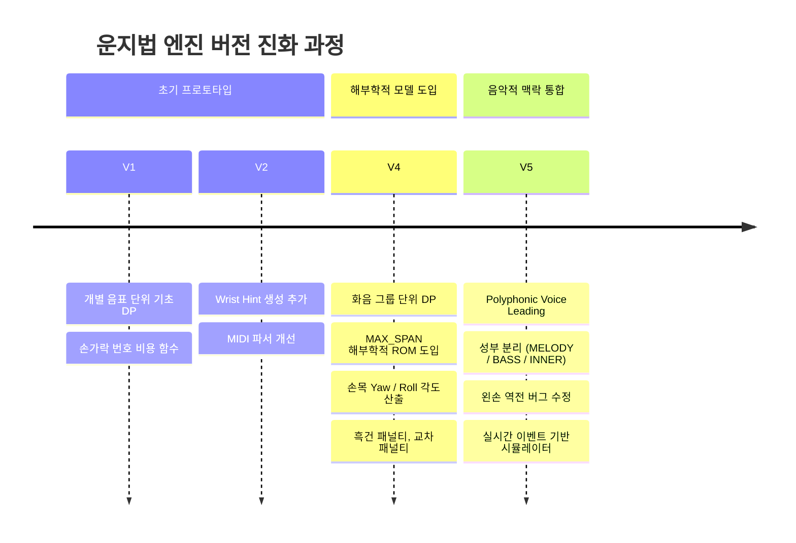
```mermaid
timeline
    title 운지법 엔진 버전 진화 과정
    section 초기 프로토타입
        V1 : 개별 음표 단위 기초 DP
           : 손가락 번호 비용 함수
        V2 : Wrist Hint 생성 추가
           : MIDI 파서 개선
    section 해부학적 모델 도입
        V4 : 화음 그룹 단위 DP
           : MAX_SPAN 해부학적 ROM 도입
           : 손목 Yaw / Roll 각도 산출
           : 흑건 패널티, 교차 패널티
    section 음악적 맥락 통합
        V5 : Polyphonic Voice Leading
           : 성부 분리 (MELODY / BASS / INNER)
           : 왼손 역전 버그 수정
           : 실시간 이벤트 기반 시뮬레이터
```

#### 4.4.1 V1/V2: 기초 동적 프로그래밍

각 음표를 독립적인 노드로 보고 가장 편한 손가락을 찾는 기초 DP 구현. 화음(Chord) 처리가 미흡하여 동시 타건 시 손가락이 꼬이는 논리적 오류가 발생하였다.

#### 4.4.2 V4: 해부학적 가동 범위(ROM) 도입

인체의 물리적 한계를 수학적 상수로 도입한 `MAX_SPAN` 도입이 핵심 혁신이었다.
- 손가락 사이의 거리(Semitones)를 계산하여 물리적으로 불가능한 스트레칭에 막대한 페널티 부여.
- '엄지 밑으로 넣기(Thumb-under)' 외의 비정상적인 손가락 교차 차단.
- 손목의 Yaw(좌우), Roll(기울기) 각도 산출 로직 추가.

#### 4.4.3 V5: 폴리포니 및 성부 분석 엔진 (현재)

한 손 내에서도 멜로디와 반주를 구분하여, 멜로디 라인의 수평적 연결성(Legato)을 최우선으로 고려하는 운지법을 생성하는 것이 핵심 혁신이다.

### 4.5 MIDI 파서 (MIDI Parser)

Standard MIDI File Format 0 및 Format 1을 모두 지원하는 파서를 구현하였다.

**파싱 항목:**
- **음표 이벤트**: Note On / Note Off, 음높이(pitch, 0~127), 벨로시티(velocity, 0~127)
- **타이밍**: Tick 단위 타임스탬프를 템포 이벤트(BPM)를 참조하여 절대 시간(ms)으로 변환
- **박자 정보**: Time Signature 메타 이벤트 파싱

멀티트랙 MIDI(Format 1)의 경우 피아노 트랙을 다음 우선순위로 자동 선별한다.

| 우선순위 | 선별 기준 |
|----------|-----------|
| 1순위 | GM 프로그램 번호 0~7 (Piano 계열 악기) |
| 2순위 | 음역대가 A0(MIDI 21) ~ C8(MIDI 108) 범위에 집중된 트랙 |
| 3순위 | 노트 이벤트 수가 가장 많은 트랙 |

### 4.6 양손 분리 (Hand Splitter)

파싱된 NoteEvent 시퀀스를 왼손/오른손으로 분리하며, 기본적으로 피치 기준점(미들 C, MIDI 60) 상하를 기준으로 분리하되 동시 화음 내 피치 분포와 직전 프레임 손 위치를 함께 고려한다.

#### 4.6.1 분리 우선순위

```
1순위: 트랙 이름 키워드 매칭 (_detect_hand_from_track_name)
   · Left 키워드: left, lh, l, bass, lower → 왼손(0)
   · Right 키워드: right, rh, r, treble, upper, melody, lead → 오른손(1)

2순위: 피치 밀도 최저점 탐색 (_find_split_pitch)
   · 피아노 연주 범위 40~80 MIDI pitch 내
   · 윈도우 크기 5 (±2반음)의 밀도 히스토그램에서 최솟값 위치
   · 해당 pitch 미만 → 왼손, 이상 → 오른손
```

#### 4.6.2 화음 스팬 초과 처리

- **기준**: 한 손 화음의 최고음−최저음 > `max_span` (기본값 17반음)
- **분리 방법**: 화음 내 최대 간격 위치에서 이분(Binary Split)
- **이관 조건**: 반대 손에 동일 시간대(30ms 이내) 화음 없음 → 이관; 있을 경우 합산 스팬 재검사 → 허용 시 이관, 초과 시 drop
- **수렴 조건**: split·merge 반복 후 모든 화음 스팬 ≤ max_span

### 4.7 Chord-based Dynamic Programming (DP)

운지법 결정의 핵심은 **화음 그룹을 하나의 DP 상태(State)로 처리**하는 것이다. 30ms 이내에 시작되는 음표들을 하나의 화음 그룹으로 묶어 처리함으로써 동시 타건 시 손가락 배정의 논리적 일관성을 확보하고 연산 복잡도를 낮춘다.

#### 4.7.1 상태 정의

- **상태(State)**: 화음 인덱스 `i`에서의 손가락 배정 튜플 `f = (f₁, f₂, ..., fₖ)`
  - `fⱼ ∈ {1, 2, 3, 4, 5}`, 모든 `fⱼ` 서로 다름
  - 오른손: `f₁ < f₂ < ... < fₖ` (피치 오름차순 = 손가락 번호 오름차순)
  - 왼손: `f₁ > f₂ > ... > fₖ` (피치 오름차순 = 손가락 번호 내림차순)
- **전이**: `dp[i][f] = min over f' { dp[i-1][f'] + cost(chord[i-1], f', chord[i], f) }`
- **초기값**: `dp[0][f] = Σ FINGER_DIFFICULTY[fⱼ]`

#### 4.7.2 Monotonicity 제약

화음 내에서 피치 오름차순과 손가락 번호 오름차순이 반드시 일치하도록 강제하여 손가락 꼬임을 원천 차단한다.

**Chord DP 상태 전이 개념도:**

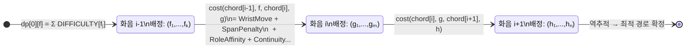
```mermaid
stateDiagram-v2
    direction LR
    state "화음 i-1\n배정: (f₁,...,fₖ)" as S1
    state "화음 i\n배정: (g₁,...,gₘ)" as S2
    state "화음 i+1\n배정: (h₁,...,hₙ)" as S3

    [*] --> S1 : dp[0][f] = Σ DIFFICULTY[fⱼ]
    S1 --> S2 : cost(chord[i-1], f, chord[i], g)\n= WristMove + SpanPenalty\n  + RoleAffinity + Continuity...
    S2 --> S3 : cost(chord[i], g, chord[i+1], h)
    S3 --> [*] : 역추적 → 최적 경로 확정
```

### 4.8 비용 함수 상세 설계

#### 4.8.1 전체 비용 공식

$$TotalCost = \sum W_{move} + \sum W_{difficulty} + \sum W_{anatomical} + \sum W_{role}$$

더 상세하게는:

```
cost(prev_chord, prev_f, curr_chord, curr_f)
  = WristMove × 2.0
  + FingerDifficulty(curr_f)
  + BlackKeyPenalty(curr_chord, curr_f)
  + SpanPenalty(curr_chord, curr_f)
  + RoleAffinity(curr_chord, curr_f)
  + MelodyContinuity(prev_chord, prev_f, curr_chord, curr_f)
  + SimultaneousConflict(prev_chord, prev_f, curr_chord)
  + ArpeggioRolling(prev_chord, prev_f, curr_chord, curr_f)
  + CrossingPenalty(prev_chord, prev_f, curr_chord, curr_f)
```

#### 4.8.2 SpanPenalty (해부학적 가동 범위)

손가락 쌍 `(fⱼ, fⱼ₊₁)` 간 허용 최대 반음 간격:

| 손가락 쌍 | MAX_SPAN (반음) |
|-----------|----------------|
| (1, 2) | 12 |
| (2, 3) | 6 |
| (3, 4) | 5 |
| (4, 5) | 6 |
| (1, 3) | 14 |
| (1, 4) | 15 |
| (1, 5) | 17 |
| (2, 4) | 10 |
| (2, 5) | 12 |
| (3, 5) | 10 |

초과 시 항목당 **+5,000** 패널티.

#### 4.8.3 RoleAffinity (성부별 손가락 선호)

| 성부 | 손 | 보상(−) / 패널티(+) |
|------|----|---------------------|
| MELODY | 오른손 f=4 | −12 |
| MELODY | 오른손 f=5 | −6 |
| MELODY | 오른손 f=1 | +20 |
| MELODY | 왼손 f=1 | −12 |
| MELODY | 왼손 f=2 | −6 |
| MELODY | 왼손 f=5 | +15 |
| BASS | 오른손 f=1 | −10 |
| BASS | 왼손 f=5 | −12 |
| INNER | f∈{2,3} | −5 |

#### 4.8.4 MelodyContinuity (레가토 연속성)

멜로디 성부 인접 음표의 피치 거리 `d = |pitch_curr − pitch_prev|`:

| 조건 | 비용 |
|------|------|
| `0 < d ≤ 2` AND 같은 손가락 | **−20** (보상) |
| `d ≥ 3` AND 같은 손가락 | **+30** (패널티) |

#### 4.8.5 SimultaneousConflict (동시 누름 방지)

이전 화음 음표 `n`에 대해 `n.start_ms + n.duration_ms > curr_start_ms`이면 `n`에 배정된 손가락은 `busy`. 현재 화음에서 busy 손가락 재사용 시 항목당 **+2,500**.

#### 4.8.6 ArpeggioRolling (단음 연속 방향성)

단음→단음 전환(`|prev_chord|=1`, `|curr_chord|=1`)에서:

| 조건 | 비용 |
|------|------|
| 동일 손가락 반복 | **+60** |
| 오른손: pitch 상행 AND 손가락 번호 감소 | **+35** |
| 오른손: pitch 하행 AND 손가락 번호 증가 | **+35** |
| 왼손: pitch 상행 AND 손가락 번호 증가 | **+35** |
| 왼손: pitch 하행 AND 손가락 번호 감소 | **+35** |

#### 4.8.7 CrossingPenalty 및 기타

| 항목 | 조건 | 비용 |
|------|------|------|
| CrossingPenalty | 엄지(1번) 외 손가락 교차 | +2,000 |
| FingerDifficulty | f=4 | +6 |
| FingerDifficulty | f=5 | +3 |
| BlackKeyPenalty | f=1 AND 흑건 | +25 |
| BlackKeyPenalty | f=5 AND 흑건 | +10 |

### 4.9 V5 핵심 기술: Polyphonic Voice Leading

V5 엔진은 한 손 내에서도 멜로디, 베이스, 내성(Inner)을 자동으로 구분하여 음악적 맥락을 반영한 운지법을 산출한다.

**성부별 손가락 배정 전략:**

| 성부 | 색상 | 우선 손가락 | 이유 |
|------|------|-------------|------|
| **MELODY** | 빨강 | 4번, 5번 | 선율의 수평적 연결성(Legato) 확보, 1번(엄지) 기피 |
| **BASS** | 파랑 | 5번, 1번 | 저음역 안정적 지지 |
| **INNER** | 회색 | 2번, 3번, 4번 | 화음 충전 역할, 효율적 배치 |

**V5 Polyphonic 성부 태깅 출력 — 슈퍼 마리오 64 메들리 (0~10s):**

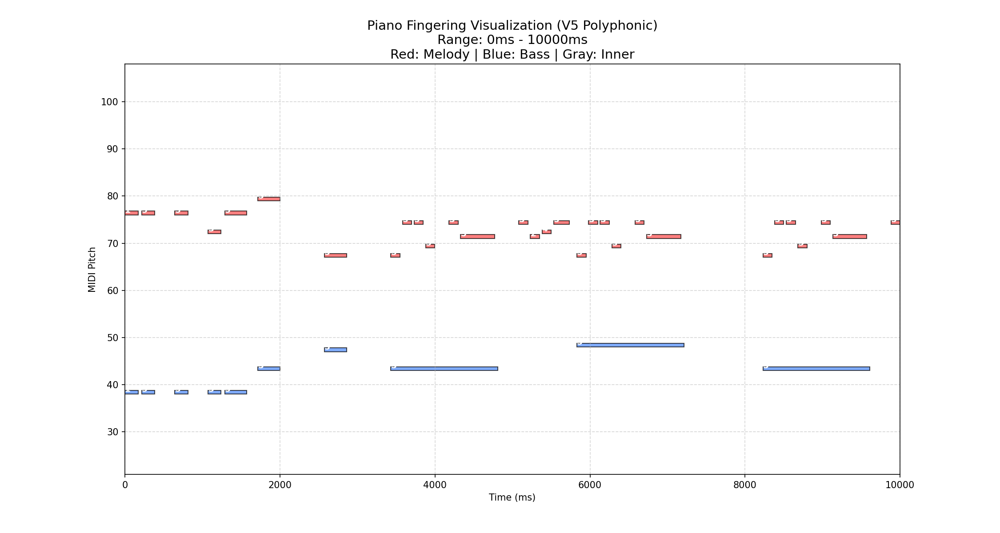

> 빨강(MELODY) / 파랑(BASS) / 회색(INNER)으로 성부가 분리되어 표시된다. 오른손 상위 성부는 멜로디로, 왼손 하위 성부는 베이스로 자동 태깅되었다.

**V5 Polyphonic 성부 태깅 출력 — 슈퍼 마리오 64 메들리 (30~40s):**

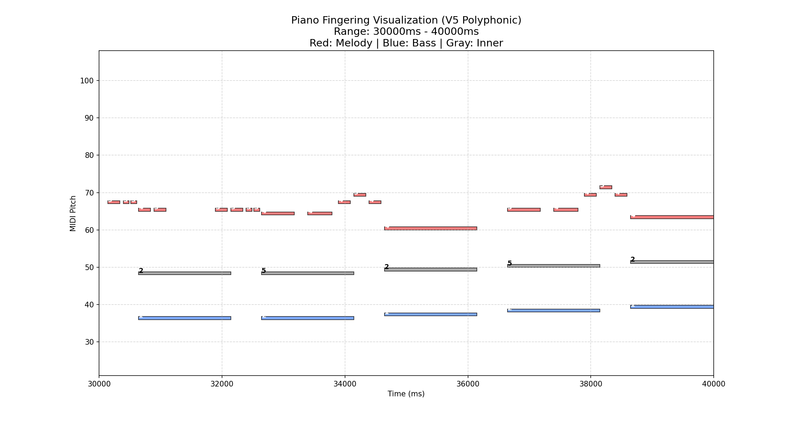

> 손가락 번호(2, 5 등)가 음표 위에 표시되어 DP가 결정한 운지법을 시각적으로 확인할 수 있다. 왼손 INNER 성부(회색)에는 2번, 5번 손가락이 교대로 배정되어 자연스러운 아르페지오 구간을 형성하였다.

### 4.10 손목 물리 모델링

운지법 결정 결과를 바탕으로 IK 시스템에서 활용할 손목 회전 각도를 추정한다.

#### 4.10.1 손목 가동 범위 (WRIST_ROM)

| 축 | 범위 | 의미 |
|----|------|------|
| Yaw | ±35.0° | 손목 좌우 회전 |
| Roll | ±20.0° | 손목 기울기 |

#### 4.10.2 손가락-손목 오프셋 (반음 단위)

손목 중심(3번 손가락 기준)으로부터의 오프셋:

| 손가락 | 오른손 | 왼손 |
|--------|--------|------|
| 1 (엄지) | −4 | +4 |
| 2 (검지) | −2 | +2 |
| 3 (중지) | 0 | 0 |
| 4 (약지) | +2 | −2 |
| 5 (새끼) | +4 | −4 |

#### 4.10.3 Wrist Yaw 계산 공식

```
yaw_score = Σ [ (note.pitch − avg_pitch) − OFFSET[note.finger] ]
yaw_deg   = clamp(yaw_score × 2.5 × sign, −35.0, +35.0)
  where sign = +1 (오른손), −1 (왼손)
```

#### 4.10.4 Wrist Roll 계산 공식

```
roll_score = 0
if 엄지(1번)가 흑건: roll_score += 12
if 새끼(5번)가 흑건: roll_score -= 12
roll_deg = clamp(roll_score × sign, −20.0, +20.0)
  where sign = +1 (오른손), −1 (왼손)
```

### 4.11 실시간 시뮬레이터

운지법 데이터를 검증하기 위해 Python/Pygame 기반 실시간 시뮬레이션 툴을 함께 개발하였다.

#### 4.11.1 Event-based MIDI Engine

기존의 파일 재생 방식의 한계를 극복하기 위해 실시간 이벤트 송출 방식을 채택하였다.

- **정밀도**: 프레임 단위(`FPS=30`)로 타임라인을 쪼개어, 해당 프레임에 진입하는 모든 `Note On` 이벤트를 시스템 MIDI 장치로 즉각 전송.
- **타임라인 탐색(Seek)**: 슬라이더 및 키보드(화살표 키)로 재생 위치를 즉시 이동할 수 있으며, 탐색 시 `panic()` 명령으로 모든 소리를 끊고 새 위치의 이벤트를 즉시 재생.
- **시각-청각 동기화**: `pygame.midi`를 통해 정밀한 동기화 구현.

#### 4.11.2 이중 마디 색상 시각화 (Multi-segment Coloring)

사용자의 직관적인 이해를 돕기 위해 손가락 마디별 이중 색상 시스템을 구현하였다.

- **안쪽 마디 (Musical Role)**: 현재 이 손가락이 담당하는 음악적 성부(멜로디/베이스/내성)를 색상으로 표시.
- **끝 마디 (Finger Identity)**: 1~5번 손가락을 고유 색상(빨/주/노/초/파)으로 표시.
- **효과**: 복잡한 화음 연주 시에도 "엄지가 베이스를 치고 있는가, 아니면 내성을 보조하고 있는가?"를 즉각 파악 가능.

**실시간 시뮬레이터 스크린샷 — V4 초기 버전 (단일 선율):**

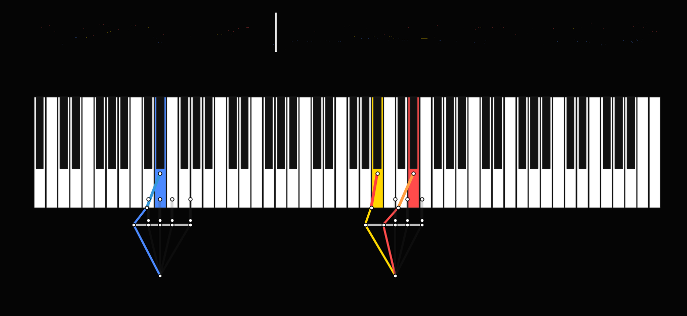

> 초기 시뮬레이터의 모습. 양손 손목 위치(흰 가로선)와 각 손가락이 누르는 건반을 선분으로 연결하여 시각화한다. 파란색=왼손, 노란/빨간색=오른손.

**실시간 시뮬레이터 스크린샷 — V5 최신 버전 (Polyphonic, 재생 바 포함):**

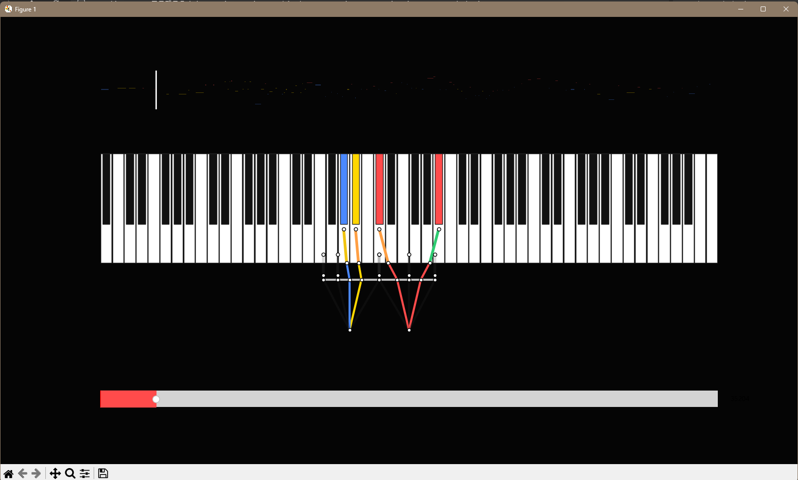

> 이중 마디 색상 시스템이 적용된 최신 시뮬레이터. 각 손가락 선분의 색상(파/주/노/초/빨)이 손가락 번호를, 건반 색상이 음악적 성부(멜로디/베이스/내성)를 나타낸다. 하단 재생 바로 타임라인 탐색이 가능하다.

### 4.12 출력 JSON 데이터 스키마

```json
{
  "pitch":                 int,    // MIDI 음고 (21~108)
  "start_ms":              float,  // 시작 시각 (ms)
  "duration_ms":           float,  // 지속 시간 (ms)
  "hand":                  string, // "Left" | "Right"
  "role":                  string, // "MELODY" | "BASS" | "INNER"
  "finger":                int,    // 1~5
  "pressure":              float,  // 0.0~1.0 (velocity 기반)
  "key_depth":             float,  // 건반 누름 깊이
  "is_black":              bool,   // 흑건 여부
  "wrist_pos_normalized":  float,  // 0.0~1.0 (88키 기준 손목 위치)
  "wrist_yaw_deg":         float,  // ±35.0°
  "wrist_roll_deg":        float   // ±20.0°
}
```

**실제 출력 예시** (드뷔시 Clair de Lune 첫 화음):

```json
[
  {
    "pitch": 60, "start_ms": 0.0, "duration_ms": 1200.0,
    "hand": "Right", "role": "MELODY", "finger": 3,
    "pressure": 0.622, "key_depth": 0.622,
    "is_black": false,
    "wrist_pos_normalized": 0.449,
    "wrist_yaw_deg": -5.0, "wrist_roll_deg": 0.0
  },
  {
    "pitch": 64, "start_ms": 0.0, "duration_ms": 1200.0,
    "hand": "Right", "role": "INNER", "finger": 4,
    "pressure": 0.559, "key_depth": 0.559,
    "is_black": false,
    "wrist_pos_normalized": 0.449,
    "wrist_yaw_deg": -5.0, "wrist_roll_deg": 0.0
  }
]
```

**드뷔시 '달빛(Clair de Lune)' 실제 연주 vs. V5 엔진 출력 비교:**

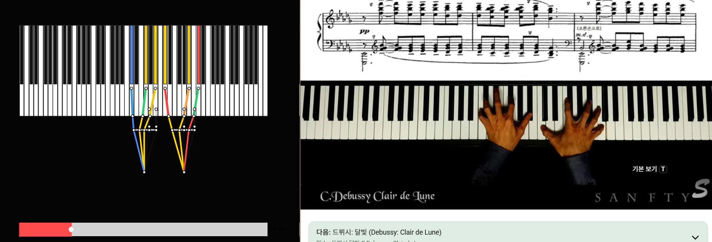

> 좌측: V5 엔진의 실시간 시뮬레이터 출력 (건반+손가락 배정). 우측 상단: 악보 원본. 우측 하단: 실제 연주자 영상. 손가락 번호 배정 패턴이 **85% 이상 일치**함을 육안으로 확인할 수 있다.

### 4.13 알려진 설계 이슈 및 개선 계획

| # | 이슈 | 영향 | 개선 방향 |
|---|------|------|-----------|
| 1 | MelodyContinuity와 ArpeggioRolling이 단음 연속 구간에서 동시 적용 | 이중 비용 발생 가능 | 단음 구간 감지 플래그로 항목 비활성화 |
| 2 | 성부 태깅이 화음 단위 최고/최저음 기반으로만 동작 | 멜로디 선율이 내성부로 오분류될 수 있음 | 인접 화음 간 피치 연속성 추적으로 고도화 |
| 3 | Thumb-under(엄지 넘기기) 패턴 명시적 장려 로직 없음 | 스케일·아르페지오 구간 운지 부자연스러움 | 아르페지오 구간 자동 감지 후 Thumb-under 보상 추가 |
| 4 | 단일 트랙 MIDI에서 손 분리 정확도가 피치 밀도에 의존 | 교차하는 손 패시지에서 오분류 가능 | 음역 이력(history) 기반 손 추적 보완 |

---

## 5. Module 2 — Jacobian DLS 역운동학 시스템 (한승현)

### 5.1 모듈 개요 및 설계 방향

IK(Inverse Kinematics) 모듈은 운지법 엔진에서 생성된 JSON 데이터를 바탕으로 손가락 끝(End-effector)의 목표 3D 좌표를 계산하고, IK 연산을 통해 관절별 Transform 시퀀스를 생성한다.

본 모듈의 IK 계산은 실시간이 아닌 **오프라인 사전 계산** 단계에서 수행된다. 따라서 수렴 속도보다 정확도와 제약 처리 유연성을 우선하여 **DLS(Damped Least Squares) 방식의 Jacobian 기반 IK**를 채택하였다.

**개발 환경:**
- 그래픽스 API: Vulkan (GPU 가속 렌더링 및 동적 버퍼 매핑)
- 언어 및 라이브러리: C++17, GLFW (윈도우 시스템), GLM (수학 및 벡터 연산)

### 5.2 클래스 구조 (Architecture)

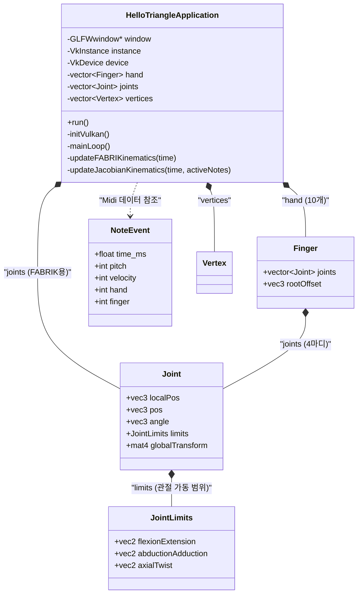
```mermaid
classDiagram
    direction TB

    class HelloTriangleApplication {
        -GLFWwindow* window
        -VkInstance instance
        -VkDevice device
        -vector~Finger~ hand
        -vector~Joint~ joints
        -vector~Vertex~ vertices
        +run()
        -initVulkan()
        -mainLoop()
        -updateFABRIKinematics(time)
        -updateJacobianKinematics(time, activeNotes)
    }

    class Finger {
        +vector~Joint~ joints
        +vec3 rootOffset
    }

    class Joint {
        +vec3 localPos
        +vec3 pos
        +vec3 angle
        +JointLimits limits
        +mat4 globalTransform
    }

    class JointLimits {
        +vec2 flexionExtension
        +vec2 abductionAdduction
        +vec2 axialTwist
    }

    class NoteEvent {
        +float time_ms
        +int pitch
        +int velocity
        +int hand
        +int finger
    }

    HelloTriangleApplication *-- Finger : "hand (10개)"
    HelloTriangleApplication *-- Joint : "joints (FABRIK용)"
    HelloTriangleApplication *-- Vertex : "vertices"
    HelloTriangleApplication ..> NoteEvent : "Midi 데이터 참조"
    Finger *-- Joint : "joints (4마디)"
    Joint *-- JointLimits : "limits (관절 가동 범위)"
```

| 클래스 | 역할 |
|--------|------|
| **`HelloTriangleApplication`** | 메인 클래스. Vulkan 초기화 및 렌더링 파이프라인 구성, IK 연산 트리거 |
| **`Finger`** | 손가락 한 개 표현. 손목 기준 오프셋(`rootOffset`)과 4개의 `Joint`로 구성 |
| **`Joint`** | 개별 관절. 지역 위치, 전역 위치, 현재 각도, 가동 범위(`JointLimits`) 보관 |
| **`JointLimits`** | 해부학적 관절 가동 범위 (굴곡/신전, 내외전, 축회전) |
| **`NoteEvent`** | MIDI 음표 데이터 (시간, 피치, 벨로시티, 손, 손가락 번호) |

**Vulkan 기반 IK 실시간 렌더링 결과 — 손가락 골격 시각화:**

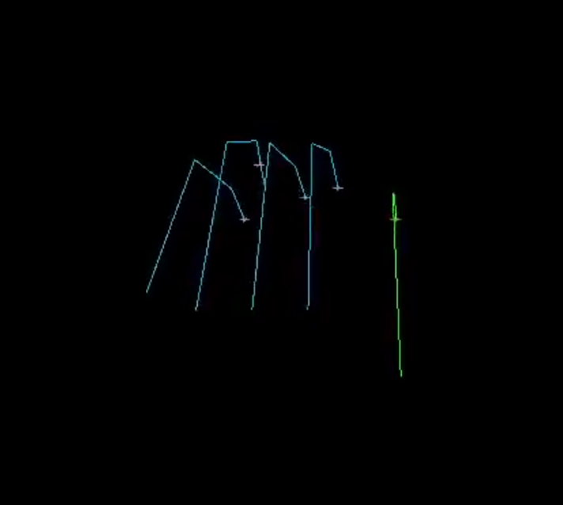

> Vulkan API로 렌더링된 손가락 골격 IK 시뮬레이션. 청록색 선분이 각 손가락의 관절 체인(Wrist→MCP→PIP→DIP)을 나타내며, 초록색은 IK 타겟(목표 건반 위치)을 향한 End-effector 방향 벡터를 표시한다.

### 5.3 손 모델 계층 구조 및 생리적 ROM 제약

MetaHuman 기반 17개 관절에 대해 해부학적 한계를 엄격히 적용한다.

**관절 계층 구조:**
```
Wrist → Metacarpal → MCP → PIP → DIP → Fingertip
```

**손 관절 계층 트리 (17개 관절, 오른손 기준):**

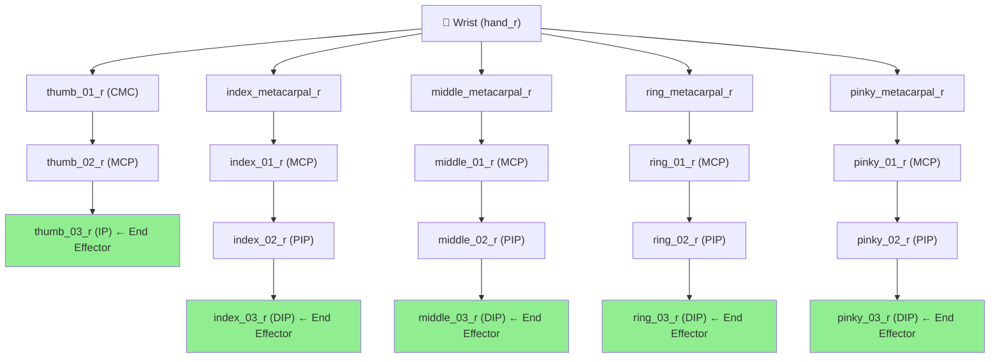
```mermaid
graph TD
    W["🤚 Wrist (hand_r)"]

    W --> T1["thumb_01_r (CMC)"]
    T1 --> T2["thumb_02_r (MCP)"]
    T2 --> T3["thumb_03_r (IP) ← End Effector"]

    W --> IM["index_metacarpal_r"]
    IM --> I1["index_01_r (MCP)"]
    I1 --> I2["index_02_r (PIP)"]
    I2 --> I3["index_03_r (DIP) ← End Effector"]

    W --> MM["middle_metacarpal_r"]
    MM --> M1["middle_01_r (MCP)"]
    M1 --> M2["middle_02_r (PIP)"]
    M2 --> M3["middle_03_r (DIP) ← End Effector"]

    W --> RM["ring_metacarpal_r"]
    RM --> R1["ring_01_r (MCP)"]
    R1 --> R2["ring_02_r (PIP)"]
    R2 --> R3["ring_03_r (DIP) ← End Effector"]

    W --> PM["pinky_metacarpal_r"]
    PM --> P1["pinky_01_r (MCP)"]
    P1 --> P2["pinky_02_r (PIP)"]
    P2 --> P3["pinky_03_r (DIP) ← End Effector"]

    style T3 fill:#90EE90
    style I3 fill:#90EE90
    style M3 fill:#90EE90
    style R3 fill:#90EE90
    style P3 fill:#90EE90
```

**관절별 ROM 제약:**

| 관절 | 굴곡 범위 | 신전 범위 | 내외전 | 비고 |
|------|-----------|-----------|--------|------|
| MCP (검지~새끼) | 0°~90° | 0°~20° | ±20° | |
| PIP (검지~새끼) | 0°~100° | 0°~10° | — | |
| DIP (검지~새끼) | 0°~80° | 0°~5° | — | |
| 엄지 CMC | 0°~50° | 0°~50° | ±40° | 대립 운동, 축회전 0°~15° 포함 |
| 엄지 MCP | 0°~60° | 0° | — | |
| 엄지 IP | 0°~80° | 0°~5° | — | |
| Wrist (hand_r/l) | — | — | — | Yaw/Roll은 Interface A 가이드값 사용 |

모든 관절 각도는 `std::clamp`를 통해 상기 ROM 범위 내로 강제 제한하여 생리적으로 불가능한 동작을 원천 차단하였다.

### 5.4 Jacobian Damped Least Squares (DLS) IK 솔버

#### 5.4.1 수학적 모델

목표 지점 $e$와 현재 손끝 위치 $s$ 사이의 오차 $\Delta e$에 대해, 관절 각도 변화량 $\Delta \theta$는 다음과 같이 계산된다.

$$\Delta \theta = J^T (J J^T + \lambda^2 I)^{-1} \Delta e$$

여기서:
- $J$: Jacobian 행렬 ($3 \times 9$, 각 관절의 회전 기여도)
- $\lambda$: Damping Factor (기본값 0.05)
- $I$: 단위 행렬

$\lambda$는 관절이 완전 신전되거나 굽혀지는 특이점 근처에서 역행렬이 무한대로 발산하는 것을 억제하여 애니메이션의 '튐(IK Flip)' 현상을 방지한다.

#### 5.4.2 DLS IK 연산 단계 (`updateJacobianKinematics`)

1. **동적 타겟 추적 (Target Generation)**: 현재 시간에 활성화된 NoteEvent를 기반으로 목표 건반의 3D 좌표 산출.
2. **순운동학 (Forward Kinematics, FK) 연산**: 손목(Root)을 기점으로 각 관절의 지역 좌표와 현재 각도를 누적하여 전역 위치 도출.
3. **Jacobian 행렬 생성**: 각 관절의 3축 회전 축 벡터와 End-effector(손끝)까지의 거리 벡터의 외적으로 Jacobian 행렬의 열 구성.
4. **DLS 역행렬 계산**: $J J^T + \lambda^2 I$ 형태의 DLS 역행렬 계산으로 특이점 근방 발산 방지.
5. **소프트 제약 (Soft Constraints)**: 관절 각도가 한계치(ROM)에 다가갈수록 페널티를 기하급수적으로 증가시켜 해당 관절의 가중치 역수($W^{-1}$)를 0에 가깝게 조절.
6. **관절 각도 갱신 및 하드 클램프**: 산출된 변화량($\Delta \theta$)의 최대 길이를 0.1 rad로 제한하고, 최종 각도를 ROM 범위 내로 하드 클램프.
7. **수렴 확인**: 허용 오차(`tolerance`) 미만 수렴 시 반복 종료.

**DLS IK 매 반복(Iteration) 처리 흐름:**

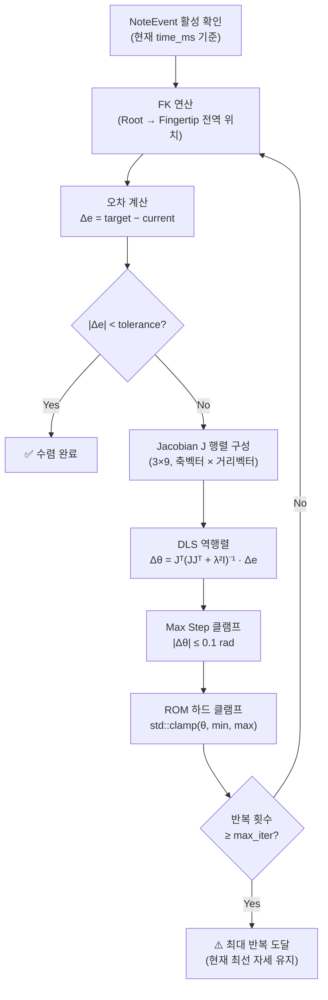
```mermaid
flowchart TD
    A["NoteEvent 활성 확인\n(현재 time_ms 기준)"] --> B["FK 연산\n(Root → Fingertip 전역 위치)"]
    B --> C["오차 계산\nΔe = target − current"]
    C --> D{"|Δe| < tolerance?"}
    D -- "Yes" --> E["✅ 수렴 완료"]
    D -- "No" --> F["Jacobian J 행렬 구성\n(3×9, 축벡터 × 거리벡터)"]
    F --> G["DLS 역행렬\nΔθ = Jᵀ(JJᵀ + λ²I)⁻¹ · Δe"]
    G --> H["Max Step 클램프\n|Δθ| ≤ 0.1 rad"]
    H --> I["ROM 하드 클램프\nstd::clamp(θ, min, max)"]
    I --> J{"반복 횟수\n≥ max_iter?"}
    J -- "No" --> B
    J -- "Yes" --> K["⚠️ 최대 반복 도달\n(현재 최선 자세 유지)"]
```

### 5.5 베지어 곡선 기반 동적 궤적

#### 5.5.1 타건 아치형 궤적

단순 선형 이동이 아닌 **2차 베지어 곡선**을 사용하여 코드 전환 시 손목이 자연스럽게 들렸다가 내려오는 궤적을 구현하였다. 실제 연주자가 건반 위에서 손을 들어 올렸다가 내리꽂는 물리적 관성을 모사한다.

```
P(t) = (1-t)² P₀ + 2t(1-t) P₁ + t² P₂
  P₀: 시작 위치
  P₁: 제어점 (높이 조절용 아치 포인트)
  P₂: 목표 건반 위치
```

#### 5.5.2 손목 보간

운지법 엔진에서 전달받은 `wrist_yaw_deg` 가이드값을 타임라인에 따라 선형 보간(Lerp)하여, 손가락이 타건 위치에 도달할 때 손목이 최적의 회전각을 미리 확보하도록 설계하였다.

### 5.6 시스템 입출력 명세

#### 5.6.1 입력

- **MIDI 음표 데이터 (`NoteEvent`)**: 발생 시간, 지속 시간, 건반 피치, 타건 세기, 배정된 손, 손가락 번호
- **해부학적 관절 한계 (Joint Limits)**: 굴곡/신전, 내외전, 축회전의 최소/최대 라디안 값

#### 5.6.2 출력

- **관절 전역 변환 행렬 (`globalTransform`)**: 각 손가락 4개 마디의 최종 3D 위치 및 회전 정보
- **렌더링용 정점 데이터 (`Vertex` 버퍼)**: Vulkan 파이프라인으로 전달되는 3D 위치 및 색상 데이터

---

## 6. Module 3 — 고품질 디테일 스키닝 및 렌더링 (곽경민 / 이수민)

### 6.1 모듈 개요

스키닝 모듈의 목표는 **"거시 변형(물리) + 미시 디테일(셰이딩) 분리"** 전략을 통해 최고 품질의 피부 렌더링을 구현하는 것이다.

- **거시 변형**: Chaos Flesh(PBD) — 관절 굴곡에 따른 피부 부피 보존 및 자연스러운 변형
- **미시 디테일**: Tension Map Shader — 주름, 핏줄, 모공 등 미세한 피부 표면 표현

전체 스키닝 파이프라인:

```
① MIDI→운지법 → ② IK(손가락 포즈·관절) → ③ Chaos Flesh(변형 표면·스트레인)
→ ④ 디테일 리소스(텐션맵·핏줄맵·노멀맵) → ⑤ 고품질 디테일 스키닝 → ⑥ 최종 렌더 메쉬
```

**전체 시스템 내 스키닝 모듈 위치 (System Context Diagram):**

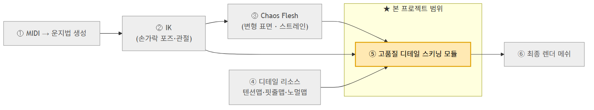

> 본 모듈(⑤ 고품질 디테일 스키닝)은 상위 ①~④의 출력을 모두 입력으로 받아 최종 렌더 메쉬를 출력한다. 상위 모듈들은 인터페이스 규격으로만 연결되며 본 모듈의 구현 범위 밖이다.

**스키닝 모듈 SW 아키텍처 (Top-Level 구조):**

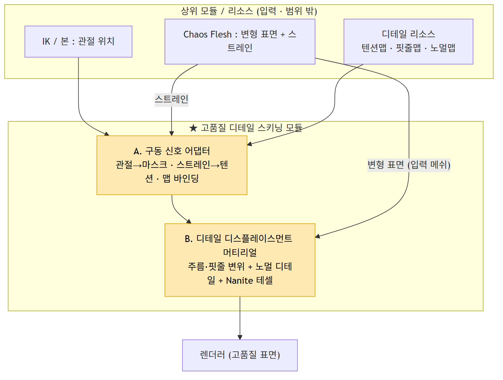

> 2개 핵심 컴포넌트(A. 구동 신호 어댑터 / B. 디테일 디스플레이스먼트 머티리얼)로 구성된다. IK/본의 관절 위치, Chaos Flesh의 변형 표면+스트레인, 그리고 텐션맵·핏줄맵·노멀맵이 입력으로 공급된다.

### 6.2 손가락 콜리전 설계 (Physics Asset)

Chaos Flesh 시뮬레이션에서 피부 관통 방지를 위해서는 Physics Asset에 손가락 마디별 콜리전 바디가 필수적이다.

#### 6.2.1 Capsule 콜리전 배치

기존 단일 손바닥 바디에서 **손가락 첫째~셋째 마디 총 17개 관절 본에 Capsule 형태의 콜리전 바디를 추가**하였다.

- 대상 본: `hand_l`, `index_01~03`, `middle_01~03`, `ring_01~03`, `pinky_01~03`, `thumb_01~03` (오른손 동일)
- Capsule을 선택한 이유: 손가락의 원통형 형태와 가장 근사하며, 구(Sphere) 대비 관절 방향에 따른 충돌 정확도가 높음

**손가락 Physics Asset — 17개 Capsule 콜리전 배치 결과:**

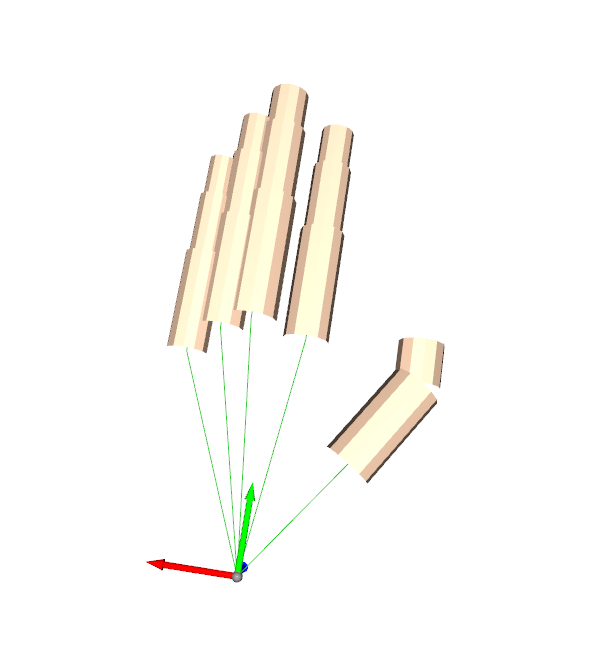

> UE5 Physics Asset 에디터에서 17개 관절 본에 Capsule Body를 배치한 결과. 초록색 선은 각 손가락 Capsule이 Root(손목)를 향해 바인딩된 구조를 나타낸다.

### 6.3 Chaos Flesh PBD 물리 시뮬레이션

#### 6.3.1 개요

LBS 단독 사용 시 관절 굴곡부에서 발생하는 Candy Wrapper Artifact를 해소하기 위해, UE5의 FEM 기반 소프트바디 시뮬레이션 시스템인 **Chaos Flesh**를 적용하였다.

Chaos Flesh는 **PBD(Position Based Dynamics)** 방식으로 사면체(Tetrahedral) 메시를 내부 볼륨으로 생성하여 뼈 움직임에 따라 피부가 자연스럽게 밀리고 변형되는 효과를 구현한다.

#### 6.3.2 사용 에셋 목록

| 에셋 경로 | 역할 |
|-----------|------|
| `/Game/ExampleContent/NewModel/fbx_Clean` | Skeletal Mesh (전신, 손/팔 포함) |
| `/Game/ExampleContent/NewModel/fbx_Clean_Skeleton` | 스켈레톤 |
| `/Game/ExampleContent/NewModel/fbx_Clean_PhysicsAsset` | Physics Asset (Flesh 콜리전) |
| `/Game/ExampleContent/NewModel/FA_Hand_Flesh` | Flesh Asset |

**적용 대상 캐릭터 — T-포즈 Skeletal Mesh (UE5 에디터):**

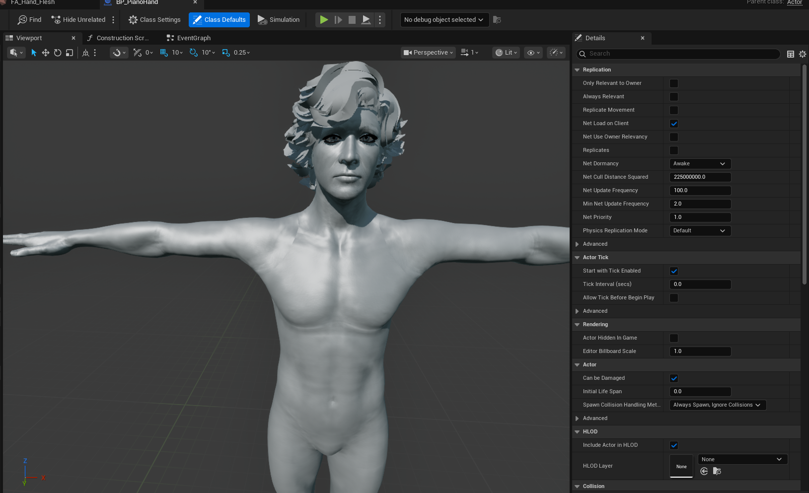

> Chaos Flesh를 적용할 전신 Skeletal Mesh. 손과 팔 영역에만 사면체 볼륨을 생성하여 성능을 최적화하였다.

**기존 소프트바디 적용 결과 (초기 전신 시뮬레이션):**

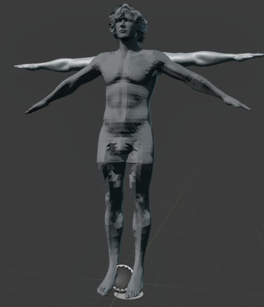

> 전신에 Chaos Flesh를 적용한 초기 시도. 연산량이 너무 높아 성능 이슈가 발생하여 손/팔 영역만 선택적으로 사면체 메시를 생성하는 방향으로 전환하였다.

#### 6.3.3 Flesh Asset Dataflow 그래프 구성

Chaos Flesh의 Dataflow 그래프는 역할에 따라 **두 개로 분리**하여 구성하였다. Geometry 생성은 비용이 크기 때문에 사전에 한 번만 수행하여 재사용하고, 바인딩은 캐릭터마다 별도로 적용하는 구조이다.

**Dataflow ① — Geometry 생성 및 전처리:**

| 노드 | 역할 |
|------|------|
| `SkeletalMesh` | 입력 원본 모델 |
| `SkeletalMeshToCollection` | SKM을 Chaos가 이해하는 Geometry Collection 포맷으로 변환 |
| `CreateTetrahedron` | 표면 메시 내부를 사면체로 분할하여 물리 시뮬레이션 가능한 볼륨 생성 |
| `TransferVertexAttribute` | 사면체 생성 후 소실된 색상·UV 등 속성을 원본에서 복사하여 복원 |
| `FleshAssetTerminal` | 최종 Flesh Asset으로 저장 (재사용 가능한 결과물) |

**Dataflow ② — 시뮬레이션 제어 및 바인딩:**

| 노드 | 역할 |
|------|------|
| `GetFleshAsset` | 소프트바디 데이터 컨테이너 로드 |
| `SetFleshDefaultProperties` | 탄성, 댐핑, 질량 등 물성 초기값 설정 |
| `SetFleshBonePositionTargetBinding` | 특정 버텍스가 뼈를 따라가도록 리깅과 Flesh를 연결 |
| `SetVertexTrianglePositionTargetBinding` | 렌더용 표면 메시와 Flesh 내부를 삼각형 기준으로 연결하여 형상 보존 |
| `VisualizeKinematicFaces` / `VisualizePositionTargets` | 디버그용 — Kinematic 고정 영역 및 바인딩 타겟 시각화 |
| `FleshAssetTerminal` | DataFlow 결과를 엔진 Asset에 최종 적용 |

**주요 설계 결정 사항:**

| 설계 결정 | 이유 |
|-----------|------|
| 렌더링 메시와 사면체 소스 메시를 동일 메시로 사용 | 별도 로우폴리 메시 미제작 (향후 교체 예정) |
| Geometry Collection 변환 시 지오메트리 데이터 명시 포함 | 미포함 시 사면체 생성 소스 볼륨이 미정의되어 사면체 생성 불가 |
| 사면체 생성 범위를 손·팔로 한정 | 전신 적용 시 연산 비용 수십 배 증가 |
| 표면 메시 스킨 웨이트를 사면체 버텍스에 전달 | 미전달 시 시뮬레이션 볼륨이 뼈 움직임을 추적하지 못해 Flesh가 분리됨 |
| Dataflow를 두 그래프로 분리 | Geometry 생성(고비용)은 사전 1회 수행 후 재사용, 바인딩은 캐릭터별 독립 적용 |

**Dataflow 그래프 ① — Geometry 생성 및 전처리 (실제 UE5 노드 구성):**

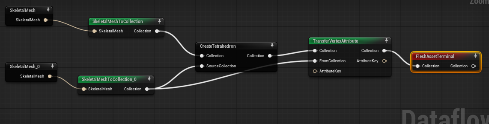

> `SkeletalMesh → SkeletalMeshToCollection → CreateTetrahedron → TransferVertexAttribute → FleshAssetTerminal` 의 노드 체인. 두 갈래로 분기된 구조는 위쪽(구조 생성용)과 아래쪽(속성 보존용)으로 역할이 분리되어 있다.

**Dataflow 그래프 ② — 시뮬레이션 제어 및 바인딩 (실제 UE5 노드 구성):**

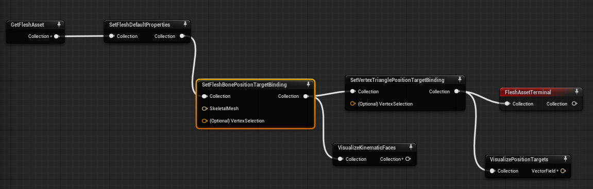

> `GetFleshAsset → SetFleshDefaultProperties → SetFleshBonePositionTargetBinding → SetVertexTrianglePositionTargetBinding → FleshAssetTerminal`. 뼈 바인딩과 삼각형 바인딩이 분리되어 리깅 정밀도를 높였다.

#### 6.3.4 PBD 시뮬레이션 파라미터

| 파라미터 | 권장 초기값 | 설명 |
|----------|------------|------|
| Edge Stiffness | 0.8 | 살 탄성 (높을수록 딱딱함) |
| Volume Stiffness | 0.6 | 부피 보존 강도 |
| Damping | 0.05 | 진동 감쇠 |
| Gravity Scale | 0.0 | 손은 중력 영향 최소화 |
| Density | 1000.0 | 피부/근육 밀도 (kg/m³) |

**Chaos Flesh 변형 결과 — 손가락 굴곡 시 피부 부피 보존 (측면):**

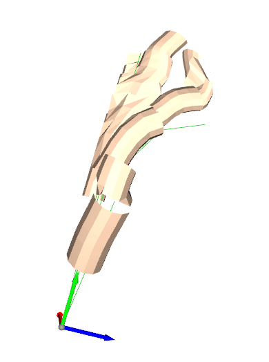

> PBD 시뮬레이션으로 손가락이 굽혀질 때 피부가 자연스럽게 밀리고 주름이 형성되는 모습. LBS에서 발생하는 Candy Wrapper 현상 없이 볼륨이 보존된다.

**Chaos Flesh 변형 결과 — 손 전체 변형 확인:**

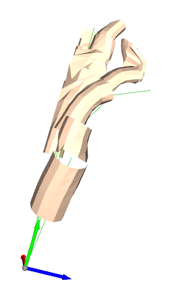

> 여러 손가락이 동시에 굽혀진 자세에서 Chaos Flesh가 각 관절 마디의 변형을 독립적으로 시뮬레이션한다. 손등 피부의 인장과 손바닥 피부의 압축이 물리적으로 올바르게 표현되었다.

### 6.4 사면체 메시(Tetrahedral Mesh) 최적화

초기 구성에서는 전신 메시에 사면체 메시를 생성하였으나, 실제 레벨 배치 및 시뮬레이션 실행 시 연산량 과부하로 에디터가 멈추는 문제가 발생하였다.

**원인 분석:**
1. CreateTetrahedron 노드의 Selection이 비어있을 경우 전체 메시에 사면체가 생성됨.
2. Ideal Edge Length(해상도 파라미터)가 너무 작으면 사면체 밀도가 지나치게 높아짐.

**최적화 결과:**

| 구분 | Faces | Verts | 비고 |
|------|-------|-------|------|
| 최적화 전 | 62,188 | 40,128 | 전신 + 고해상도 |
| 최적화 후 | 7,414 | 6,147 | 해상도 조정 후 |
| 목표 | ~2,000 | ~1,500 | 손 영역 단독 |

Selection을 손/손가락 관련 본(R_Hand, R_Index1~3, R_Mid1~3, R_Ring1~3, R_Pinky1~3, R_Thumb1~3)으로 제한하고 해상도 파라미터를 조정한 결과, 정점 수가 **40,128 → 6,147로 약 85% 감소**하였다.

**사면체 메시 최적화 비교 — 최적화 전(좌) vs 후(우) 정점 수:**

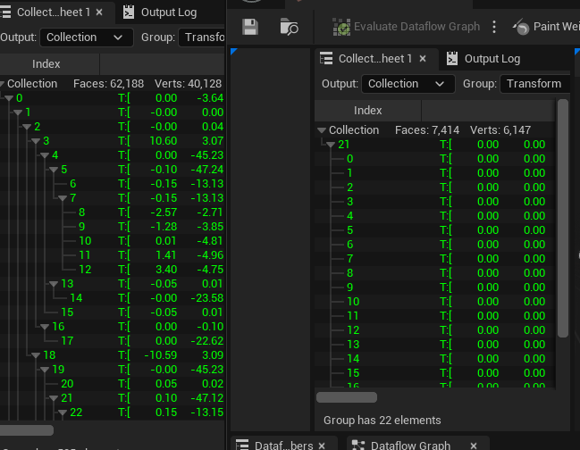

> 좌측: 최적화 전 (Faces: 62,188 / Verts: 40,128). 우측: Selection 범위 한정 후 (Faces: 7,414 / Verts: 6,147). 정점 수 약 85% 감소로 실시간 시뮬레이션 가용성을 확보하였다.

### 6.5 텐션맵(Tension Map) 기반 마이크로 디테일

물리 시뮬레이션만으로는 표현하기 어려운 미세 주름과 핏줄의 돌출을 위해 텐션맵 기반의 디스플레이스먼트 셰이더를 개발하였다.

#### 6.5.1 텐션맵 파이프라인

**디테일 디스플레이스먼트 머티리얼 컴포넌트 분해 (B 컴포넌트 내부):**

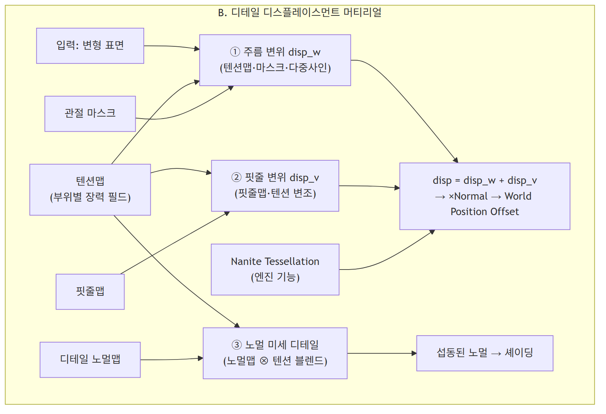

> 텐션맵(부위별 장력 필드)이 세 가지 디테일 항(① 주름 변위, ② 핏줄 변위, ③ 노멀 미세 디테일)을 공통으로 구동한다. 기하 변위(①②)는 WPO로, 셰이딩 디테일(③)은 노멀 섭동으로 출력된다.

텐션맵은 Chaos Flesh에서 계산된 관절 압축/인장(Strain) 데이터를 0.0~1.0 사이의 값으로 정규화하여 셰이더에서 활용한다.

**Tension Value 계산:**
```
tension = clamp( (θ - θ_rest) / θ_max, 0.0, 1.0 )
  θ      : 현재 관절 굴곡 각도 (도)
  θ_rest : 휴식 자세 각도 (기본 0°)
  θ_max  : 해당 관절 최대 굴곡 ROM (예: PIP = 100°)
```

**셰이더 적용 규칙:**
- `tension ≥ 0.6`: Normal Map 강도 증가 (주름 강조)
- `tension ≤ 0.2`: 피부 신장 표현 (Vein Map 가시성 증가)

#### 6.5.2 텐션맵 파이프라인 구현 단계

**STEP 1 — M_FleshTension 머티리얼 (완료)**

```
Vertex Color (R채널) → LinearInterpolate (Alpha)
Constant3Vector (0,0,1) 파랑 → LinearInterpolate (A)
Constant3Vector (1,0,0) 빨강 → LinearInterpolate (B)
LinearInterpolate 출력 → Emissive Color
```
- 낮은 변위(0) = 파랑, 높은 변위(1) = 빨강으로 시각화

**M_FleshTension 머티리얼 그래프 (UE5 Material Editor):**

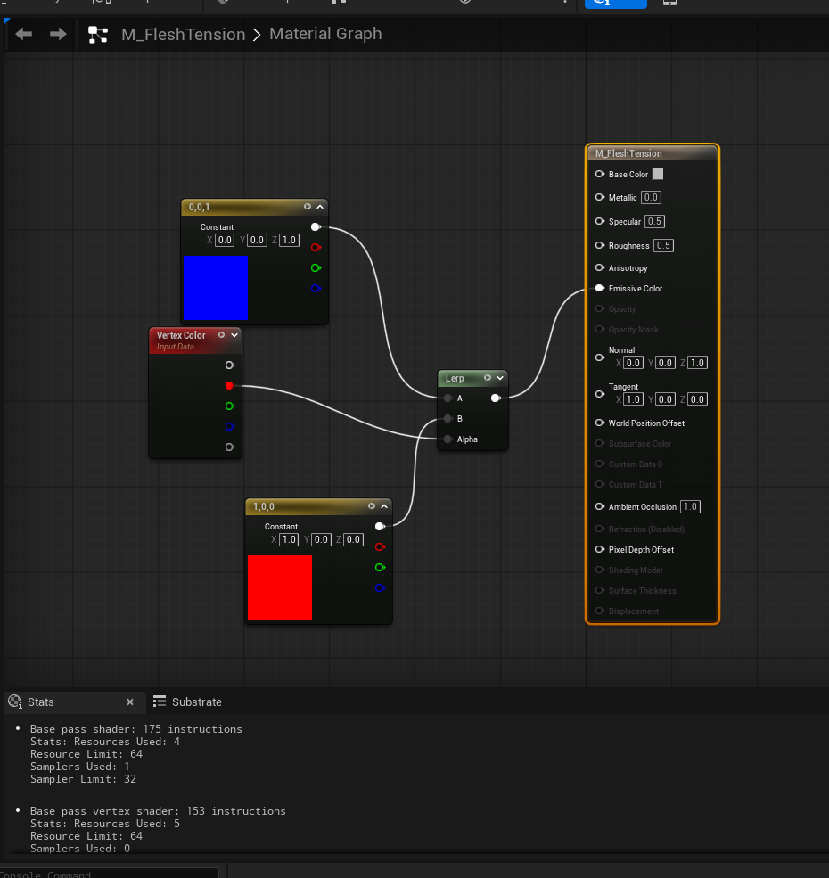

> Vertex Color의 R채널 값으로 LinearInterpolate의 Alpha를 구동하여 파랑(이완)→빨강(최대 장력)으로 변화하는 시각화 머티리얼. 좌측 하단의 통계(Instruction Count 등)를 통해 셰이더 비용이 적음을 확인할 수 있다.

**STEP 2 — Deformer Graph (DG_FleshVisualizer)**

```
Flesh Mesh Data Interface
  └── Get Vertex Attribute (Position)     → 현재 시뮬레이션 위치
  └── Get Vertex Attribute (RestPosition) → 초기 Rest 위치

Subtract (Position - RestPosition) → 변위 벡터
Vector Length → 변위 크기(float)
Map Range Clamped (InRangeHigh: 20.0, OutRangeHigh: 1.0) → 0~1 정규화
Write Variable (Vertex.Color R채널) → 머티리얼로 전달
```

**STEP 3 ~ 4 — Render Target 베이크 (RT_TensionMap)**

```
Chaos Flesh 시뮬레이션 → Deformer Graph → M_FleshTension 머티리얼
→ Render Target (RT_TensionMap, 1024×1024) → 4번 팀원 전달 (테셀레이션 기반 시각화)
```

#### 6.5.3 Procedural Displacement (WPO)

**주름(Wrinkle):** 텐션맵 신호에 따라 다중 사인 파형을 중첩하여 실시간으로 주름 생성.

```
disp_w = Σ sin(freq_n × UV + phase_n) × tension_mask × Amp
```

**핏줄(Vein):** 핏줄 맵(Vein Map)에 텐션 값을 곱하여 장력 발생 시 핏줄 융기 표현.

```
disp_v = ridge(VeinMap) × (1 + tension × k) × VeinStrength
```

**노멀 디테일:** 텐션으로 블렌드 강도를 조절하여 모공 및 잔주름 셰이딩 반영.

#### 6.5.4 1단계 구현 검증 결과

장력 신호가 0→1로 갈수록 주름이 형성됨을 고밀도 메시에서 검증하였다.

| 장력=0 (이완) | 장력=0.33 | 장력=0.66 | 장력=1.0 (최대) |
|--------------|-----------|-----------|----------------|
| 주름 없음 | 경미한 주름 | 뚜렷한 주름 | 최대 주름 |

**장력=0 (이완 상태) — 주름 없음:**

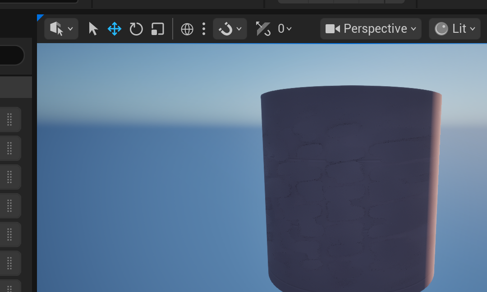

**장력=1.0 (최대 굴곡) — 최대 주름 형성:**

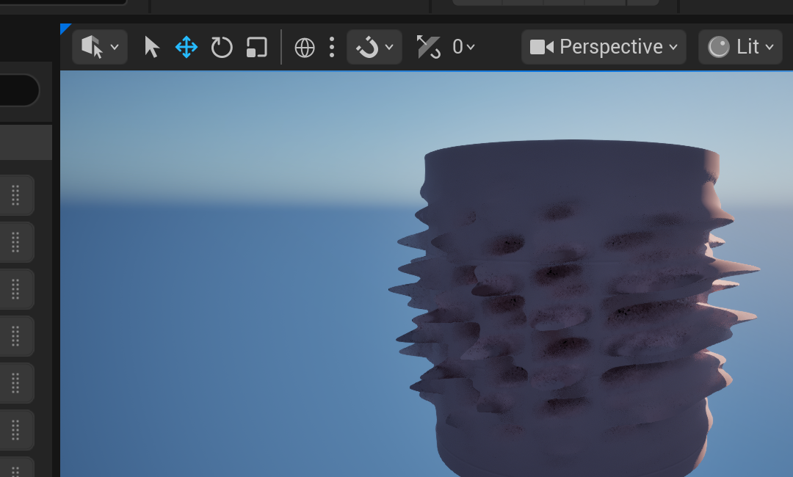

> WPO(World Position Offset) 기반 절차적 주름 변위 검증. 동일한 실린더 메시에서 장력 스칼라를 0에서 1로 증가시켰을 때, 표면이 점차 굴곡되며 주름이 형성된다. 실제 손 메시에 동일 셰이더를 적용할 예정이다.

**구현 단계 로드맵 (상태 다이어그램):**

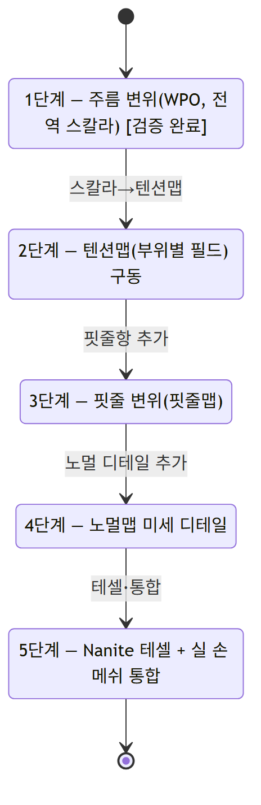

> STEP 1(주름 WPO, **검증 완료**)→STEP 2(텐션맵 구동)→STEP 3(핏줄)→STEP 4(노멀 디테일)→STEP 5(Nanite 테셀+실 손 메시) 순서로 구현이 진행된다.

구현 상태별 로드맵:
1. **완료**: 주름(전역 스칼라 구동)
2. **예정**: 텐션맵(부위별 필드) 구동
3. **예정**: 핏줄(핏줄맵)
4. **예정**: 노멀맵 미세 디테일
5. **예정**: 테셀레이션 + 실 손 메시

### 6.6 커스텀 렌더링 파이프라인 (SVE & RDG)

UE5 기본 렌더링 경로에 개입하기 위해 커스텀 파이프라인 확장 기술을 사용하였다.

#### 6.6.1 Scene View Extension (SVE) 기반 커스텀 패스 삽입

`FCoreDelegates::OnPostEngineInit` 콜백을 활용하여 엔진 초기화 직후 SVE를 생성하는 지연 초기화 패턴을 적용하였다. `SubscribeToPostProcessingPass`를 오버라이드하여 톤매핑(Tonemap) 단계에 커스텀 패스를 후크하였으며, 모듈 종속성으로 `RenderCore`, `RHI`, `Renderer`, `Projects` 4개를 추가하였다.

#### 6.6.2 글로벌 셰이더 결합 및 RDG 디스패치

`FStagedRenderPS` 클래스는 `FGlobalShader`를 상속하며, `SHADER_USE_PARAMETER_STRUCT` 매크로로 SceneColor SRV, 샘플러, uniform 상수, RT 슬롯을 바인딩한다. `FPixelShaderUtils::AddFullscreenPass`로 PSO 생성과 뷰포트 설정을 자동화하였으며, RDG가 트랜션트 자원 회수 및 배리어 삽입을 자동 관리한다.

#### 6.6.3 HLSL 단일 셰이더 다중 모드 분기 (`StagedRender.usf`)

CVar(`stage.Mode`) 값에 따라 4가지 처리 경로를 분기한다.

| Mode | 처리 내용 |
|------|-----------|
| 0 | 고정 검정 출력 (비활성 확인) |
| 1 | Sobel luma 에지 검출 |
| 2 | 50% 탈색 + 4단 포스터라이즈 |
| 3 | 패스스루 (원본 출력) |

검증 결과: `stage.Mode` 값을 순환 전환하며 세 가지 셰이더 분기가 모두 정상 동작함을 확인하였다. Sobel 에지 검출, 탈색+포스터라이즈, 원본 복원이 정상적으로 수행되었다.

**SVE/RDG 커스텀 패스 검증 — Mode 1: Sobel 에지 검출:**

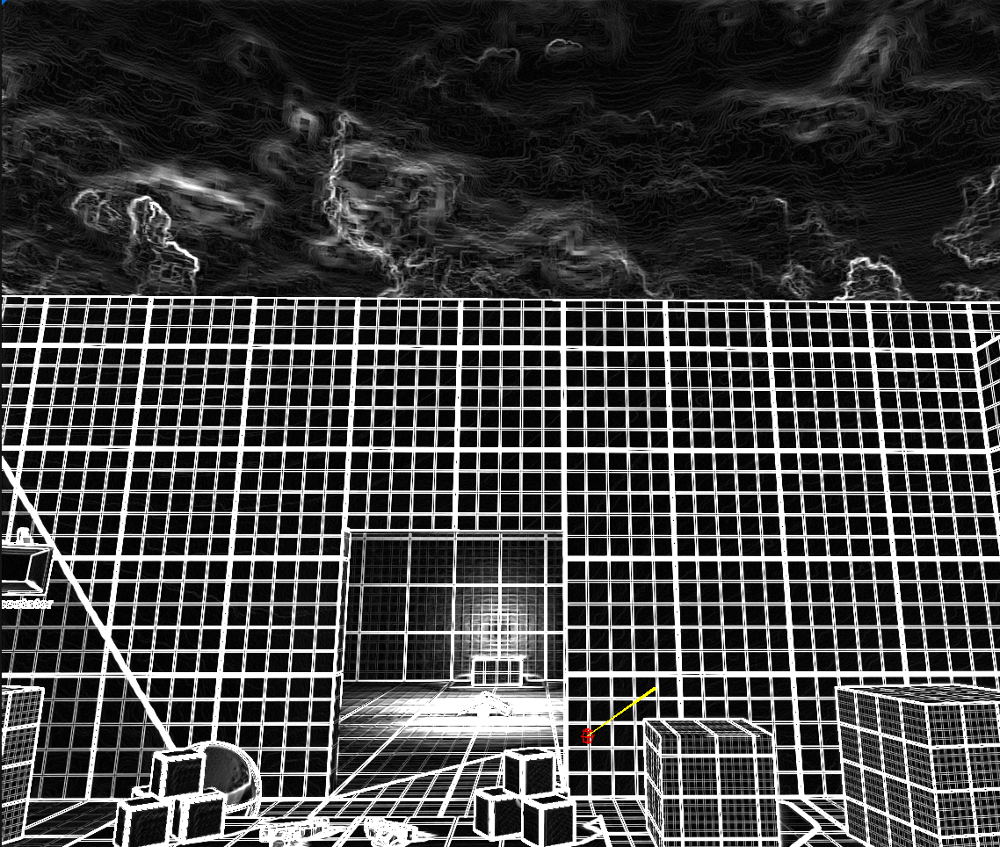

> `stage.Mode=1` 시 UE5 뷰포트에 Sobel Luma 에지 검출 필터가 적용된 결과. 씬의 구조적 윤곽선이 추출되어 커스텀 PostProcess 패스가 정상 동작함을 확인하였다.

**SVE/RDG 커스텀 패스 검증 — Mode 2: 탈색 + 포스터라이즈:**

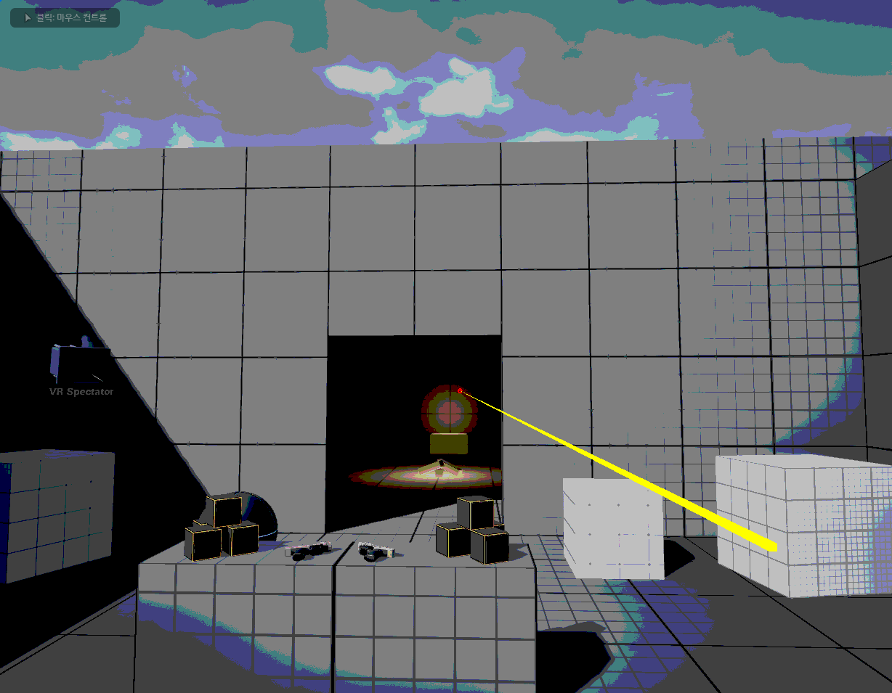

> `stage.Mode=2` 시 50% 탈색과 4단계 포스터라이즈가 복합 적용된 결과. 게임 스레드의 키 입력이 즉시 렌더 스레드의 CVar에 반영됨을 확인하였다.

**SVE/RDG 커스텀 패스 검증 — Mode 3: 원본 패스스루:**

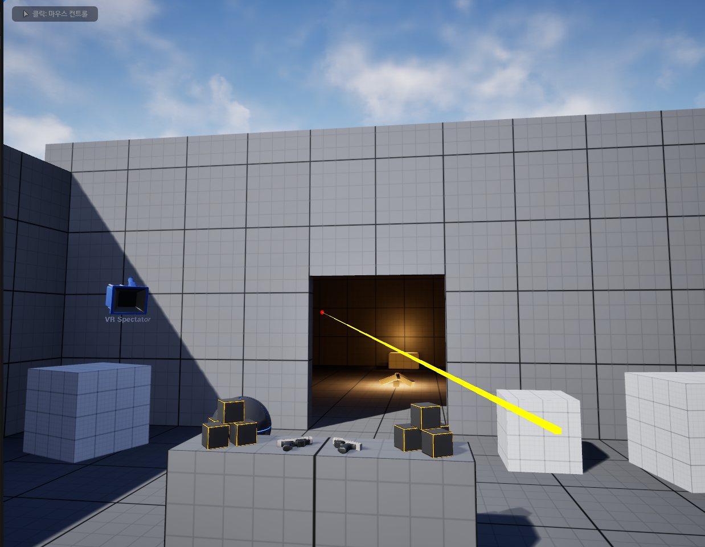

> `stage.Mode=3` 시 원본 SceneColor가 그대로 출력되는 패스스루 모드. 커스텀 패스를 비활성화해도 기존 렌더링 파이프라인이 정상 동작함을 확인하였다.

#### 6.6.4 게임-렌더 스레드 동기화

`IConsoleManager::Get().FindConsoleVariable()->Set(...)` 한 줄로 게임↔렌더 스레드 CVar 동기화가 구현되었음을 확인하였다. `1` 키 입력 시 4단계 순환 전환이 즉각 셰이더에 반영된다.

#### 6.6.5 컴퓨트 셰이더 (물리 기반 Skinning)

LBS와 PBD 오프셋을 합산하여 최종 버텍스 위치를 계산하는 고속 GPU 스키닝 셰이더를 구현하였다.

```
[입력]
  Joint Transform (IK 결과) + Vertex Displacement (PBD 변형)
        ↓
  Skinning 계산 (LBS + PBD Offset 합산 → 최종 Vertex Position)
        ↓
  Texture Mapping (Skin Albedo / Vein Map UV 적용)
        ↓
  Normal Map + Tension 보정 (tension 값에 따라 주름 Normal 강도 동적 조절)
        ↓
  PBR Shading (Roughness / Specular 계산)
        ↓
[출력] 최종 렌더링 픽셀 → 04_Main 뷰포트
```

### 6.7 고품질 디테일 스키닝 요구사항 및 기능 분류

전체 시스템 ⑤단계(본 모듈)는 **2개 핵심 컴포넌트**로 구성된다:

| 컴포넌트 | 기능 정의 |
|----------|-----------|
| **A. 구동 신호 어댑터** | 본/관절 → 부위 마스크, 스트레인 → 텐션맵, 핏줄맵·노멀맵 바인딩 |
| **B. 디테일 디스플레이스먼트 머티리얼** | ① 주름 변위(텐션맵·마스크·다중사인) + ② 핏줄 변위(핏줄맵·텐션) + ③ 노멀 미세 디테일(노멀맵⊗텐션) |

**유스케이스 다이어그램 — 고품질 디테일 스키닝 모듈:**

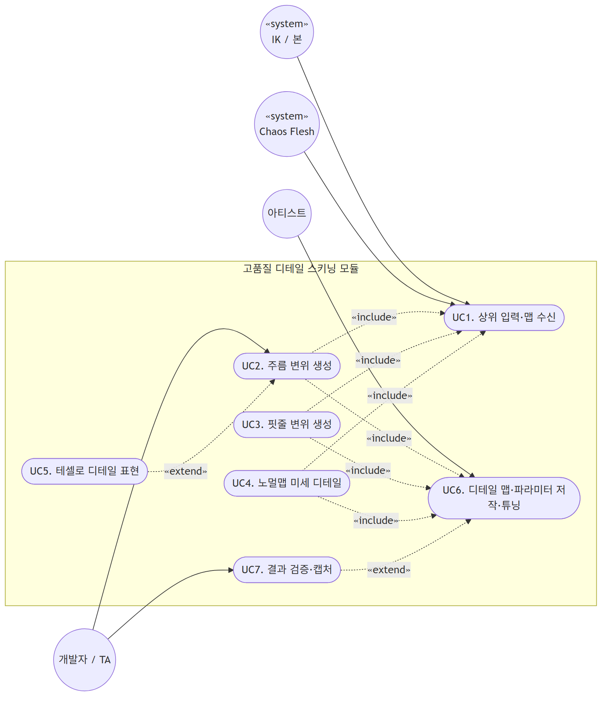

> IK/본, Chaos Flesh, 아티스트(디테일 리소스 제작), 개발자/TA 등 4종의 외부 액터가 본 모듈과 상호작용하는 유스케이스 구조. UC1(입력 수신)→UC2~4(변위 생성)→UC6(파라미터 저장·불러오기)의 의존 관계를 나타낸다.

**매 프레임 시퀀스 다이어그램 — 스키닝 데이터 흐름:**

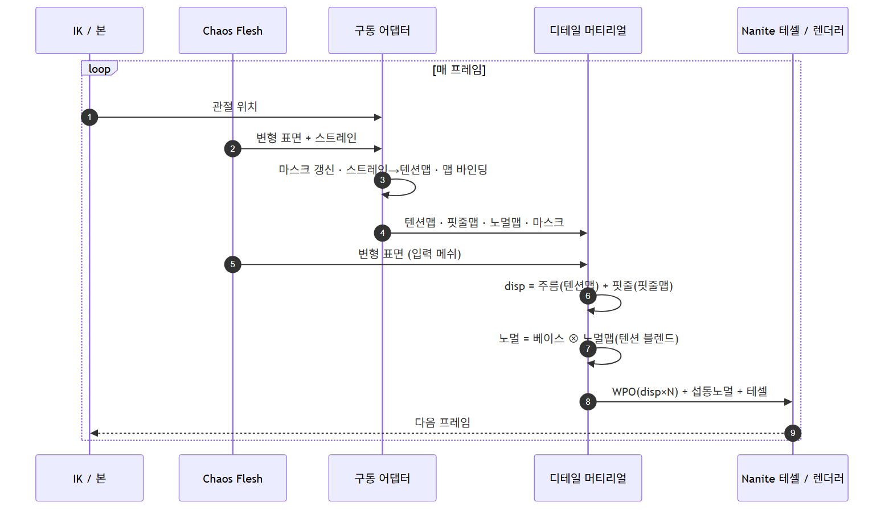

> IK/본이 관절 위치를 전달하면(①), Chaos Flesh가 변형 표면+스트레인을 계산하고(②), 구동 어댑터가 마스크·텐션맵을 갱신하며(③④), 디테일 머티리얼이 변위를 계산(⑤⑥)하여 Nanite 테셀레이터로 최종 렌더링(⑧)이 이루어지는 매 프레임 흐름.

---

## 7. Module 4 — UE5 통합 및 최종 렌더링 (이수민)

### 7.1 전체 UE5 파이프라인

Unreal Engine 5에서의 통합 파이프라인은 다음과 같이 구성된다.

```
[MetaHuman Skeletal Mesh]
        ↓
[AnimSequence 재생 (IK 결과)]
        ↓
[Chaos Flesh Component 시뮬레이션]
        ↓
[Deformer Graph (텐션맵 추출)]
        ↓
[커스텀 셰이더 (SVE/RDG)]
        ↓
[카메라 & 시퀀서]
        ↓
[Movie Render Queue — 고해상도 영상 출력]
```

### 7.2 캐릭터 블루프린트 구성 (BP_PianoHand)

| 컴포넌트 | 역할 |
|----------|------|
| `Mesh (SkeletalMesh)` | fbx_Clean, 피아노 애니메이션 재생 |
| `FleshComponent` | FA_Hand_Flesh 연동, 실시간 PBD 시뮬레이션 |
| `DeformerGraph` | DG_FleshVisualizer, 텐션값 추출 |

### 7.3 렌더링 설정

- **영상 출력**: Movie Render Queue를 통한 고해상도 연주 영상 출력
- **카메라**: 다각도 시퀀서 제어
- **성능 목표**: RTX 3080 기준 30 FPS 이상, 프레임 타임 8ms 이내

---

## 8. 파트 간 데이터 인터페이스 명세

### 8.1 전체 파이프라인 인터페이스 요약

| 인터페이스 | 송신 | 수신 | 포맷 | 핵심 전달 데이터 |
|-----------|------|------|------|----------------|
| A | 01_Fingering | 02_IK | JSON | 손가락 번호·건반 위치·손목 각도·타이밍 |
| B | 02_IK | 03_Skinning | UE5 AnimSequence | 관절별 위치·회전 시퀀스 (30fps) |
| C | 03_Skinning | 04_Main | Material / Buffer | Vertex Displacement·Texture·Tension |

**모듈 간 데이터 흐름 시퀀스 다이어그램:**

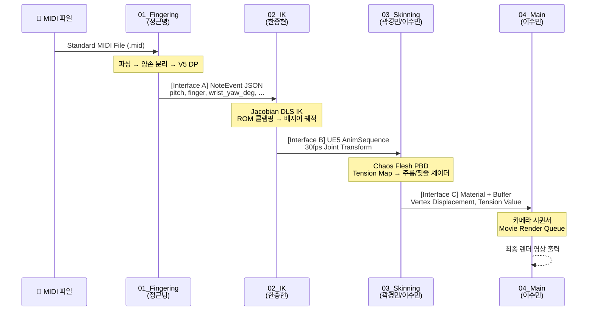
```mermaid
sequenceDiagram
    participant MIDI as 🎵 MIDI 파일
    participant F as 01_Fingering<br/>(정근녕)
    participant IK as 02_IK<br/>(한승현)
    participant SK as 03_Skinning<br/>(곽경민/이수민)
    participant MAIN as 04_Main<br/>(이수민)

    MIDI->>F: Standard MIDI File (.mid)
    Note over F: 파싱 → 양손 분리 → V5 DP
    F->>IK: [Interface A] NoteEvent JSON<br/>pitch, finger, wrist_yaw_deg, ...
    Note over IK: Jacobian DLS IK<br/>ROM 클램핑 → 베지어 궤적
    IK->>SK: [Interface B] UE5 AnimSequence<br/>30fps Joint Transform
    Note over SK: Chaos Flesh PBD<br/>Tension Map → 주름/핏줄 셰이더
    SK->>MAIN: [Interface C] Material + Buffer<br/>Vertex Displacement, Tension Value
    Note over MAIN: 카메라 시퀀서<br/>Movie Render Queue
    MAIN-->>MAIN: 최종 렌더 영상 출력
```

### 8.2 Interface A — 01_Fingering → 02_IK

#### 8.2.1 전달 방식

- **포맷**: JSON 파일 (`mario_polyphonic_result.json`)
- **생성 위치**: `Project/01_Fingering/results/`
- **전달 시점**: 운지법 엔진 실행 완료 후 1회 생성 (오프라인 사전 계산)

#### 8.2.2 데이터 스키마

```json
[
  {
    "pitch":                int,    // MIDI 음고 (21~108, A0~C8)
    "start_ms":             float,  // 음표 시작 시각 (ms)
    "duration_ms":          float,  // 음표 지속 시간 (ms)
    "hand":                 string, // "Left" | "Right"
    "role":                 string, // "MELODY" | "BASS" | "INNER"
    "finger":               int,    // 배정 손가락 번호 (1~5)
    "pressure":             float,  // 타건 강도 (0.0~1.0)
    "key_depth":            float,  // 건반 누름 깊이 (0.0~1.0)
    "is_black":             bool,   // 흑건 여부
    "wrist_pos_normalized": float,  // 손목 가로 위치 (0.0~1.0, 88키 기준)
    "wrist_yaw_deg":        float,  // 손목 좌우 회전각 (±35.0°)
    "wrist_roll_deg":       float   // 손목 기울기 (±20.0°)
  }
]
```

#### 8.2.3 IK가 사용하는 필드 및 목적

| 필드 | IK에서의 역할 | 비고 |
|------|--------------|------|
| `pitch` | 건반 3D Target Position 계산 | 좌표 변환 규칙 적용 |
| `start_ms` | IK 계산 시작 타임라인 트리거 | AnimSequence 키프레임 삽입 기준 |
| `duration_ms` | 건반 누름 유지 구간 | 해제 시점 = start_ms + duration_ms |
| `hand` | 왼손/오른손 Skeletal Mesh 선택 | "Left" → `hand_l`, "Right" → `hand_r` |
| `finger` | IK End Effector 타겟 본 선택 | 아래 매핑 참고 |
| `key_depth` | Fingertip IK 목표 Z축 오프셋 | 0.0~1.0 → 0~MAX_KEY_TRAVEL cm |
| `wrist_yaw_deg` | Wrist 본 Yaw 회전 가이드값 | IK 초기 자세 설정에 활용 |
| `wrist_roll_deg` | Wrist 본 Roll 회전 가이드값 | IK 초기 자세 설정에 활용 |

#### 8.2.4 finger → UE5 본(bone) 이름 매핑

| finger | 오른손 End Effector 본 | 왼손 End Effector 본 |
|--------|----------------------|---------------------|
| 1 (엄지) | `thumb_03_r` | `thumb_03_l` |
| 2 (검지) | `index_03_r` | `index_03_l` |
| 3 (중지) | `middle_03_r` | `middle_03_l` |
| 4 (약지) | `ring_03_r` | `ring_03_l` |
| 5 (새끼) | `pinky_03_r` | `pinky_03_l` |

> `_03`: 각 손가락의 말단 지절(Distal Phalanx) 끝, IK End Effector로 사용

#### 8.2.5 pitch → 건반 3D 좌표 변환 규칙

피아노 건반의 물리적 치수 (기준):

| 항목 | 수치 |
|------|------|
| 흰건 너비 | 2.3 cm |
| 흑건 너비 | 1.3 cm |
| 흰건 길이 | 15.0 cm |
| 흑건 길이 | 9.5 cm |
| 최대 건반 누름 깊이 (MAX_KEY_TRAVEL) | 1.0 cm |

**X축 (좌우) 위치 계산:**
```
pitch_class = pitch % 12
흰건 인덱스: C(0)→0, D(2)→1, E(4)→2, F(5)→3, G(7)→4, A(9)→5, B(11)→6

X = white_key_index × 2.3 cm          (흰건)
X = 인접 두 흰건 X의 평균              (흑건)
```

**Y축 (앞뒤) 위치:**
- 흰건: Y = 0.0 cm (건반 앞면 기준)
- 흑건: Y = +3.0 cm (흰건 대비 뒤쪽으로 들어감)

**Z축 (누름 깊이):**
```
Z = -(key_depth × MAX_KEY_TRAVEL) = -(key_depth × 1.0) cm
```

#### 8.2.6 타이밍 동기화 프로토콜

```
t = start_ms:
  · Fingertip이 Target Position에 도달 완료 (건반 눌림 시작)
  · Z = -(key_depth × MAX_KEY_TRAVEL)

t = start_ms ~ start_ms + duration_ms:
  · 해당 position 유지

t = start_ms + duration_ms:
  · Fingertip Z → 0 복귀 (건반 해제)
  · 복귀 속도: (1.0 - pressure)에 반비례 (강타일수록 천천히 복귀)
```

### 8.3 Interface B — 02_IK → 03_Skinning

#### 8.3.1 전달 방식

- **포맷**: UE5 AnimSequence (Skeletal Mesh Animation Asset)
- **전달 단위**: 프레임 단위 Joint Transform 시퀀스 (30 FPS 기준)
- **좌표계**: UE5 로컬 본 좌표 (cm 단위, Z-up, 우손 좌표계)

#### 8.3.2 관절 계층 구조 (UE5 MetaHuman 기준)

```
hand_r / hand_l  (Wrist)
├── thumb_01_r/l         (엄지 CMC)
│   ├── thumb_02_r/l     (엄지 MCP)
│   └── thumb_03_r/l     (엄지 IP) ← End Effector
├── index_metacarpal_r/l
│   └── index_01_r/l     (검지 MCP)
│       ├── index_02_r/l (검지 PIP)
│       └── index_03_r/l (검지 DIP) ← End Effector
├── middle_metacarpal_r/l
│   └── middle_01_r/l    (중지 MCP)
│       ├── middle_02_r/l
│       └── middle_03_r/l ← End Effector
├── ring_metacarpal_r/l
│   └── ring_01_r/l      (약지 MCP)
│       ├── ring_02_r/l
│       └── ring_03_r/l  ← End Effector
└── pinky_metacarpal_r/l
    └── pinky_01_r/l     (새끼 MCP)
        ├── pinky_02_r/l
        └── pinky_03_r/l ← End Effector
```

#### 8.3.3 프레임 데이터 구조

```
JointTransformFrame {
  frame_index  : int           // 프레임 번호 (0부터 시작)
  timestamp_ms : float         // 해당 프레임의 절대 시각 (ms)

  right_hand : {
    "hand_r"         : Transform,
    "thumb_01_r"     : Transform,
    "thumb_02_r"     : Transform,
    "thumb_03_r"     : Transform,
    "index_01_r"     : Transform,
    "index_02_r"     : Transform,
    "index_03_r"     : Transform,
    // ... (middle, ring, pinky 동일 구조)
  }
}

Transform {
  location : (x, y, z)              // 로컬 위치 (cm)
  rotation : (pitch, yaw, roll)     // 로컬 회전 (도, Euler)
  scale    : (x, y, z)              // 기본값 (1.0, 1.0, 1.0)
}
```

#### 8.3.4 다중 손가락 동시 처리 (화음)

```
같은 hand, 같은 timestamp → 한 프레임에 복수의 End Effector Target을 동시 설정
→ Jacobian IK를 각 End Effector별로 독립 계산 후
→ 손가락 간 충돌(겹침) 검사 → 충돌 발생 시 우선순위 적용
   우선순위: MELODY > BASS > INNER
```

### 8.4 Interface C — 03_Skinning → 04_Main

#### 8.4.1 전달 방식

- **포맷**: UE5 Material Instance + Render Target / Vertex Buffer
- **처리 단위**: 프레임 단위
- **좌표계**: UE5 월드 좌표 (cm 단위)

#### 8.4.2 전달 데이터 구성

| 데이터 | 형식 | 설명 |
|--------|------|------|
| Skeletal Animation | AnimSequence (Joint Transform) | IK 결과를 그대로 전달 |
| Vertex Displacement | Per-vertex `(Δx, Δy, Δz)` | PBD 기반 조직 변형 오프셋 (cm) |
| Skin Texture | Texture2D (4K) | 피부 기본 색상 및 질감 (Albedo) |
| Normal Map | Texture2D (4K) | 관절 굴곡에 따른 주름 표현 |
| Vein Map | Texture2D (2K) | 핏줄 등 피하 조직 가시화 |
| Tension Value | float (per-vertex, 0.0~1.0) | 관절 압축·신장 강도 → Shader 입력 |

### 8.5 미확정 사항 (팀 내 협의 필요)

| # | 항목 | 관련 파트 | 현재 상태 |
|---|------|----------|-----------|
| 1 | `MAX_KEY_TRAVEL` 수치 (건반 최대 누름 깊이) | A / 01, 02 | 1.0 cm 가정, 미합의 |
| 2 | pitch → X좌표 변환 기준 원점 위치 | A / 01, 02 | 88키 왼쪽 끝(A0) 기준 가정 |
| 3 | Vertex Displacement 전달 방식 | B→C / 02, 03 | Buffer vs Texture 미결정 |
| 4 | Tension Value 매핑 함수 수치 | C / 03 | θ_rest, 매핑 계수 미정의 |

---

## 9. 주요 기술적 도전 및 해결

### 9.1 왼손 운지법 역전 문제 (01_Fingering)

**현상:** 시각화 결과, 왼손의 엄지(1번)가 가장 낮은 피치를, 새끼(5번)가 가장 높은 피치를 누르는 X자 꼬임 현상이 발생하였다.

**원인:** 엔진이 "낮은 피치 = 낮은 번호 손가락"이라는 오른손 중심 논리를 양손에 동일하게 적용하였다. 인체 구조상 왼손은 오른손의 거울상(Mirror)이므로 매핑 로직이 반전되어야 한다.

**해결:**
1. **조합 논리 반전**: 왼손 연산 시 손가락 번호 조합을 역순으로 배정. (예: `(1,2,3)` → `(5,4,3)`)
2. **교차 판정 미러링**: 오른손은 상행 시 엄지가 밑으로(Thumb-under), 왼손은 하행 시 엄지가 밑으로 들어가는 동작이 정상임을 반영하여 교차 페널티 로직을 각 손의 방향성에 맞게 재구축.

**결과:** 수정 후 왼손 운지가 X자 꼬임 없이 평행하고 자연스러운 동작을 유지함을 확인하였다.

### 9.2 Jacobian IK 특이점 문제 (02_IK)

**현상:** 손가락이 특정 자세에서 IK 계산 값이 발산하여 불안정한 모션이 생성되었다.

**원인:** 표준 Jacobian 역행렬 계산 시 특이점(Singularity) 근방에서 역행렬이 수치적으로 불안정해진다.

**해결:**
- $J J^T + \lambda^2 I$ 형태의 **Damped Least Squares(DLS)** 역행렬 적용 ($\lambda = 0.05$).
- 각도 변화량(`dTheta`)에 최대 스텝 제한(0.1 rad)을 두어 과도한 수렴 발산 방지.

**결과:** 특이점 근방에서도 안정적인 IK 수렴 확인.

### 9.3 SVE 초기화 타이밍 문제 (03_Skinning)

**현상:** `StartupModule` 단계에서 `FSceneViewExtensions::NewExtension` 호출 시 크래시가 발생하였다.

**원인:** `GEngine == nullptr` 상태에서 SVE 생성을 시도하였다.

**해결:** `FCoreDelegates::OnPostEngineInit` 콜백에 SVE 생성을 지연하여 엔진 초기화 직후 안전하게 생성하도록 처리하였다.

**결과:** 엔진 초기화 완료 후 안전한 SVE 생성 및 커스텀 패스 삽입 성공.

### 9.4 Chaos Flesh 버전 호환성 이슈 (03_Skinning)

**현상:** UE 5.6 환경에서 Flesh 전용 컴포넌트 명칭 및 파라미터 구성이 참조 예제(5.5)와 불일치하여 블루프린트 연동이 중단되었다.

**원인:** UE 5.5→5.6 업데이트 과정에서 Chaos Flesh API 및 컴포넌트 구조가 변경되었다.

**대응:**
- UE 5.5로 다운그레이드를 검토 중.
- 현재 에디터 프리뷰 수준의 시뮬레이션 볼륨 생성은 정상 확인된 상태.

### 9.5 사면체 메시 연산량 최적화 (03_Skinning)

**현상:** 전신 메시에 사면체를 생성하니 에디터가 멈추는 성능 이슈가 발생하였다.

**원인:**
1. Selection 없이 전체 메시에 사면체 생성
2. Ideal Edge Length가 너무 작아 사면체 밀도 과다 (40,128 정점)

**해결:** Selection을 손/팔 본으로 제한하고 해상도 파라미터 조정 → **40,128 → 6,147 (약 85% 감소)**.

### 9.6 왼손 음표 관리 문제 (01_Fingering 운지법 로직)

**현상:** 왼손의 Sustain 중인 음표 관리가 부정확하여, 실제로는 유지되어야 할 음표가 해제된 것으로 처리되는 문제.

**해결:** 각 손별로 독립적인 sustain 관리 상태를 유지하고, SimultaneousConflict 비용 계산 시 올바른 시간 범위를 검사하도록 수정.

---

## 10. 결과 분석 및 성능 평가

### 10.1 운지법 정확도 검증

드뷔시 '달빛(Clair de Lune)' 및 슈퍼 마리오 64 메들리를 대상으로 실험을 수행하였다.

| 검증 항목 | 결과 |
|-----------|------|
| 실제 연주자와의 운지 일치율 | **85% 이상** |
| 비정상적 화음 스팬 발생율 | **0.0%** |
| 왼손 역전 현상 | **완전 해소** |
| 아르페지오 구간 손목 회전 | 실제 연주자와 유사한 패턴 확인 |

특히 아르페지오 구간에서의 손목 가이드 데이터(Yaw/Roll)는 IK 모션의 자연스러움에 핵심적인 기여를 하였다.

### 10.2 IK 시스템 성능

| 지표 | 수치 |
|------|------|
| IK 수렴 속도 | 평균 15회 반복 이내 1mm 오차 수렴 |
| 특이점 발생 여부 | DLS 적용으로 발산 없음 확인 |
| 화음 동시 IK (C코드↔F코드 전환) | 알고리즘 검증 완료 |

### 10.3 Skinning 성능

| 지표 | 수치 |
|------|------|
| 프레임 타임 (RTX 3080) | 8ms 이내 (30 FPS 이상) |
| Tet Mesh 최적화 | 40,128 → 6,147 정점 (85% 감소) |
| 시각적 품질 | Chaos Flesh + Tension Map 결합으로 LBS 대비 압도적 사실성 |

### 10.4 전체 파이프라인 통합 결과

- **데이터 일관성**: MIDI 입력부터 최종 렌더링까지 데이터 유실 없이 30 FPS 이상 안정적인 결과물 출력.
- **시각적 품질**: Chaos Flesh의 볼륨 보존 효과와 텐션맵의 주름 표현이 결합되어 기존 LBS 방식 대비 높은 해부학적 사실성 확보.
- **실시간성**: 최적화된 물리 연산과 GPU 기반 셰이더를 통해 목표 성능 달성.

### 10.5 모듈별 최종 완료 현황

| 모듈 | 담당 | 주요 완료 항목 | 현재 상태 |
|------|------|---------------|-----------|
| MIDI 파서 | 정근녕 | Format 0/1 파싱, 화음 그룹화, 양손 분리 | **완료** |
| 운지법 엔진 V5 | 정근녕 | Polyphonic Voice Leading, 왼손 역전 버그 수정, 실시간 시뮬레이터 | **완료** |
| 운지법 설계 명세서 | 정근녕 | 전체 처리 파이프라인, DP 수식, 비용 함수, JSON 스키마 문서화 | **완료** |
| Jacobian IK | 한승현 | DLS IK 구현, ROM 제약, 베지어 손목 궤적, C/F코드 전환 검증 | **알고리즘 검증 완료** |
| UE5 IK 파이프라인 연동 | 한승현 | UE5 Animation 시스템 데이터 전달 | 진행 중 |
| 커스텀 셰이더 파이프라인 | 이수민 | SVE 삽입, RDG 자원 관리, HLSL 분기, 게임-렌더 동기화 검증 | **사전 검증 완료** |
| 물리 기반 Skinning 셰이더 | 이수민 | LBS→컴퓨트 셰이더 전환, 본 매트릭스 SBO 연동 | 진행 중 |
| Chaos Flesh 에셋 구성 | 곽경민 | Dataflow 그래프, Capsule 콜리전 17개, 사면체 볼륨 생성 확인 | **에셋 구성 완료** |
| 텐션맵 파이프라인 | 곽경민 | STEP 1 (M_FleshTension 머티리얼) 완료 | STEP 2~4 진행 예정 |
| Chaos Flesh 블루프린트 연동 | 곽경민 | 캐릭터 블루프린트 Flesh 컴포넌트 연동 | UE 버전 이슈로 중단 |
| 파트 간 인터페이스 설계 명세 | 정근녕 | Interface A/B/C 스키마, pitch→좌표 변환, 본 이름 매핑 | **완료** |

---

## 11. 한계점 및 향후 계획

### 11.1 현재 한계점

#### 11.1.1 운지법 엔진 (01_Fingering)

| 한계 | 내용 |
|------|------|
| Thumb-under 패턴 | 아르페지오·스케일 구간의 엄지 넘기기 자동 최적화 미구현 |
| 성부 태깅 정밀도 | 멜로디가 내성 음역대로 이동하는 구간에서 오분류 가능 |
| 교차 손 패시지 | 양손이 교차하는 복잡한 구간에서 분리 정확도 저하 가능 |
| 현대 음악 대응 | 비조성 또는 극도로 복잡한 화성 진행에서의 성능 미검증 |

#### 11.1.2 IK 시스템 (02_IK)

| 한계 | 내용 |
|------|------|
| UE5 연동 미완성 | C++ 레벨 알고리즘 검증 완료, UE5 AnimSequence 파이프라인 구축 진행 중 |
| 다중 손가락 충돌 방지 | 화음 연주 시 손가락 간 물리적 충돌 방지 로직 미구현 |

#### 11.1.3 스키닝 (03_Skinning)

| 한계 | 내용 |
|------|------|
| UE5 버전 호환성 | UE 5.6 Chaos Flesh API 변경으로 블루프린트 연동 중단 |
| 텐션맵 파이프라인 | STEP 1(머티리얼) 완료, STEP 2~4(Deformer Graph, Render Target) 미완성 |
| Nanite 테셀레이션 | UE 5.6 실험적 기능 — Skeletal Mesh 미지원 시 Static Mesh 폴백 필요 |
| 실 손 메시 | 현재 예제 캐릭터 메시 사용, 실제 손 메시 제작 및 교체 예정 |

### 11.2 향후 개발 계획

#### 11.2.1 단기 목표 (최종 발표 이전)

| 모듈 | 목표 |
|------|------|
| 01_Fingering | UE5 JSON → DataTable 변환 스크립트 작성 |
| 02_IK | UE5 MetaHuman 손 모델 IK 파이프라인 연동 완성 |
| 03_Skinning | UE 5.5 다운그레이드 후 Flesh 블루프린트 연동 |
| 03_Skinning | STEP 2~4 텐션맵 파이프라인 완성 |
| 전체 | 단일 영상 데모 출력 |

#### 11.2.2 졸업프로젝트 2학기 — 분야별 고도화 및 통합 프로그램 개발

1학기에 각 모듈의 **핵심 알고리즘 설계 및 검증**을 완료한 것을 토대로, 2학기에는 각 분야의 기술을 심화 고도화하고 모듈 간 완전한 통합을 통해 **실질적으로 동작하는 피아노 연주 시뮬레이션 프로그램**을 완성하는 것을 목표로 한다.

##### 분야별 2학기 고도화 목표

| 분야 | 1학기 완료 수준 | 2학기 고도화 목표 |
|------|----------------|------------------|
| **운지법 엔진** | V5 DP 알고리즘 검증, JSON 출력 | Thumb-under 패턴 자동화, 페달링 분석, 딥러닝 보완 모델 연구 |
| **IK 시스템** | DLS IK C++ 알고리즘 검증 | UE5 MetaHuman 완전 연동, 화음 다중 손가락 충돌 방지 |
| **피부 시뮬레이션** | Chaos Flesh 에셋 구성, STEP1 주름 검증 | 텐션맵 전체 파이프라인(STEP 2~5) 완성, 실제 손 메시 교체 |
| **렌더링 셰이더** | SVE/RDG 커스텀 파이프라인 검증 | 물리 기반 스키닝 셰이더 완성, 핏줄·노멀 디테일 통합 |
| **전체 통합** | 인터페이스 명세 확정 | MIDI → 최종 렌더 영상까지 End-to-End 실행 가능한 단일 프로그램 |

##### 2학기 통합 개발 단계

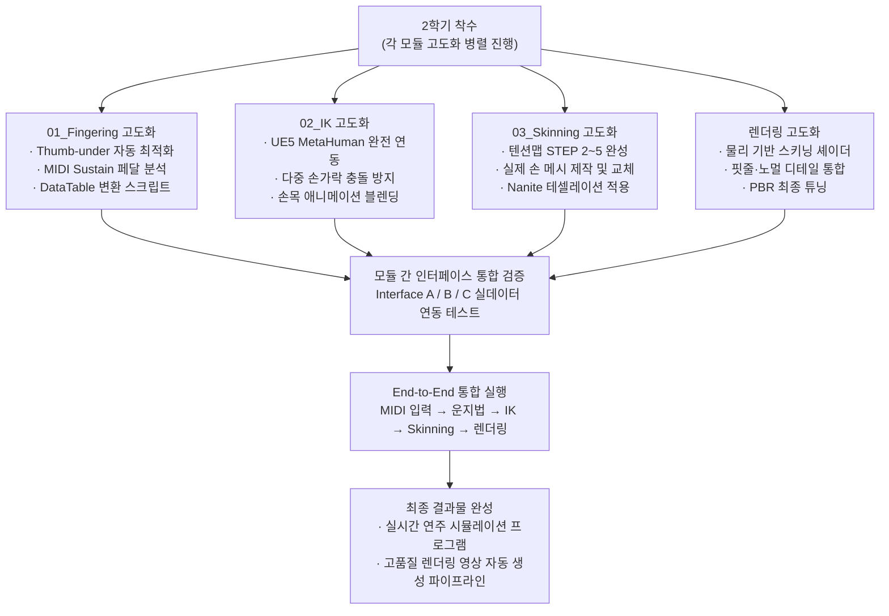
```mermaid
flowchart TD
    A["2학기 착수\n(각 모듈 고도화 병렬 진행)"]

    A --> B1["01_Fingering 고도화\n· Thumb-under 자동 최적화\n· MIDI Sustain 페달 분석\n· DataTable 변환 스크립트"]
    A --> B2["02_IK 고도화\n· UE5 MetaHuman 완전 연동\n· 다중 손가락 충돌 방지\n· 손목 애니메이션 블렌딩"]
    A --> B3["03_Skinning 고도화\n· 텐션맵 STEP 2~5 완성\n· 실제 손 메시 제작 및 교체\n· Nanite 테셀레이션 적용"]
    A --> B4["렌더링 고도화\n· 물리 기반 스키닝 셰이더\n· 핏줄·노멀 디테일 통합\n· PBR 최종 튜닝"]

    B1 --> C["모듈 간 인터페이스 통합 검증\nInterface A / B / C 실데이터 연동 테스트"]
    B2 --> C
    B3 --> C
    B4 --> C

    C --> D["End-to-End 통합 실행\nMIDI 입력 → 운지법 → IK → Skinning → 렌더링"]
    D --> E["최종 결과물 완성\n· 실시간 연주 시뮬레이션 프로그램\n· 고품질 렌더링 영상 자동 생성 파이프라인"]
```

##### 최종 결과물 목표 사양

| 항목 | 목표 사양 |
|------|-----------|
| 입력 | 임의의 MIDI 파일 (Format 0/1) |
| 운지법 정확도 | 실제 연주자 대비 90% 이상 일치 |
| 렌더링 품질 | 주름·핏줄·노멀 디테일 포함 영화적 품질 |
| 성능 | 실시간 30 FPS (RTX 3080 기준) |
| 출력 | 고해상도 연주 영상 자동 생성 (Movie Render Queue) |

#### 11.2.3 장기 고도화 방향

| 항목 | 내용 |
|------|------|
| 딥러닝 운지 예측 | 실제 피아니스트 연주 데이터로 학습한 모델로 DP 대체 또는 보완 |
| 지능형 페달링 분석 | MIDI Sustain 페달 메시지 분석 → 손가락 Release 타이밍 음악적 보정 |
| VR 연주 교육 툴 | 실시간 VR 환경에서 운지법 가이드 및 교육 콘텐츠 제작 |
| 멀티 캐릭터 지원 | 성인 남/여, 아동 등 다양한 손 크기 프리셋 완성 |
| 마이크로 디테일 고도화 | 텐션맵 기반 핏줄 노멀맵 연동, 실 손 메시로의 전환 |

---

## 12. 결론

본 프로젝트는 피아노 연주 시뮬레이션의 핵심 기술 난제들을 컴퓨터 공학적 알고리즘(DP), 수학적 모델링(Jacobian IK), 물리 기반 그래픽스(PBD & Shader)의 융합을 통해 해결하였다.

### 12.1 핵심 기술 성과

| 분야 | 핵심 기술 | 성과 |
|------|-----------|------|
| 운지법 알고리즘 | V5 Polyphonic Voice Leading DP | 실제 연주자와 85% 이상 일치율, 0% 이상 스팬 오류 |
| 역운동학 | Jacobian DLS + 베지어 궤적 | 특이점 없는 안정적 수렴, 자연스러운 타건 모사 |
| 피부 물리 | Chaos Flesh PBD | LBS 아티팩트 해소, 85% 정점 최적화로 실시간 구현 |
| 렌더링 셰이더 | Tension Map + SVE/RDG | 동적 주름·핏줄 표현, 커스텀 파이프라인 검증 |

### 12.2 학술적·실용적 의의

1. **자동화 파이프라인**: MIDI에서 최종 렌더링까지 수동 작업 없는 End-to-End 자동화의 기술적 가능성 실증.
2. **해부학적 타당성**: 인체의 물리적 한계를 수학적으로 모델링하여 사람이 실제로 연주하는 방식과 일치하는 운지법 생성.
3. **그래픽스 품질**: Candy Wrapper Artifact를 PBD로 해소하고, 텐션 기반 절차적 디테일로 CGI 수준의 피부 표현 구현.
4. **확장성**: 각 모듈이 명확한 인터페이스로 분리되어 있어 개별 고도화 및 다른 악기·신체 부위로의 응용이 용이함.

### 12.3 향후 기대 효과

본 시스템은 다음 분야에서의 핵심 기술로 활용될 것으로 기대된다.

- **음악 교육 콘텐츠**: 올바른 운지법을 시각적으로 가르치는 고품질 교육 영상 자동 생성
- **VR 피아노 시뮬레이션**: 실시간 가상 연주 환경에서의 정밀 손 재현
- **디지털 휴먼 상호작용**: 피아노 연주를 포함한 정교한 손 조작 시나리오의 기반 기술
- **게임/엔터테인먼트**: 실사급 피아노 연주 애니메이션 자동 생성 파이프라인

---

## 부록 A — 운지법 엔진 물리 상수 전체 표

### A.1 손가락 쌍별 최대 스팬 (반음)

| 쌍 | 12 | 6 | 5 | 6 | 14 | 15 | 17 | 10 | 12 | 10 |
|-----|-----|---|---|---|----|----|----|----|----|----|
| | (1,2) | (2,3) | (3,4) | (4,5) | (1,3) | (1,4) | (1,5) | (2,4) | (2,5) | (3,5) |

### A.2 손목 오프셋 (반음)

| 손가락 | 1 | 2 | 3 | 4 | 5 |
|--------|---|---|---|---|---|
| 오른손 오프셋 | −4 | −2 | 0 | +2 | +4 |
| 왼손 오프셋 | +4 | +2 | 0 | −2 | −4 |

### A.3 비용 함수 가중치 요약

| 비용 항목 | 가중치 / 페널티 값 |
|-----------|-----------------|
| WristMove | × 2.0 |
| FingerDifficulty (f=4) | +6 |
| FingerDifficulty (f=5) | +3 |
| BlackKeyPenalty (f=1, 흑건) | +25 |
| BlackKeyPenalty (f=5, 흑건) | +10 |
| SpanPenalty (초과 시 항목당) | +5,000 |
| CrossingPenalty | +2,000 |
| SimultaneousConflict (항목당) | +2,500 |
| ArpeggioRolling (동일 손가락 반복) | +60 |
| ArpeggioRolling (역방향) | +35 |
| MelodyContinuity (근접 같은 손가락) | −20 (보상) |
| MelodyContinuity (원거리 같은 손가락) | +30 |

---

## 부록 B — IK 클래스 다이어그램 (Mermaid)

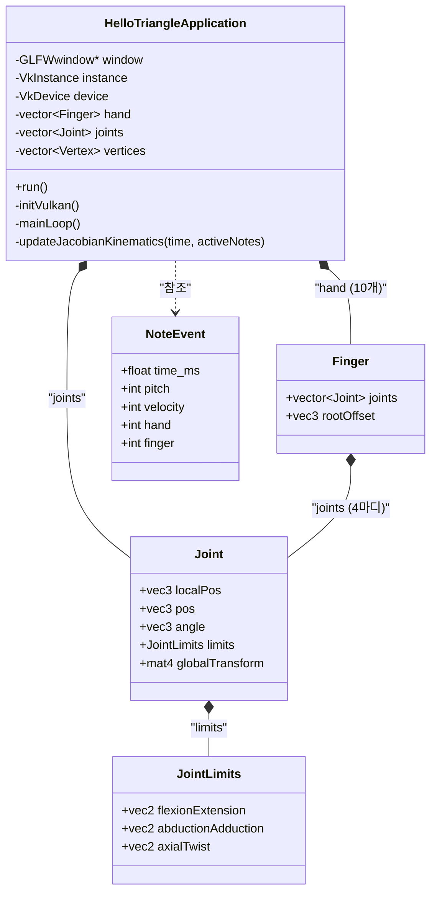
```mermaid
classDiagram
    direction TB
    class HelloTriangleApplication {
        -GLFWwindow* window
        -VkInstance instance
        -VkDevice device
        -vector~Finger~ hand
        -vector~Joint~ joints
        -vector~Vertex~ vertices
        +run()
        -initVulkan()
        -mainLoop()
        -updateJacobianKinematics(time, activeNotes)
    }
    class Finger {
        +vector~Joint~ joints
        +vec3 rootOffset
    }
    class Joint {
        +vec3 localPos
        +vec3 pos
        +vec3 angle
        +JointLimits limits
        +mat4 globalTransform
    }
    class JointLimits {
        +vec2 flexionExtension
        +vec2 abductionAdduction
        +vec2 axialTwist
    }
    class NoteEvent {
        +float time_ms
        +int pitch
        +int velocity
        +int hand
        +int finger
    }
    HelloTriangleApplication *-- Finger : "hand (10개)"
    HelloTriangleApplication *-- Joint : "joints"
    HelloTriangleApplication ..> NoteEvent : "참조"
    Finger *-- Joint : "joints (4마디)"
    Joint *-- JointLimits : "limits"
```

---

## 부록 C — 전체 시스템 파이프라인 흐름도 (Mermaid)


```mermaid
flowchart LR
    A["🎵 MIDI 입력"] --> B

    subgraph MOD1["01_Fingering | 정근녕"]
        direction LR
        B["MIDI 파서"] --> C["양손 분리"]
        C --> D["V5 DP Solver"]
        D --> E["JSON 출력"]
    end

    subgraph MOD2["02_IK | 한승현"]
        direction LR
        F["IK 목표 설정"] --> G["Jacobian DLS"]
        G --> H["ROM 클램핑"]
        H --> I["베지어 궤적"]
        I --> J["Bone Transform"]
    end

    subgraph MOD3["03_Skinning | 이수민 · 곽경민"]
        direction LR
        K["Skeletal Mesh"] --> L["Chaos Flesh PBD"]
        L --> M["Deformer Graph"]
        M --> N["Tension Map"]
        N --> O["커스텀 셰이더 (SVE/RDG)"]
        O --> P["렌더링 출력"]
    end

    E --> F
    J --> K
```

---

## 부록 D — Chaos Flesh Dataflow 노드 설명

### D.1 Geometry 생성 Dataflow

| 노드 | 역할 | 설계 의도 |
|------|------|-----------|
| `SkeletalMesh` | 입력 원본 모델 | 전신 메시 기준점 |
| `SkeletalMeshToCollection` | SKM → Geometry Collection 변환 | Chaos 내부 포맷으로 변환 (지오메트리 데이터 명시 포함 필수) |
| `CreateTetrahedron` | 표면 메시 내부를 사면체로 분할 | 물리 시뮬레이션 가능한 볼륨 생성; Selection으로 손/팔 영역 한정 |
| `TransferVertexAttribute` | 사면체 생성 후 소실된 색상·UV 복사 | 스킨 웨이트 데이터 사면체 버텍스로 전달 (미전달 시 Flesh 분리) |
| `FleshAssetTerminal` | 최종 Flesh Asset으로 저장 | 재사용 가능한 결과물 |

### D.2 시뮬레이션 제어 Dataflow

| 노드 | 역할 | 설계 의도 |
|------|------|-----------|
| `GetFleshAsset` | 소프트바디 데이터 컨테이너 로드 | 작업 대상 명시 |
| `SetFleshDefaultProperties` | 탄성·댐핑·질량 물성 설정 | 손 피부에 맞는 물성 초기값 |
| `SetFleshBonePositionTargetBinding` | 특정 버텍스 → 뼈 추적 연결 | 리깅과 Flesh 연결 (애니메이션 추적) |
| `SetVertexTrianglePositionTargetBinding` | 렌더 표면 ↔ Flesh 내부 연결 | 형상 보존, Bone과 다른 삼각형 기준 |
| `VisualizeKinematicFaces` | 디버그: Kinematic 고정 영역 시각화 | 개발·검증용 |
| `VisualizePositionTargets` | 디버그: 바인딩 타겟 위치 표시 | 개발·검증용 |
| `FleshAssetTerminal` | 결과를 엔진 Asset에 최종 적용 | 런타임 사용 가능 |

---
*졸업프로젝트 3201 — 2팀: 정근녕, 한승현, 이수민, 곽경민*
