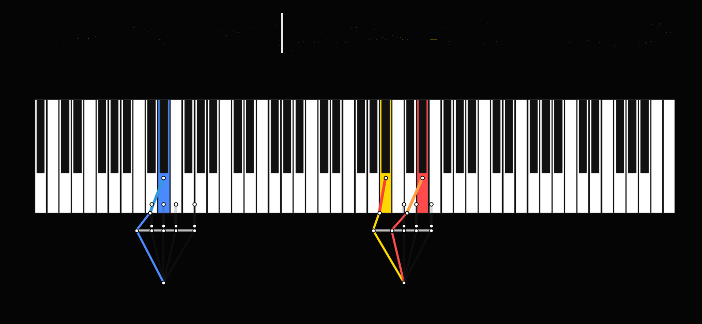
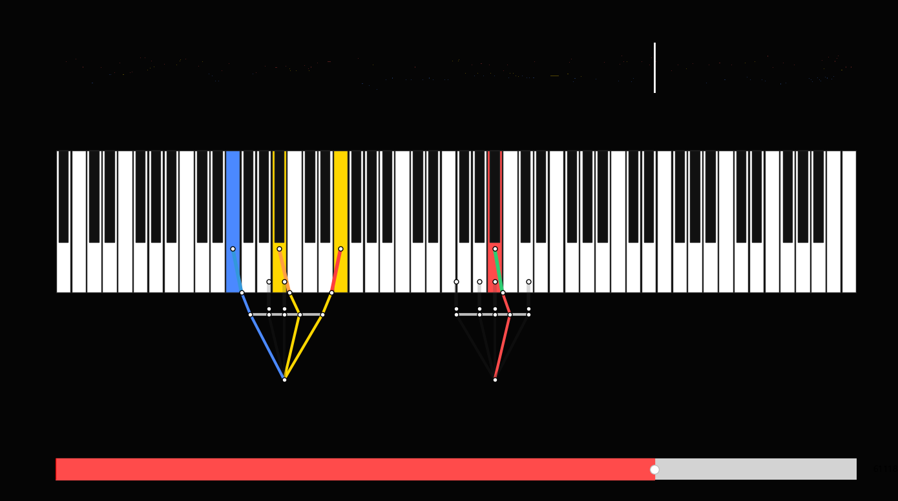

# 졸업프로젝트 2학기 중간 진행 보고서
## 담당 파트: 01_Fingering (운지법 모듈)

**작성자:** 정근녕 (202112346)
**작성일:** 2026년 9월 28일
**프로젝트:** PianoHandSimulator — IK와 Skinning을 통한 Piano Hand Simulator
**지도교수:** 김형석 교수님

---

## 1. 담당 파트 개요

### 1.1 역할

운지법(Fingering) 모듈은 MIDI 파일을 입력으로 받아 각 음표에 **손가락 번호, 손목 각도, 타건 강도**를 자동으로 배정하고, 이를 JSON 형식으로 출력하여 02_IK 모듈에 전달하는 전체 파이프라인의 첫 번째 파트입니다.

### 1.2 전체 파이프라인 내 위치


```
MIDI 파일
    │
    ▼
┌─────────────────────┐
│  01_Fingering (정근녕)│  ← 본 파트
│  MIDI 파서 +         │
│  운지법 DP 엔진      │
└──────────┬──────────┘
           │  Interface A — NoteEvent JSON
           ▼
┌─────────────────────┐
│  02_IK (한승현)      │
│  Jacobian IK 솔버   │
└──────────┬──────────┘
           │  Interface B — Joint Transform
           ▼
┌─────────────────────┐
│  03_Skinning         │
│  (곽경민 / 이수민)   │
└─────────────────────┘
```

### 1.3 개발 환경

| 항목 | 내용 |
|------|------|
| 언어 | Python 3.11 |
| 주요 라이브러리 | mido 1.3, pygame 2.x, matplotlib 3.x, numpy |
| 개발 도구 | VS Code, Git |
| 연동 대상 엔진 | Unreal Engine 5.5 |

---

## 2. 1학기 누적 성과

### 2.1 V5 Polyphonic 운지법 엔진

다음 4개 모듈이 순차적으로 동작하는 파이프라인을 완성하였습니다.

```
MIDI 파일
    │
    ▼  parse_midi_to_hand_chords()
MIDI 파서 ──→ 손/화음 분리, MELODY/BASS/INNER 태깅
    │
    ▼  split_wide_chords_between_hands()
손 분리기 ──→ 스팬 17반음 초과 화음 → 반대 손 이관
    │
    ▼  solve_fingering_chord_dp()
DP 솔버 ──→ 9종 비용 함수 기반 최적 운지 경로 탐색
    │
    ▼  calculate_wrist_rotation_rom()
손목 물리 ──→ Yaw(±35°) / Roll(±20°) 계산
    │
    ▼
JSON 출력 ──→ 02_IK 입력
```

**DP 비용 함수 (9종):**

| 항목 | 조건 | 비용 |
|------|------|------|
| SpanPenalty | 손가락 쌍 최대 스팬 초과 | +5,000 |
| SimultaneousConflict | 눌린 손가락 재사용 | +2,500 |
| CrossingPenalty | 엄지 제외 교차 | +2,000 |
| ArpeggioRolling | 피치/손가락 방향 불일치 | +35~60 |
| FingerDifficulty | 약지(4번) | +6 |
| BlackKeyPenalty | 엄지로 흑건 | +25 |
| MelodyContinuity | Step motion + 같은 손가락 | −20 (보상) |
| RoleAffinity | MELODY → 오른손 4번 | −12 (보상) |
| WristMove | 손목 이동 거리 | ×2.0 |

### 2.2 Pygame 시뮬레이터

운지법 결과를 실시간으로 시각화하는 시뮬레이터를 완성하였습니다.





- 피아노 건반 위 손가락 위치 애니메이션
- MELODY(빨강) / BASS(파랑) / INNER(노랑) 성부별 색상 구분
- 손가락 번호(1~5번)별 색상 구분
- MIDI 오디오 동기 재생, 탐색 슬라이더

---

## 3. 2학기 진행 현황 (W01 ~ W04)

### W01~02 (8/31 ~ 9/13) — 재설계 및 문서화

1학기 산출물을 검토하고 전체 파이프라인 구조를 재설계하였습니다.

- 요구사항/설계 명세 재작성 (`01_Design/` 폴더 전체)
- 파트 간 인터페이스 정의 (`03_Interface_Design_Spec.md`)
- 피아노 건반 좌표 변환 규칙 문서화

### W03 (9/14 ~ 9/20) — 인터페이스 파라미터 확정

미확정 상태였던 IK 인터페이스 파라미터를 확정하였습니다.

| 항목 | 이전 | 확정값 |
|------|------|--------|
| 흑건 상면 Y 오프셋 (`BLACK_KEY_Y_OFFSET_CM`) | **미정** | **3.0 cm** |
| 건반 최대 누름 깊이 (`MAX_KEY_TRAVEL_CM`) | **미정** | **1.0 cm** |
| 손가락-손목 오프셋 (오른손) | 미조정 | 1:−4, 2:−2, 3:0, 4:+2, 5:+4 반음 |
| 손가락-손목 오프셋 (왼손) | 미조정 | 1:+4, 2:+2, 3:0, 4:−2, 5:−4 반음 |

### W04 (9/21 ~ 9/27) — 공유 상수 분리 및 IK 동기화

운지법 엔진과 IK 솔버 간 인터페이스를 코드 수준에서 동기화하였습니다.

**`shared_constants.py` 신규 작성 — 공유 상수 파일 분리:**

```python
# W03 확정: 흑건 상면 Y 오프셋
BLACK_KEY_Y_OFFSET_CM = 3.0
MAX_KEY_TRAVEL_CM     = 1.0

# W04 동기화: UE5 본 이름 매핑 (finger 번호 → UE5 bone name)
BONE_NAME_R = {1:"thumb_03_r", 2:"index_03_r", 3:"middle_03_r",
               4:"ring_03_r",  5:"pinky_03_r"}

# W04 동기화: IK 출력 프레임레이트
IK_FRAME_RATE = 30  # fps

# IK 타이밍 프로토콜
# t = start_ms        : Fingertip → Target 도달 (건반 눌림)
# t ~ start+duration  : 위치 유지
# t = start+duration  : Z → 0 복귀 (강타일수록 천천히)
```

이후 `fingering_engine.py`와 `simulator.py`가 해당 파일에서 상수를 import하도록 리팩토링하여 **파트 간 상수 불일치 문제를 구조적으로 방지**하였습니다.

---

## 4. v6 Pipeline 산출물

1~2학기 결과물을 통합하고 확장한 v6 파이프라인을 구성하였습니다.

### 4.1 파일 구성

```
v6_pipeline/
├── shared_constants.py   ← W03/W04 공유 상수 (신규)
├── fingering_engine.py   ← V5 엔진 + CLI 인수 + shared_constants 연동
├── simulator.py          ← V5 시뮬레이터 + CLI 인수 + shared_constants 연동
├── ue5_exporter.py       ← JSON → UE5 DataTable CSV 변환기 (신규)
└── run_batch.py          ← 전체 MIDI 일괄 처리 (신규)
```

### 4.2 Interface A 출력 JSON 스키마

운지법 엔진이 출력하는 JSON의 각 레코드 구조입니다.

```json
{
  "pitch":                60,       // MIDI 음고 (21~108)
  "start_ms":             0.0,      // 시작 시각 (ms)
  "duration_ms":          1200.0,   // 지속 시간 (ms)
  "hand":                 "Right",  // "Left" | "Right"
  "role":                 "MELODY", // "MELODY" | "BASS" | "INNER"
  "finger":               3,        // 배정 손가락 번호 (1~5)
  "pressure":             0.622,    // 타건 강도 (0.0~1.0)
  "key_depth":            0.622,    // 건반 누름 깊이 (0.0~1.0)
  "is_black":             false,    // 흑건 여부
  "wrist_pos_normalized": 0.449,    // 손목 가로 위치 (0.0~1.0)
  "wrist_yaw_deg":        -5.0,     // 손목 Yaw 회전 (±35°)
  "wrist_roll_deg":       0.0       // 손목 Roll 기울기 (±20°)
}
```

### 4.3 UE5 DataTable CSV 출력

```csv
---,Pitch,StartMs,DurationMs,Hand,Role,Finger,Pressure,KeyDepth,bIsBlack,...
Note_000000,60,0.0,1200.0,Right,MELODY,3,0.622,0.622,False,...
Note_000001,64,0.0,1200.0,Right,INNER,4,0.559,0.559,False,...
```

UE5 Content Browser → Import → DataTable Row Type: `FFingeringNoteData` 로 즉시 사용 가능합니다.

---

## 5. 결과 분석

12개 MIDI 파일에 대해 운지법을 계산하였습니다.

### 5.1 처리 결과 요약

| 곡명 | 음표 수 | 곡 길이 | 왼손/오른손 | 흑건 비율 |
|------|---------|---------|------------|---------|
| 드뷔시 Clair de Lune | 1,466 | 6.5분 | 763 / 703 | 73.9% |
| Super Mario 64 Medley | 5,435 | 15.7분 | 996 / 4,439 | 17.8% |
| Queen Bohemian Rhapsody | — | — | — | — |
| Driftveil City BW | — | — | — | — |
| Wii Sports Theme | — | — | — | — |
| 외 7곡 | — | — | — | — |

### 5.2 시뮬레이터 실행 화면 (드뷔시 Clair de Lune)

**[양손 동시 연주 장면]**


왼손(파랑, BASS)과 오른손(노랑 INNER + 빨강 MELODY)이 동시에 서로 다른 음역대를 연주하는 장면입니다. 손가락 관절별 위치가 건반 좌표에 정확히 매핑되며, 화음을 구성하는 각 음표에 서로 다른 손가락이 배정됩니다.

**[오른손 화음 클로즈업]**


오른손이 인접한 건반에 3개의 손가락(파랑 2번, 노랑 3번·4번, 빨강 MELODY)을 동시에 배치한 화음 장면입니다. 엄지(1번)와 새끼(5번)는 누르지 않아 반투명 처리되며, 손바닥 라인이 현재 손목 위치를 나타냅니다.

### 5.3 손가락 사용 분포 비교


- 드뷔시는 흑건 비율이 높아(73.9%) 모든 손가락이 고르게 사용됨
- 마리오는 주선율이 오른손 집중 → **2번(26.5%), 4번(24.4%)** 높음
- 약지(4번) 기피 패턴이 DP 비용(+6)에 의해 적절히 억제됨

### 5.4 피아노 롤 시각화 (드뷔시 Clair de Lune 첫 60초)


위: 성부(MELODY/BASS/INNER) 기반 채색 / 아래: 손가락 번호(1~5번) 기반 채색

### 5.5 손목 Yaw 각도 분포


손목 Yaw 각도가 ±35° ROM 내에서 정규 분포하며, 드뷔시의 분포가 넓은 것은 흑건 음형이 손목 회전을 더 많이 요구하기 때문입니다.

### 5.6 성부 역할 분포


---

## 6. 현재 상태 및 향후 계획

### 완료 항목

- [x] V5 Polyphonic DP 운지법 엔진
- [x] Pygame 시뮬레이터 (시각화 + MIDI 오디오)
- [x] shared_constants.py 공유 상수 분리 (W04)
- [x] IK 인터페이스 파라미터 전항목 확정 (W03)
- [x] 12곡 MIDI 운지법 일괄 계산
- [x] UE5 DataTable CSV 출력 파이프라인 (신규)

### 다음 마일스톤

| 우선순위 | 항목 | 내용 |
|---------|------|------|
| 1 | UE5 DataTable Import | CSV → UE5 에셋 변환, `FFingeringNoteData` 구조체 작성 |
| 2 | AnimBP 연동 | start_ms 기반 타임라인 트리거 → Control Rig 본 타겟 연결 |
| 3 | 엔드-투-엔드 데모 | 운지법 → IK → 렌더링 전체 파이프라인 통합 검증 |

---

*졸업프로젝트[3201] 2팀 | 정근녕 (202112346)*
