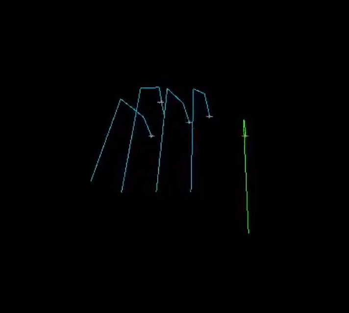
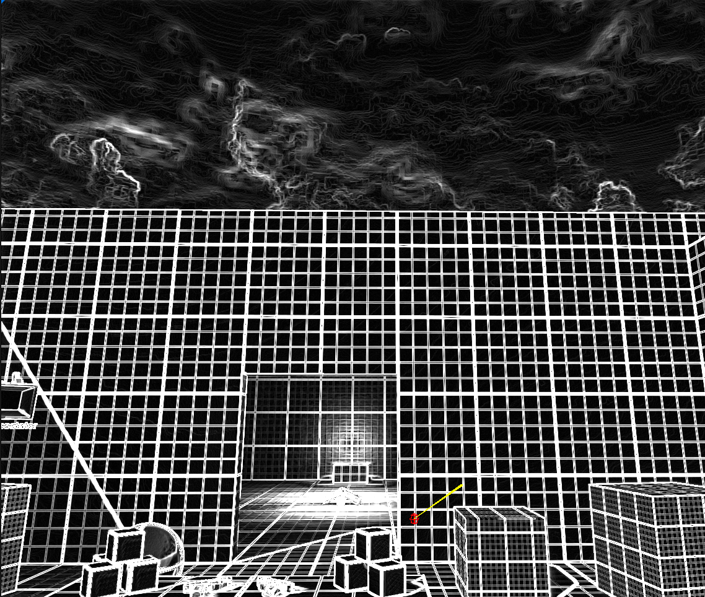
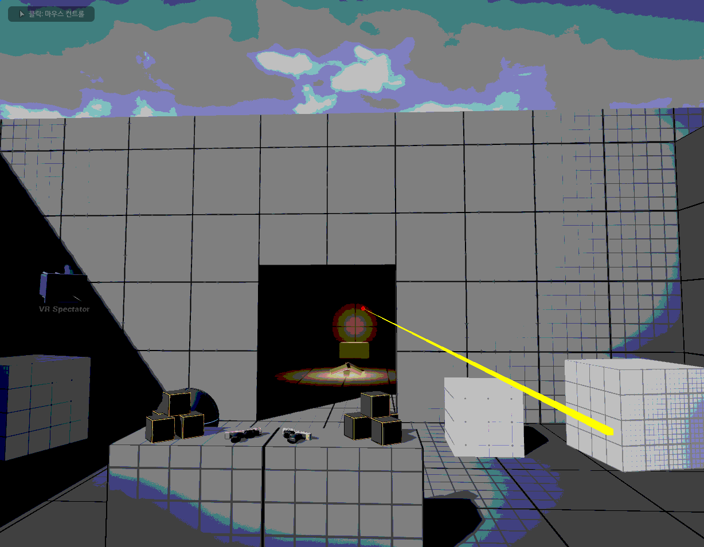
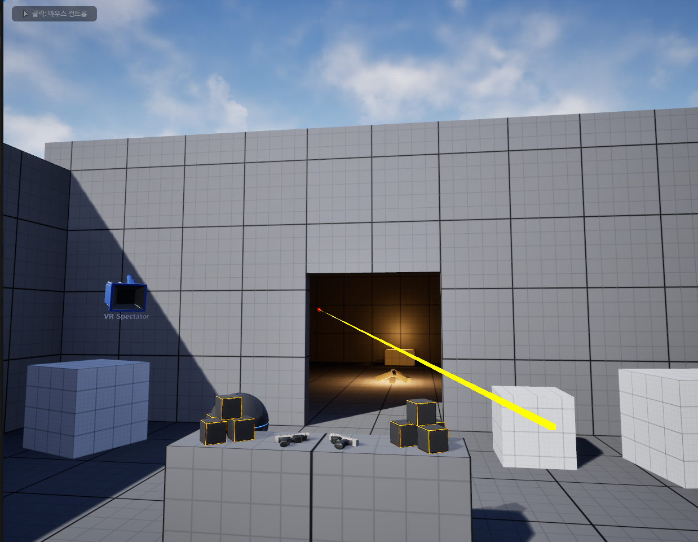

# 피아노 연주 시뮬레이션 및 고정밀 렌더링 시스템
## 졸업 프로젝트 중간 보고서

| 항목 | 내용 |
|---|---|
| 과목 | 졸업프로젝트 3201 |
| 팀 | 2팀 |
| 제출일 | 2026년 5월 12일 |
| 팀원 | 정근녕, 한승현, 이수민, 곽경민 |

---

## 목차

1. [프로젝트 개요](#1-프로젝트-개요)
2. [전체 시스템 아키텍처](#2-전체-시스템-아키텍처)
3. [진행 현황 요약](#3-진행-현황-요약)
4. [모듈별 상세 구현 현황](#4-모듈별-상세-구현-현황)
   - 4.1 [운지법 결정 엔진 (정근녕)](#41-운지법-결정-엔진--정근녕)
   - 4.2 [IK 기반 모션 생성 (한승현)](#42-ik-기반-모션-생성--한승현)
   - 4.3 [커스텀 셰이더 파이프라인 (이수민)](#43-커스텀-셰이더-파이프라인--이수민)
   - 4.4 [Chaos Flesh PBD Skinning (곽경민)](#44-chaos-flesh-pbd-skinning--곽경민)
5. [주요 기술적 도전 및 해결](#5-주요-기술적-도전-및-해결)
6. [향후 계획](#6-향후-계획)
7. [결론](#7-결론)

---

## 1. 프로젝트 개요

### 1.1 기획 배경

기존 게임 및 시뮬레이션 환경에서 손가락 움직임은 Linear Blend Skinning(LBS)에 의존하여, 피아노 연주와 같은 정교한 동작 시 관절 뭉개짐(Candy Wrapper Artifact), 주름 및 피하 조직의 비사실적 표현 문제가 발생합니다. 또한 MIDI 데이터만으로 실제 피아니스트 수준의 운지법을 자동 재현하고 영화적 품질의 렌더링을 생성하는 도구는 현재 존재하지 않습니다.

본 프로젝트는 이러한 기술적 공백을 해소하기 위해, **MIDI 입력 → 최적 운지법 계산 → IK 기반 모션 생성 → 고품질 피부 렌더링** 으로 이어지는 통합 파이프라인을 구축하는 것을 목표로 합니다.

### 1.2 프로젝트 목표

- **MIDI-to-Motion**: MIDI 파일을 파싱하여 해부학적으로 유효한 최적 운지법을 자동 계산하고 IK 애니메이션 데이터로 변환합니다.
- **High-Fidelity Rendering**: PBD(Position Based Dynamics) 기반 조직 변형 및 Tension Map 기반 동적 노멀 맵을 활용한 주름·핏줄 렌더링을 구현합니다.

### 1.3 팀 구성 및 역할 분담

| 팀원 | 담당 모듈 | 주요 역할 |
|---|---|---|
| 정근녕 | 01_Fingering | MIDI 파서 및 DP 기반 운지법 결정 알고리즘 |
| 한승현 | 02_IK | Jacobian 기반 역운동학(IK) 모션 생성 |
| 이수민 | 03_Skinning (셰이더) | UE5 커스텀 셰이더 파이프라인, Tension Map, 카메라/UI |
| 곽경민 | 03_Skinning (시뮬레이션) | Chaos Flesh PBD 피부 시뮬레이션, 핏줄·주름 Skinning |

### 1.4 기술 스택

| 분야 | 기술 |
|---|---|
| 운지법 알고리즘 | Python, Dynamic Programming, Polyphonic Voice Leading |
| IK 시스템 | C++, Jacobian IK (Damped Least Squares) |
| 렌더링 엔진 | Unreal Engine 5.5 |
| 피부 시뮬레이션 | Chaos Flesh (FEM/PBD), Physics Asset |
| 셰이더 | HLSL, Scene View Extension (SVE), RDG |
| 데이터 포맷 | Standard MIDI File (Format 0/1), JSON |

---

## 2. 전체 시스템 아키텍처


---

## 3. 진행 현황 요약

| 모듈 | 담당 | 주요 완료 항목 | 현재 상태 |
|---|---|---|---|
| MIDI 파서 | 정근녕 | Format 0/1 파싱, 화음 그룹화, 양손 분리 | 완료 |
| 운지법 엔진 V5 | 정근녕 | Polyphonic Voice Leading, 왼손 역전 버그 수정, 실시간 시뮬레이터 | 완료 |
| Jacobian IK | 한승현 | DLS IK 구현, ROM 제약, 베지어 손목 궤적, C/F코드 전환 검증 | 알고리즘 검증 완료 |
| UE5 IK 파이프라인 연동 | 한승현 | UE5 Animation 시스템 데이터 전달 | 진행 중 |
| 커스텀 셰이더 파이프라인 | 이수민 | SVE 삽입, RDG 자원 관리, HLSL 분기, 게임-렌더 동기화 검증 | 사전 검증 완료 |
| 물리 기반 Skinning 셰이더 | 이수민 | LBS→컴퓨트 셰이더 전환, 본 매트릭스 SBO 연동 | 진행 중 |
| Chaos Flesh 에셋 구성 | 곽경민 | Dataflow 그래프, Capsule 콜리전 17개, 사면체 볼륨 생성 확인 | 에셋 구성 완료 |
| Chaos Flesh 블루프린트 연동 | 곽경민 | 캐릭터 블루프린트 Flesh 컴포넌트 연동 | UE 버전 이슈로 중단 |

---

## 4. 모듈별 상세 구현 현황

### 4.1 운지법 결정 엔진 — 정근녕

#### 4.1.1 MIDI 파서

운지법 엔진의 입력 단계로, Standard MIDI File Format 0 및 Format 1을 모두 지원하는 파서를 구현하였습니다.

**파싱 항목:**
- **음표 이벤트**: Note On / Note Off, 음높이(pitch, 0~127), 벨로시티(velocity, 0~127)
- **타이밍**: Tick 단위 타임스탬프를 템포 이벤트(BPM)를 참조하여 절대 시간(ms)으로 변환
- **박자 정보**: Time Signature 메타 이벤트 파싱

멀티트랙 MIDI(Format 1)의 경우 피아노 트랙을 다음 우선순위로 자동 선별합니다.

| 우선순위 | 선별 기준 |
|---|---|
| 1순위 | GM 프로그램 번호 0~7 (Piano 계열 악기) |
| 2순위 | 음역대가 A0(MIDI 21) ~ C8(MIDI 108) 범위에 집중된 트랙 |
| 3순위 | 노트 이벤트 수가 가장 많은 트랙 |

파싱 결과는 다음 `NoteEvent` 자료구조로 메모리에 적재됩니다.

```
NoteEvent {
  time_ms      // 절대 시간 (밀리초)
  pitch        // MIDI 음높이 (0~127)
  velocity     // 벨로시티 (0~127)
  duration_ms  // 음표 지속 시간 (밀리초)
  hand         // 왼손: 0, 오른손: 1
  finger       // 운지법 알고리즘이 배정한 손가락 번호 (1~5)
}
```

#### 4.1.2 양손 분리 (Hand Splitter)

파싱된 NoteEvent 시퀀스를 왼손/오른손으로 분리합니다. 기본적으로 피치 기준점(미들 C, MIDI 60) 상하를 기준으로 분리하되, 동시 화음 내 피치 분포와 직전 프레임 손 위치를 함께 고려하여 경계 부근의 음표에 대한 귀속을 결정합니다. 이를 통해 양손이 교차하는 구간에서도 논리적으로 일관된 분리 결과를 얻을 수 있습니다.

#### 4.1.3 알고리즘 진화 과정

본 엔진은 세 단계의 반복적 개선을 거쳐 현재 V5에 도달하였습니다.

| 버전 | 핵심 도입 개념 | 한계 |
|---|---|---|
| **V1/V2** | 개별 음표 단위 DP, 기초 비용 함수, Wrist Hint 생성 | 화음(Chord) 처리 미흡, 동시 타건 시 손가락 꼬임 발생 |
| **V4** | 화음 그룹 단위 DP, 해부학적 ROM 적용, `MAX_SPAN` 페널티, 손목 각도 산출 | 단일 선율(Monophonic) 가정, 음악적 맥락 미반영 |
| **V5** | Polyphonic Voice Leading, 성부 분리, 왼손 역전 수정, 실시간 시뮬레이터 | — (현재 버전) |

#### 4.1.4 Chord-based DP 구조

운지법 결정의 핵심은 **화음 그룹을 하나의 DP 상태(State)로 처리**하는 것입니다. 30ms 이내에 시작되는 음표들을 하나의 화음 그룹으로 묶어 처리함으로써 동시 타건 시 손가락 배정의 논리적 일관성을 확보하고 연산 복잡도를 낮춥니다.

**상태 정의 및 전이:**

- **상태(State)**: 현재 화음 그룹에 배정된 손가락 조합 (예: `(1, 3, 5)`)
- **Monotonicity 제약**: 화음 내에서 피치 오름차순과 손가락 번호 오름차순이 반드시 일치하도록 강제하여 손가락 꼬임을 원천 차단합니다.
- **전이(Transition)**: 이전 화음의 최적 상태에서 현재 화음의 각 후보 상태로 전이할 때의 비용을 계산하여 최소 누적 비용 경로를 탐색합니다.

**해부학적 스팬 제약 (MAX_SPAN):**

각 손가락 쌍(Pair)별로 물리적으로 도달 가능한 최대 건반 간격(반음 수)을 상수로 정의하여, 이를 초과하는 운지 조합에 막대한 페널티를 부여합니다. 이를 통해 인체 가동 범위를 벗어나는 배정을 사전에 차단합니다.

#### 4.1.5 V5 핵심 기술: Polyphonic Voice Leading

V5 엔진은 한 손 내에서도 멜로디, 베이스, 내성(Inner)을 자동으로 구분하여 음악적 맥락을 반영한 운지법을 산출합니다.

**성부별 손가락 배정 전략:**

| 성부 | 색상 | 우선 손가락 | 이유 |
|---|---|---|---|
| **MELODY** | 빨강 | 4번, 5번 | 선율의 수평적 연결성(Legato) 확보, 1번(엄지) 기피 |
| **BASS** | 파랑 | 5번, 1번 | 저음역 안정적 지지 |
| **INNER** | 회색 | 2번, 3번, 4번 | 화음 충전 역할, 효율적 배치 |

**비용 함수 구성:**

$$TotalCost = \sum W_{move} + \sum W_{difficulty} + \sum W_{anatomical} + \sum W_{role}$$

- $W_{move}$: 이전 포지션에서 현재 포지션까지의 손목 이동 거리
- $W_{difficulty}$: 4·5번 손가락의 태생적 약함을 반영한 기본 비용
- $W_{anatomical}$: 흑건 엄지 사용, MAX_SPAN 초과 스팬, 비정상 손가락 교차에 대한 페널티
- $W_{role}$: 성부 역할에 따른 손가락 선호도 가중치 (멜로디 라인의 레가토 연결성 포함)

#### 4.1.6 손목 물리 모델링

운지법 결정 결과를 바탕으로 IK 시스템에서 활용할 손목 회전 각도를 추정합니다.

- **Wrist Yaw**: 손가락들이 누르는 건반의 평균 위치와 손목 중심축 사이의 오프셋을 계산하여 `-35.0° ~ +35.0°` 범위 내의 각도를 산출합니다.
- **Wrist Roll**: 엄지가 흑건을 누르거나 새끼손가락이 흑건을 누를 때 발생하는 손목의 기울어짐을 모사합니다 (`±20.0°`).

두 값 모두 인간의 생리적 가동 범위를 하드 클램핑하여 비현실적인 각도가 출력되지 않도록 처리하였습니다.

#### 4.1.7 실시간 시뮬레이터

운지법 데이터를 검증하기 위해 Python/Pygame 기반 실시간 시뮬레이션 툴을 함께 개발하였습니다.

**주요 기능:**
- **이벤트 기반 MIDI 재생**: `pygame.midi`를 통해 FPS(30) 단위로 타임라인을 분할하고, 해당 프레임에 진입하는 모든 Note On 이벤트를 시스템 MIDI 장치로 즉시 전송하여 시각-청각 동기화를 구현하였습니다.
- **타임라인 탐색(Seek)**: 슬라이더 및 키보드(화살표 키)로 재생 위치를 즉시 이동할 수 있으며, 탐색 시 `panic()` 명령으로 모든 소리를 끊고 새 위치의 이벤트를 즉시 재생합니다.
- **이중 마디 시각화**: 손가락 마디별로 성부 역할(안쪽 마디)과 손가락 번호(끝 마디)를 서로 다른 색상으로 채색하여 데이터 가독성을 높였습니다.

| **[그림 1]** 화음 타건 — 왼손·오른손 골격 시각화 | **[그림 2]** 다중 손가락 동시 타건 및 타임라인 슬라이더 |
|:---:|:---:|
|  |  |
| 왼손(파랑)과 오른손(노랑·빨강) 손가락 골격이 해당 건반으로 향하는 모습 | 왼손(파랑·노랑)·오른손(빨강·초록) 동시 타건과 하단 재생 슬라이더 |

#### 4.1.8 출력 데이터 사양

운지법 엔진은 UE5 IK 시스템 구동에 필요한 다음 JSON 데이터를 출력합니다.

```json
{
  "pitch": 76,
  "start_ms": 1234.5,
  "duration_ms": 250.0,
  "hand": "right",
  "finger": 3,
  "role": "MELODY",
  "wrist_yaw_deg": -12.4,
  "wrist_roll_deg": 3.1,
  "pressure": 0.72,
  "key_depth": 0.68
}
```

---

### 4.2 IK 기반 모션 생성 — 한승현

#### 4.2.1 설계 방향

본 모듈의 IK 계산은 실시간이 아닌 **오프라인 사전 계산** 단계에서 수행됩니다. 따라서 수렴 속도보다 정확도와 제약 처리 유연성을 우선하여 **DLS(Damped Least Squares) 방식의 Jacobian 기반 IK**를 채택하였습니다.

#### 4.2.2 손 모델 계층 구조 및 ROM 설정 (`initHand`)

관절 계층: **Wrist → Metacarpal → MCP → PIP → DIP → Fingertip**

| 관절 | 굴곡 범위 | 신전 범위 | 내외전 |
|---|---|---|---|
| MCP | 0° ~ 90° | 0° ~ 20° | ±20° |
| PIP | 0° ~ 100° | 0° ~ 10° | — |
| DIP | 0° ~ 80° | 0° ~ 5° | — |
| 엄지 CMC | 0° ~ 50° | 0° ~ 50° | ±40° (축회전 0°~15°) |
| 엄지 MCP | 0° ~ 60° | 0° | — |
| 엄지 IP | 0° ~ 80° | 0° ~ 5° | — |

모든 관절 각도는 `std::clamp`를 통해 상기 ROM 범위 내로 강제 제한하여 생리적으로 불가능한 동작을 원천 차단하였습니다.

#### 4.2.3 DLS IK 연산 (`updateJacobianKinematics`)

1. 타겟 건반 좌표와 현재 End-effector(손가락 끝) 사이의 오차 벡터 산출
2. Forward Kinematics(`computeFK`)로 관절 글로벌 변환 갱신
3. 회전 축과 End-effector 거리 벡터의 외적으로 $3 \times 9$ Jacobian 행렬 생성
4. $J J^T + \lambda^2 I$ 형태의 DLS 역행렬 계산으로 특이점 근방 발산 방지 ($\lambda = 0.05$)
5. 허용 오차(`tolerance`) 미만 수렴 시 반복 종료

#### 4.2.4 베지어 곡선 기반 손목 궤적

단순 선형 이동이 아닌 **2차 베지어 곡선**을 사용하여 코드 전환 시 손목이 자연스럽게 들렸다가 내려오는 궤적을 구현하였습니다. C코드↔F코드 전환 시나리오에서 알고리즘 검증을 완료하였습니다.

**[그림 3] Jacobian IK 시각화 — 손가락 골격 렌더링**
> C++ 레벨에서 구현된 DLS Jacobian IK의 계산 결과. 각 손가락이 목표 건반 좌표를 향해 수렴하는 것을 확인하였습니다.



> **[영상]** IK 테스트 결과: [`IK TEST.mp4`](./IK%20TEST.mp4)

#### 4.2.5 향후 연동 계획

현재 C++ 레벨에서의 알고리즘 검증이 완료된 상태이며, 다음 단계로 오프라인 계산 결과를 UE5 Animation 시스템으로 전달하는 데이터 파이프라인 구축 및 다중 손가락 충돌 방지 로직 결합 테스트를 진행할 예정입니다.

---

### 4.3 커스텀 셰이더 파이프라인 — 이수민

#### 4.3.1 개요 및 목적

본 모듈의 최종 목표는 UE5 렌더링 파이프라인 내에 **물리 기반 GPU Skinning 셰이더**를 삽입하는 것입니다. 이를 위해 중간 단계로 동일한 6요소 부트스트랩 구조를 공유하는 **단계형 시각 처리(Staged Rendering) 파이프라인**을 테스트베드로 구축하여 핵심 기술 요소 4가지를 사전 검증하였습니다.

**사전 검증이 필요한 4가지 핵심 기술:**
1. 엔진 렌더링 파이프라인 사이에 커스텀 패스를 안전하게 삽입하는 메커니즘
2. 글로벌 셰이더(Global Shader)와 HLSL 결합
3. RDG(Render Dependency Graph) 기반 GPU 자원 관리
4. 게임 스레드-렌더 스레드 간 데이터 동기화

#### 4.3.2 검증 항목별 구현 내용

**① Scene View Extension(SVE) 기반 커스텀 패스 삽입**

`FCoreDelegates::OnPostEngineInit` 콜백을 활용하여 엔진 초기화 직후 SVE를 생성하는 지연 초기화 패턴을 적용하였습니다. `SubscribeToPostProcessingPass`를 오버라이드하여 톤매핑(Tonemap) 단계에 커스텀 패스를 후크하였으며, 모듈 종속성으로 `RenderCore`, `RHI`, `Renderer`, `Projects` 4개를 추가하였습니다.

**② 글로벌 셰이더 결합 및 RDG 디스패치**

`FStagedRenderPS` 클래스는 `FGlobalShader`를 상속하며, `SHADER_USE_PARAMETER_STRUCT` 매크로로 SceneColor SRV, 샘플러, uniform 상수, RT 슬롯을 바인딩합니다. `FPixelShaderUtils::AddFullscreenPass`로 PSO 생성과 뷰포트 설정을 자동화하였으며, RDG가 트랜션트 자원 회수 및 배리어 삽입을 자동 관리합니다.

**③ HLSL 단일 셰이더 다중 모드 분기 (`StagedRender.usf`)**

CVar(`stage.Mode`) 값에 따라 4가지 처리 경로를 분기합니다.

| Mode | 처리 내용 |
|---|---|
| 0 | 고정 검정 출력 (비활성 확인) |
| 1 | Sobel luma 에지 검출 |
| 2 | 50% 탈색 + 4단 포스터라이즈 |
| 3 | 패스스루 (원본 출력) |

**④ 게임-렌더 스레드 동기화**

`IConsoleManager::Get().FindConsoleVariable()->Set(...)` 한 줄로 게임↔렌더 스레드 CVar 동기화가 구현되었음을 확인하였습니다. `1` 키 입력 시 4단계 순환 전환이 즉각 셰이더에 반영됩니다.

#### 4.3.3 검증 결과

`stage.Mode` 값을 순환 전환하며 세 가지 셰이더 분기가 모두 정상 동작함을 확인하였습니다.

| **[그림 3]** Stage 1 — Sobel 에지 검출 | **[그림 4]** Stage 2 — 탈색 + 포스터라이즈 | **[그림 5]** Stage 3 — 패스스루 |
|:---:|:---:|:---:|
|  |  |  |
| 톤매핑 이후 LDR 씬에 커스텀 Sobel 셰이더가 정상 삽입됨 | 동일 씬에 탈색 + 4단 포스터라이즈 분기 처리 출력 확인 | `stage.Mode 3` 설정 시 원본 렌더링이 정상 복원됨 |

#### 4.3.4 향후 확장 계획

현재 검증된 파이프라인 골격을 기반으로 다음 단계를 진행할 예정입니다.
- PP 단계 후크 → 정점 처리 단계 후크로 전환하여 `USkeletalMeshComponent` 정점 스트림에 직접 접근
- `FStagedRenderPS`를 본 매트릭스 SBO와 가중치 버퍼를 입력으로 받는 **컴퓨트 셰이더**로 교체
- CVar 브릿지를 Structured Buffer 업로드 경로로 확장하여 매 프레임 다량의 본 변환을 안전하게 전달

---

### 4.4 Chaos Flesh PBD Skinning — 곽경민

#### 4.4.1 개요

LBS 단독 사용 시 관절 굴곡부에서 발생하는 Candy Wrapper Artifact를 해소하기 위해, UE5의 FEM 기반 소프트바디 시뮬레이션 시스템인 **Chaos Flesh**를 적용하였습니다. 사면체(Tetrahedral) 메시를 내부 볼륨으로 생성하여 뼈 움직임에 따라 피부가 자연스럽게 밀리고 변형되는 효과를 구현하며, 향후 Tension Map 및 노멀 맵과 연동하여 손등의 핏줄·주름 표현까지 확장하는 것을 최종 목표로 합니다.

#### 4.4.2 손가락 콜리전 설계

Chaos Flesh 시뮬레이션에서 피부 관통 방지를 위해서는 Physics Asset에 손가락 마디별 콜리전 바디가 필수적입니다. 기존 단일 손바닥 바디에서 **손가락 첫째~셋째 마디 총 17개 관절 본에 Capsule 콜리전 바디를 추가**하였습니다. Capsule을 선택한 이유는 손가락의 원통형 형태와 근사하며 구(Sphere) 대비 관절 방향에 따른 충돌 정확도가 높기 때문입니다.

**[그림 6] Physics Asset — Capsule 콜리전 배치**
> 각 손가락 마디별 독립적인 Capsule 콜리전 바디를 확인하였습니다.

.png)

#### 4.4.3 Flesh Asset Dataflow 그래프 구성

**[그림 7] Flesh Asset Dataflow 그래프 및 사면체 볼륨 생성 결과**
> (좌) Dataflow 노드 구성: SkeletalMeshToCollection → CreateTetrahedron → FleshAssetTerminal
> (우) 파란색 사면체 볼륨이 캐릭터 손·팔 영역에 정상 생성됨을 확인하였습니다.

.png)

주요 설계 결정 사항은 다음과 같습니다.

| 설계 결정 | 이유 |
|---|---|
| 렌더링 메시와 사면체 소스 메시를 동일 메시로 사용 | 별도 로우폴리 메시 미제작 (향후 교체 예정) |
| Geometry Collection 변환 시 지오메트리 데이터 명시 포함 | 미포함 시 사면체 생성 소스 볼륨이 미정의되어 사면체 생성 불가 |
| 사면체 생성 범위를 손·팔로 한정 | 전신 적용 시 연산 비용 수십 배 증가; PBD 연산량은 사면체 수에 비례 |
| 표면 메시 스킨 웨이트를 사면체 버텍스에 전달 | 미전달 시 시뮬레이션 볼륨이 뼈 움직임을 추적하지 못해 Flesh가 분리됨 |

#### 4.4.4 Flesh 시뮬레이션 결과 (에디터 프리뷰)

**[그림 8] 손 에셋 — T-포즈 기본 상태**

.png)

**[그림 9] 손가락 굴곡 — Flesh 변형 전 (LBS 단독)**
> 굴곡 시 관절 부위에서 LBS 아티팩트(뭉개짐)가 관찰됩니다.

.png)

**[그림 10] 손가락 굴곡 — Flesh 변형 적용 후**
> Chaos Flesh 적용 시 피부 볼륨이 보존되며 보다 자연스러운 변형이 관찰됩니다.

.png)

> **[영상]** 메시-스켈레톤 바인딩 테스트: [`Mesh_Skeleton_Binding_Test(7주차).mp4`](../Mesh_Skeleton_Binding_Test(7주차).mp4)

#### 4.4.5 현재 진행 상태 및 이슈

**진행 완료:**
- Flesh Asset 생성 및 Dataflow 그래프 구성을 완료하였습니다.
- 에디터 프리뷰에서 사면체 시뮬레이션 볼륨 정상 생성을 확인하였습니다.

**현재 이슈 — UE 버전 호환성:**
작업 환경(UE 5.6)과 참조 예제(UE 5.5) 간의 Flesh 전용 컴포넌트 API 변경으로 인해 캐릭터 블루프린트 연동 단계에서 진행이 중단된 상태입니다. **UE 5.5로 다운그레이드** 후 재시도를 검토 중입니다.

---

## 5. 주요 기술적 도전 및 해결

### 5.1 왼손 운지법 역전 문제 (01_Fingering)

**현상:** 시각화 결과, 왼손의 엄지(1번)가 가장 낮은 피치를, 새끼(5번)가 가장 높은 피치를 누르는 X자 꼬임 현상이 발생하였습니다.

**원인:** 엔진이 "낮은 피치 = 낮은 번호 손가락"이라는 오른손 중심 논리를 양손에 동일하게 적용하였습니다. 인체 구조상 왼손은 오른손의 거울상(Mirror)이므로 매핑 로직이 반전되어야 합니다.

**해결:**
1. 왼손 연산 시 손가락 번호 조합을 역순으로 배정하였습니다. (예: `(1,2,3)` → `(5,4,3)`)
2. 교차 판정 로직을 각 손의 방향성에 맞게 재구축하였습니다. (오른손: 상행 시 엄지 밑으로; 왼손: 하행 시 엄지 밑으로)

**결과:** 수정 후 왼손 운지가 X자 꼬임 없이 평행하고 자연스러운 동작을 유지함을 확인하였습니다.

### 5.2 Jacobian IK 특이점 문제 (02_IK)

**현상:** 손가락이 특정 자세에서 IK 계산 값이 발산하여 불안정한 모션이 생성되었습니다.

**원인:** 표준 Jacobian 역행렬 계산 시 특이점(Singularity) 근방에서 역행렬이 수치적으로 불안정합니다.

**해결:** $J J^T + \lambda^2 I$ 형태의 **Damped Least Squares(DLS)** 역행렬을 적용하였습니다 ($\lambda = 0.05$). 또한 각도 변화량(`dTheta`)에 최대 스텝 제한을 두어 과도한 수렴 발산을 방지하였습니다.

### 5.3 SVE 초기화 타이밍 문제 (03_Skinning)

**현상:** `StartupModule` 단계에서 `FSceneViewExtensions::NewExtension` 호출 시 크래시가 발생하였습니다.

**원인:** `GEngine == nullptr` 상태에서 SVE 생성을 시도하였습니다.

**해결:** `FCoreDelegates::OnPostEngineInit` 콜백에 SVE 생성을 지연하여 엔진 초기화 직후 안전하게 생성하도록 처리하였습니다.

### 5.4 Chaos Flesh 버전 호환성 이슈 (03_Skinning)

**현상:** UE 5.6 환경에서 Flesh 전용 컴포넌트 명칭 및 파라미터 구성이 참조 예제(5.5)와 불일치하여 블루프린트 연동이 중단되었습니다.

**대응:** UE 5.5 다운그레이드를 검토 중입니다. 현재 에디터 프리뷰 수준의 시뮬레이션 볼륨 생성은 정상 확인된 상태입니다.

---

## 6. 향후 계획

### 6.1 모듈별 다음 목표

| 모듈 | 다음 목표 |
|---|---|
| 01_Fingering | 복잡한 대위법 및 현대 곡 대응력 향상; UE5 JSON 데이터 테이블 임포터 개발 |
| 02_IK | UE5 MetaHuman 손 모델 IK 파이프라인 연동; 다중 손가락 충돌 방지 로직 |
| 03_Skinning (셰이더) | PP 후크 → 정점 처리 단계 전환; LBS/DQS 통합 컴퓨트 셰이더 구현 |
| 03_Skinning (Flesh) | UE 5.5 전환; Flesh 블루프린트 연동; Tension Map 핏줄·주름 표현 |

---

## 7. 결론

본 중간 보고서에서는 피아노 연주 시뮬레이션 시스템의 4개 모듈에 대한 현재까지의 구현 현황을 정리하였습니다.

**01_Fingering** 모듈은 MIDI 파서부터 V5 Polyphonic Voice Leading 엔진까지 완성하여, 멜로디·베이스·내성 3성부 자동 분리 및 해부학적 ROM 기반의 최적 운지법 데이터를 JSON 형태로 안정적으로 출력할 수 있는 상태입니다.

**02_IK** 모듈은 C++ 레벨에서 DLS Jacobian IK 알고리즘의 검증을 완료하였으며, 베지어 곡선 기반 자연스러운 손목 궤적 생성까지 구현하였습니다. 현재 UE5 연동 파이프라인 구축이 진행 중입니다.

**03_Skinning (셰이더)** 모듈은 SVE·RDG·HLSL·스레드 동기화 등 커스텀 셰이더 파이프라인의 4개 핵심 기술 사전 검증을 완료하여, 물리 기반 Skinning 셰이더로의 확장을 위한 안정적인 토대를 마련하였습니다.

**03_Skinning (Flesh)** 모듈은 Chaos Flesh Dataflow 그래프 구성 및 에디터 수준의 사면체 시뮬레이션 볼륨 생성을 확인하였으나, UE 버전 호환성 이슈로 블루프린트 연동이 중단된 상태로 엔진 다운그레이드 후 재시도할 예정입니다.

1학기 최종 발표까지 각 모듈의 UE5 통합 및 전체 파이프라인 데모 시연을 목표로 개발을 지속하겠습니다.

---

*본 보고서는 2026년 5월 12일 기준으로 작성되었습니다.*
